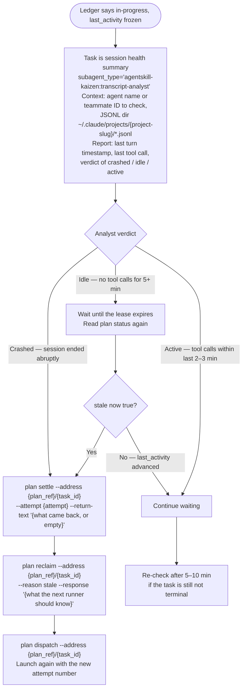

# Agent Health Check Procedure

Full procedure for `implement-feature`'s Agent Health Check step. Reached only when one of the
trigger conditions in the main skill fires — most dispatches never reach this file.

## Ask the ledger first

The ledger already answers "is this worker still working" without reading any session file. Each
task row carries when its lease expires, when the runner last touched it, and a `stale` flag that
is true once the lease has run out:

```bash
uv run "${CLAUDE_PLUGIN_ROOT}/sam_schema/cli.py" plan status --plan-address "{plan_ref}"
```

Read the row for the task in question and take the branch its state names:

| row state | what it means | what to do |
|---|---|---|
| `status` is terminal (`complete`, `failed`, `blocked`, `skipped`, `deferred`) | the worker closed its attempt | judge it per [the work loop](../../../docs/work-ledger/work-loop.md); the launch is finished whether or not a message arrived |
| `in-progress`, `stale` false, `last_activity` advancing between two reads a couple of minutes apart | the worker is alive and renewing its lease | keep waiting |
| `in-progress`, `stale` false, `last_activity` frozen | the worker is running long work without renewing, or it has stopped | run the transcript check below |
| `in-progress`, `stale` true | the lease ran out with nobody behind it | `plan reclaim --address {plan_ref}/{task_id} --reason stale`, then `plan dispatch` and launch again |
| `in-progress`, no attempt open, never settled | an attempt ended without a close | `plan reclaim --address {plan_ref}/{task_id} --reason imported`, then dispatch again |

A re-launch always follows a fresh `plan dispatch`, which opens a new attempt and prints its
number. Never re-launch a worker on the attempt number of a launch that already ended: commands
from the superseded attempt are refused with `stale-attempt`, and the new worker can neither renew
nor finish.

Where a launch handle you hold has ended and the row is still `in-progress`, settle it first —
`plan settle --address {plan_ref}/{task_id} --attempt {attempt} --return-text "{what came back}"` —
so the row stops reading as a worker at work.

## Transcript check

Only when the ledger says `in-progress` with a frozen `last_activity` is a session file worth
reading, and even then not by you.

**Never read JSONL session files directly in the orchestrator context.** Session files can exceed
40K tokens. Always delegate to `agentskill-kaizen:transcript-analyst` with an empty context window.

Session JSONL files are at `~/.claude/projects/{project-slug}/*.jsonl`, filterable by `agentId`
field. The `{project-slug}` is the absolute project path with `/` replaced by `-` (e.g.
`/home/user/repos/myproject` → `-home-user-repos-myproject`).


