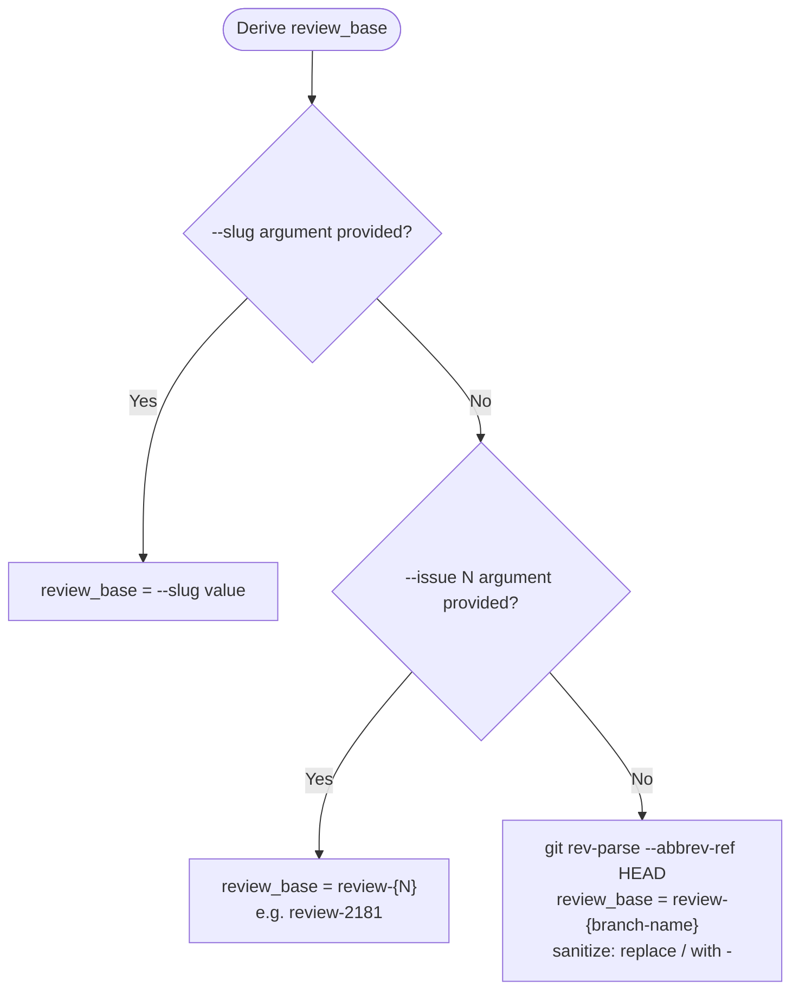

# Multi-Perspective Review

## Role

Dispatches every worker — the four reviewers and the synthesizer — as `dh:task-worker`, never a
specialist agent directly, so each can claim and close its own SAM task (see Behavioral Rules). The
gate in Step 7 applies to the synthesizer's punch list, not to the four raw verdicts.

Activate `dh:review-verdict-contract` before the first verdict-schema operation.

## Argument Parsing

| Argument | Type | Description |
|----------|------|-------------|
| `--diff <git-range>` | **required** | Passed to `git diff --name-only`. Commit outstanding changes first, then pass `<base>..HEAD`, where `<base>` is a commit SHA captured before this work's first commit — the caller is responsible for supplying one that still resolves. |
| `--issue <N>` | optional | GitHub issue number used for ephemeral plan linkage and slug derivation. |
| `--slug <str>` | optional | Explicit slug override. When omitted, derived from `--issue` or current git branch. |

Parse arguments from the invocation arguments string. Abort with usage message if `--diff` is
absent.

---

## Step 1: Resolve Changed Files

Run:

```bash
git diff --name-only <git-range>
```

Split stdout by newline. Trim empty lines. This is the `changed_files` list.

**Abort condition:** If `changed_files` is empty, print the following and stop:

```text
ERROR: No changed files found for diff range <git-range>. Nothing to review.
```

Do not create a team or a plan when `changed_files` is empty.

---

## Step 2: Derive Review Slug

Derive `review_base` exactly once using this flowchart:



Run this command and capture its stdout as `run_stamp`:

```text
uv run --quiet --script "${CLAUDE_SKILL_DIR}/scripts/gen_run_stamp.py"
```

`review_slug` is `{review_base}-{run_stamp}`, for example
`review-2181-20260824T014233Z-3f9a2c7e1b804d56`.

Use `review_slug` unchanged in plan operations. Use `multi-{review_slug}` as the team name.

---

## Step 3: Create the Ephemeral Review Plan

**Create a new plan on every run.** Never search for and reuse an existing plan.

### Create the Ephemeral Plan

Build the changed-files body block:

```text
Changed files:
{each file on its own line}
```

Create all five tasks in one typed MCP call. Replace `{changed_files_block}` with the literal
newline-separated changed-files block. Omit `issue` when `--issue` was not provided.

```python
mcp__plugin_dh_sam__sam_plan(
    config={
        "action": "create",
        "slug": "{review_slug}",
        "goal": "Multi-perspective review for {review_slug}",
        "issue": <issue_number_or_omit_if_absent>,
        "tasks": [
            {
                "id": "T1",
                "title": "Security Review",
                "agent": "dh:reviewer-security",
                "priority": 1,
                "complexity": "medium",
                "dependencies": [],
                "body": "Review every changed file through the security lens.\n"
                "Return structured verdict per verdict-schema.md.\n\n{changed_files_block}",
            },
            {
                "id": "T2",
                "title": "Performance Review",
                "agent": "dh:reviewer-performance",
                "priority": 1,
                "complexity": "medium",
                "dependencies": [],
                "body": "Review every changed file through the performance lens.\n"
                "Return structured verdict per verdict-schema.md.\n\n{changed_files_block}",
            },
            {
                "id": "T3",
                "title": "Quality Review",
                "agent": "dh:reviewer-quality",
                "priority": 1,
                "complexity": "medium",
                "dependencies": [],
                "body": "Review every changed file through the quality lens.\n"
                "Return structured verdict per verdict-schema.md.\n\n{changed_files_block}",
            },
            {
                "id": "T4",
                "title": "Accessibility Review",
                "agent": "dh:reviewer-accessibility",
                "priority": 1,
                "complexity": "low",
                "dependencies": [],
                "body": "Apply the SKIP rule first. Otherwise review ARIA attributes, color-only "
                "signals, and keyboard parity. Return structured verdict per verdict-schema.md."
                "\n\n{changed_files_block}",
            },
            {
                "id": "T5",
                "title": "Review Synthesis",
                "agent": "dh:review-synthesizer",
                "priority": 1,
                "complexity": "medium",
                "dependencies": ["T1", "T2", "T3", "T4"],
                "body": "Read the Review Results section of T1..T4 on this plan and synthesize "
                "them into one deduplicated, cross-referenced punch list.\n"
                "Write the punch-list block per verdict-schema.md §2.6 into this task's "
                "Punch List section.",
            },
        ],
    }
)
```

Store the returned `plan_ref` as `{PA}`. Completion criterion: `plan_ref` is non-empty and the
result has `task_count=5`.

---

## Step 4: Dispatch Four Workers in Parallel

Dispatch all four workers simultaneously. Do NOT wait between spawns — all four are independent
and must run in parallel. Each worker receives a minimal prompt that tells it to run the
`dh:start-task` skill (name it in prose — a harness-specific invocation form reaches only the
harness that defines it) against its own task reference. `dh:start-task` owns claim, active-task
registration, and execution; a worker that never runs it claims nothing and writes nothing, which
Step 6 records as a missing verdict. The `agent:` field in each SAM task tells `dh:task-worker`
which specialist profile to load via `profile_load` internally.

Dispatch `dh:task-worker` for all four tasks, not the reviewer agents directly — see Behavioral
Rules for why. `dh:review-synthesizer` reaches the plan the same way, so Step 6 dispatches it
identically.

Every prompt names the same output destination: the `Review Results` section of the worker's own
task. That section is the only channel the synthesizer reads in Step 6 — a reviewer that does not
write it is a missing verdict, and the punch list records it as one. The loaded profile — not the
dispatch prompt — performs that write: each reviewer agent's own SOP ends with a mandatory write
to `Review Results` as part of what `dh:start-task` executes.

```text
Agent(
  name="{worker}",
  subagent_type="dh:task-worker",
  prompt="Before starting work, load these skills: dh:subagent-contract\n\nYou are working on {lens} review. Your task: {PA}/{task}.\n\nRun the dh:start-task skill against {PA} --task {task}. The loaded profile writes your structured verdict block into the task's Review Results section — that is where the punch list reads your verdict. Do not write that section yourself first; the profile's own SOP performs the single write."
)
```

Substitute one row per spawn:

| `{worker}` | `{lens}` | `{task}` |
|------------|----------|----------|
| `security-worker` | security | `T1` |
| `performance-worker` | performance | `T2` |
| `quality-worker` | quality | `T3` |
| `accessibility-worker` | accessibility | `T4` |

---

## Step 5: Wait for the Four Reviews to Finish

Wait until `T1`..`T4` have all reached a terminal status. Poll:

```python
mcp__plugin_dh_sam__sam_plan(plan="{PA}", config={"action": "status"})
```

A task is terminal at `complete`, `blocked`, `failed`, `skipped`, or `deferred`. `T5` stays
`not-started` throughout this step — it is dispatched in Step 6, and its dependencies keep
`sam_plan(action="ready")` from offering it before all four reviews land.

---

## Step 6: Synthesize the Punch List

Dispatch one more worker against `T5`. It reads the four `Review Results` sections, merges
findings that name the same defect across perspectives into single entries, and writes the
punch-list block into `T5`'s own `Punch List` section. As with the four reviewer workers, the
`dh:review-synthesizer` profile — loaded by `dh:start-task` — performs that write as its own Step
5.

```text
Agent(
  name="synthesis-worker",
  subagent_type="dh:task-worker",
  prompt="Before starting work, load these skills: dh:subagent-contract\n\nYou are synthesizing the four perspective verdicts on plan {PA} into one punch list. Your task: {PA}/T5.\n\nRun the dh:start-task skill against {PA} --task T5. The loaded profile writes your punch-list block into the task's Punch List section — that is where the gate reads your output. Do not write that section yourself first; the profile's own SOP performs the single write."
)
```

Wait for `T5` to reach a terminal status, then read it and take its `Punch List` section:

```python
mcp__plugin_dh_sam__sam_task(plan="{PA}", task="T5", config={"action": "read"})
punch_list = json.loads(punch_list_section)
```

The block carries each perspective's §2.1 verdict block verbatim in `verdicts`, the perspectives
that returned nothing in `missing`, and the deduplicated findings in `entries`. It gives the gate
everything it needs to render the summary and entries, but not everything it needs to trust the
`verdict` token or the findings behind `entries` — see the reconciliation checks below.

`json.loads` succeeding proves the section is JSON, not that it is a punch list. Run the
`review-verdict-contract` §2.6 validity checks against the parsed
block before Step 7 reads any field, and take the `Punch list not produced` failure path below —
naming the check that failed — when any of them fails. Indexing a field the gate needs out of an
unvalidated block raises on `{}` and silently under-reports coverage on a block missing a
perspective, and a review that reports fewer perspectives than it ran is a false pass.

**Reconcile against source (§2.6 checks 6 and 7):** the synthesizer copies each `verdicts[i]` block
from its perspective's own `Review Results` section, but a copy is a claim, not a guarantee. Read
the four raw `Review Results` sections on `T1`..`T4` — comparing the punch list's own `verdicts`
and `entries` fields against each other is not enough, since both are the synthesizer's own output
and an internally-consistent alteration to both still passes. Confirm two things against those raw
sections directly:

- Check 6: each `verdicts[i].verdict` matches its source perspective's `verdict` field exactly. An
  LLM that alters a source `REJECT` to `APPROVE` while carrying its finding text forward still
  produces a block that passes every other check, because none of them compares `verdict` to its
  source.
- Check 7: each raw finding's `description` on `T1`..`T4` appears verbatim in some
  `entries[].descriptions`, at the index where that entry's `entries[].perspectives` names the
  finding's own perspective. An LLM that alters a finding's `file`, `severity`, `description`, or
  `rule` identically in both `verdicts[i].findings` and `entries`, or drops one while inventing a
  duplicate attribution to keep the total unchanged, still passes every check that compares the
  punch list only against itself.

A mismatch on either check is that check failing: take the `Punch list not produced` failure path
below and name the check and the perspective or finding it failed on — a punch list that silently
drops a REJECT, or silently misstates a finding, is a false pass, and the gate's entire correctness
rests on these two checks, so both run on every synthesis, not only when something looks wrong.

**Punch list not produced:** a terminal `T5` whose `Punch List` section is absent, does not
parse as JSON, or fails any validation check above is synthesis that did not happen. FAIL with
`Punch list not produced`, name the check that failed, report which perspectives did write a
`Review Results` section so the run is diagnosable, then exit non-zero — this failure happens
before Step 7, so this exit is the only one that will run for it.

---

## Step 7: Apply Gate and Print Summary

### Gate Logic

Both inputs come from the punch list read in Step 6: `punch_list["verdicts"]` and
`punch_list["missing"]`.

Apply gate in this order:

1. **Check for missing verdicts.** For each perspective named in `punch_list["missing"]`, FAIL
   immediately with message `"Perspective {X} did not return a verdict"`. A missing verdict is
   never an approval.

2. **Check for REJECT.** If any verdict has `verdict == "REJECT"`, the gate FAILS. Collect all
   REJECT verdicts and their blocking findings for the summary. Report the blocking findings from
   `punch_list["entries"]`, where a defect two perspectives raised appears once and names both.

3. **Check for all-SKIP edge case.** If all four verdicts are `SKIP`, the gate PASSES but the
   summary MUST include this exact warning line:

   ```text
   NOTE: No perspectives reviewed — all skipped
   ```

4. **All other combinations** (any APPROVE, remaining SKIP) → gate PASSES.

### Summary Line Format

Print one canonical summary line:

```text
Security: {token} | Performance: {token} | Quality: {token} | Accessibility: {token}
```

Take each `{token}` from the verdict-to-token mapping in
`review-verdict-contract` §2.2, which also shows a fully
rendered example line.

### Exit

1. If gate FAILED (missing verdict or any REJECT): print the summary line, then exit non-zero.
2. If gate PASSED (all-SKIP warning applies): print the summary line, then print the warning
   line `NOTE: No perspectives reviewed — all skipped`, then exit 0.
3. If gate PASSED (normal): print the summary line, then exit 0.

Each of the four reviewer workers and the synthesis worker terminates on its own once its task
completes — there is no shared group object to release.

---

## Dispatch Flow

Before dispatching a run, or when verifying that a completed run's argument parsing, gate checks,
and exit path followed the required sequence, consult
[Dispatch Flow](./references/dispatch-flow.md) — a step-faithful flowchart cross-referencing every
step, condition, and terminal outcome in Steps 1-7 above.

---

## Behavioral Rules

- Dispatch uses `dh:task-worker` because the perspective reviewer agents cannot claim or close a SAM task. Specialist behavior is selected through the task profile. See `dh:dispatch-contract`.
- **Each reviewer task body must embed the newline-separated changed-files list.** Reviewers read
  their task body to obtain the scan target; they do not receive it via the prompt. T5 reads the
  four verdict sections instead, so its body names those and carries no file list.

---

## Manual Acceptance Testing

Security REJECT, Accessibility SKIP, and summary-line-format behavior require live skill execution
against real diff inputs and are not covered by automated structural checks. See
[Acceptance Test Guide](./references/acceptance-test-guide.md) for fixture-based verification
procedures.
