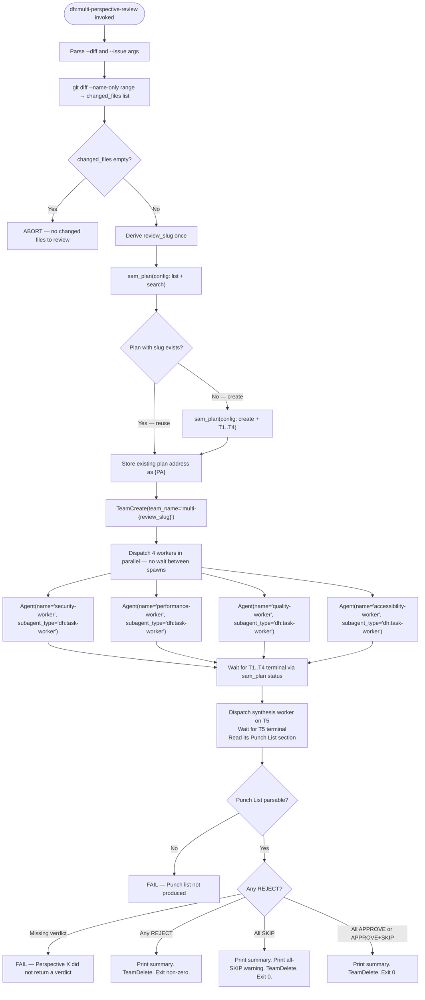

# Multi-Perspective Review

## Role

Orchestrates four independent perspective reviewers in parallel against a diff. Each reviewer
specialises in a single dimension: Security, Performance, Quality, or Accessibility. The skill
creates an ephemeral SAM plan, dispatches four `dh:task-worker` teammates via `TeamCreate`,
dispatches a fifth worker that reads the four verdict blocks back and synthesizes them into one
deduplicated punch list, applies the gate logic to that punch list, and prints one canonical
summary line per perspective.

This skill does NOT replace language-scoped code review (`dh:forensic-review`). It runs
alongside it as an orthogonal quality signal. It is an upstream dependency of #1430
(confidence-gate consolidation), which will replace the stub gate logic in Step 6 without
changing the caller interface.

## Argument Parsing

| Argument | Type | Description |
|----------|------|-------------|
| `--diff <git-range>` | **required** | Git range passed to `git diff --name-only`. Examples: `HEAD~1..HEAD`, `main..feature-branch`, `abc123..def456`. |
| `--issue <N>` | optional | GitHub issue number used for artifact registration and ephemeral plan linkage. |
| `--slug <str>` | optional | Explicit slug override. When omitted, derived from `--issue` or current git branch. |

Parse arguments from the invocation arguments string. Abort with usage message if `--diff` is
absent.

---

## Step 1: Resolve Changed Files

Run:

```bash
git diff --name-only <git-range>
```

Split stdout by newline. Trim empty lines. This is the `changed_files` list.

**Abort condition:** If `changed_files` is empty, print the following and stop:

```text
ERROR: No changed files found for diff range <git-range>. Nothing to review.
```

Do not create a team or a plan when `changed_files` is empty.

---

## Step 2: Derive Review Slug

Derive `review_slug` exactly once using the first matching rule:

1. `--slug` argument is provided → use its value directly
2. `--issue <N>` argument is provided → `review-{N}` (e.g., `review-2181`)
3. Neither provided → read current git branch name via `git rev-parse --abbrev-ref HEAD` and
   use `review-{branch-name}` (sanitize branch name: replace `/` with `-`)

Use `review_slug` unchanged in plan operations. Use `multi-{review_slug}` as the team name.

---

## Step 3: Create Ephemeral Review Plan (check-or-create)

**CRITICAL: check-or-create semantics are mandatory.** List matching plans before creating one so
repeated runs reuse the existing address.

### 3a: Check for Existing Plan

Call:

```python
mcp__plugin_dh_sam__sam_plan(config={"action": "list", "search": "{review_slug}"})
```

Inspect the returned `items` array. If any item has `feature` equal to `{review_slug}`:

- Store its non-empty `plan_ref` as `{PA}` (e.g., `#2181,P8a3f1b29`)
- Skip step 3b — do not create a new plan
- Reset every task the reused plan already ran. For each of `T1`..`T5` whose status is terminal,
  call `mcp__plugin_dh_sam__sam_task(plan="{PA}", task="T{N}", config={"action": "state", "status": "not-started"})`.
  A terminal task cannot be claimed, so a worker dispatched against it stops without writing —
  and the run would then read the previous run's `Review Results` and `Punch List` blocks as if
  they applied to this diff.

If no matching plan is found, proceed to step 3b.

### 3b: Create the Ephemeral Plan

Build the changed-files body block:

```text
Changed files:
{each file on its own line}
```

Create all four tasks in one typed MCP call. Replace `{changed_files_block}` with the literal
newline-separated changed-files block. Omit `issue` when `--issue` was not provided.

```python
mcp__plugin_dh_sam__sam_plan(
    config={
        "action": "create",
        "slug": "{review_slug}",
        "goal": "Multi-perspective review for {review_slug}",
        "issue": <issue_number_or_omit_if_absent>,
        "tasks": [
            {
                "id": "T1",
                "title": "Security Review",
                "agent": "dh:reviewer-security",
                "priority": 1,
                "complexity": "medium",
                "dependencies": [],
                "body": "Review every changed file through the security lens.\n"
                "Return structured verdict per verdict-schema.md.\n\n{changed_files_block}",
            },
            {
                "id": "T2",
                "title": "Performance Review",
                "agent": "dh:reviewer-performance",
                "priority": 1,
                "complexity": "medium",
                "dependencies": [],
                "body": "Review every changed file through the performance lens.\n"
                "Return structured verdict per verdict-schema.md.\n\n{changed_files_block}",
            },
            {
                "id": "T3",
                "title": "Quality Review",
                "agent": "dh:reviewer-quality",
                "priority": 1,
                "complexity": "medium",
                "dependencies": [],
                "body": "Review every changed file through the quality lens.\n"
                "Return structured verdict per verdict-schema.md.\n\n{changed_files_block}",
            },
            {
                "id": "T4",
                "title": "Accessibility Review",
                "agent": "dh:reviewer-accessibility",
                "priority": 1,
                "complexity": "low",
                "dependencies": [],
                "body": "Apply the SKIP rule first. Otherwise review ARIA attributes, color-only "
                "signals, and keyboard parity. Return structured verdict per verdict-schema.md."
                "\n\n{changed_files_block}",
            },
            {
                "id": "T5",
                "title": "Review Synthesis",
                "agent": "dh:review-synthesizer",
                "priority": 1,
                "complexity": "medium",
                "dependencies": ["T1", "T2", "T3", "T4"],
                "body": "Read the Review Results section of T1..T4 on this plan and synthesize "
                "them into one deduplicated, cross-referenced punch list.\n"
                "Write the punch-list block per verdict-schema.md §2.6 into this task's "
                "Punch List section.",
            },
        ],
    }
)
```

Store the returned `plan_ref` as `{PA}`. Completion criterion: `plan_ref` is non-empty and the
result has `task_count=5`.

---

## Step 4: TeamCreate and Dispatch Four Workers in Parallel

Create the team:

```text
TeamCreate(team_name="multi-{review_slug}")
```

Dispatch all four workers simultaneously. Do NOT wait between spawns — all four are independent
and must run in parallel. Each worker receives a minimal prompt that invokes `start-task`.
`start-task` owns claim, active-task registration, and execution. The `agent:` field in each
SAM task tells `dh:task-worker` which specialist profile to load via `profile_load` internally.

Dispatch `dh:task-worker` for all four tasks: the four perspective reviewer agents declare
`sam_task` to write their verdict but not the rest of the SAM task lifecycle, so under
`dh:dispatch-contract` they cannot be the dispatch target and their behavior reaches the work as a
loaded profile instead. `dh:review-synthesizer` reaches the same one operation, so Step 6
dispatches it the same way.

Every prompt names the same output destination: the `Review Results` section of the worker's own
task. That section is the only channel the gate reads in Step 5 — a reviewer that does not write it
is a missing verdict.

```text
Agent(
  team_name="multi-{review_slug}",
  name="security-worker",
  subagent_type="dh:task-worker",
  prompt="Before starting work, load these skills: dh:subagent-contract\n\nYou are working on security review. Your task: {PA}/T1.\n\nWrite your structured verdict block as the content of the Review Results section on that task, via mcp__plugin_dh_sam__sam_task(plan=\"{PA}\", task=\"T1\", config={\"action\": \"update\", \"append_section\": \"Review Results\", \"section_content\": <raw JSON verdict block>}). That section is where the gate reads your verdict.\n\nSkill(skill=\"start-task\", args=\"{PA} --task T1\")"
)

Agent(
  team_name="multi-{review_slug}",
  name="performance-worker",
  subagent_type="dh:task-worker",
  prompt="Before starting work, load these skills: dh:subagent-contract\n\nYou are working on performance review. Your task: {PA}/T2.\n\nWrite your structured verdict block as the content of the Review Results section on that task, via mcp__plugin_dh_sam__sam_task(plan=\"{PA}\", task=\"T2\", config={\"action\": \"update\", \"append_section\": \"Review Results\", \"section_content\": <raw JSON verdict block>}). That section is where the gate reads your verdict.\n\nSkill(skill=\"start-task\", args=\"{PA} --task T2\")"
)

Agent(
  team_name="multi-{review_slug}",
  name="quality-worker",
  subagent_type="dh:task-worker",
  prompt="Before starting work, load these skills: dh:subagent-contract\n\nYou are working on quality review. Your task: {PA}/T3.\n\nWrite your structured verdict block as the content of the Review Results section on that task, via mcp__plugin_dh_sam__sam_task(plan=\"{PA}\", task=\"T3\", config={\"action\": \"update\", \"append_section\": \"Review Results\", \"section_content\": <raw JSON verdict block>}). That section is where the gate reads your verdict.\n\nSkill(skill=\"start-task\", args=\"{PA} --task T3\")"
)

Agent(
  team_name="multi-{review_slug}",
  name="accessibility-worker",
  subagent_type="dh:task-worker",
  prompt="Before starting work, load these skills: dh:subagent-contract\n\nYou are working on accessibility review. Your task: {PA}/T4.\n\nWrite your structured verdict block as the content of the Review Results section on that task, via mcp__plugin_dh_sam__sam_task(plan=\"{PA}\", task=\"T4\", config={\"action\": \"update\", \"append_section\": \"Review Results\", \"section_content\": <raw JSON verdict block>}). That section is where the gate reads your verdict.\n\nSkill(skill=\"start-task\", args=\"{PA} --task T4\")"
)
```

---

## Step 5: Wait for the Four Reviews to Finish

Wait until `T1`..`T4` have all reached a terminal status. Poll:

```python
mcp__plugin_dh_sam__sam_plan(plan="{PA}", config={"action": "status"})
```

A task is terminal at `complete`, `blocked`, `failed`, `skipped`, or `deferred`. `T5` stays
`not-started` throughout this step — it is dispatched in Step 6, and its dependencies keep
`sam_plan(action="ready")` from offering it before all four reviews land.

---

## Step 6: Synthesize the Punch List

Dispatch one more worker against `T5`. It reads the four `Review Results` sections, merges
findings that name the same defect across perspectives into single entries, and writes the
punch-list block into `T5`'s own `Punch List` section.

```text
Agent(
  team_name="multi-{review_slug}",
  name="synthesis-worker",
  subagent_type="dh:task-worker",
  prompt="Before starting work, load these skills: dh:subagent-contract\n\nYou are synthesizing the four perspective verdicts on plan {PA} into one punch list. Your task: {PA}/T5.\n\nWrite your punch-list block as the content of the Punch List section on that task, via mcp__plugin_dh_sam__sam_task(plan=\"{PA}\", task=\"T5\", config={\"action\": \"update\", \"append_section\": \"Punch List\", \"section_content\": <raw JSON punch-list block>}). That section is where the gate reads your output.\n\nSkill(skill=\"start-task\", args=\"{PA} --task T5\")"
)
```

Wait for `T5` to reach a terminal status, then read it and take the last `Punch List` section:

```python
mcp__plugin_dh_sam__sam_task(plan="{PA}", task="T5", config={"action": "read"})
punch_list = json.loads(punch_list_section)
```

The punch-list block schema is defined in
[./references/verdict-schema.md](./references/verdict-schema.md) §2.6. It carries each
perspective's §2.1 verdict block verbatim in `verdicts`, the perspectives that returned nothing in
`missing`, and the deduplicated findings in `entries`. Reading it gives the gate everything it
needs, so Step 7 does not read the four `Review Results` sections. Read them when you want to
check the punch list against its sources — the sections stay on `T1`..`T4` for exactly that.

**Missing punch list:** a terminal `T5` carrying no parsable `Punch List` section is synthesis
that did not happen. FAIL with `Punch list not produced`, and report which perspectives did write
a `Review Results` section so the run is diagnosable.

---

## Step 7: Apply Gate and Print Summary

### Gate Logic

The gate logic is the pre-#1430 stub. The full gate logic including the all-SKIP edge case is
defined in [./references/verdict-schema.md](./references/verdict-schema.md) §2.4. Both inputs come
from the punch list read in Step 6: `punch_list["verdicts"]` and `punch_list["missing"]`.

Apply gate in this order:

1. **Check for missing verdicts.** For each perspective named in `punch_list["missing"]`, FAIL
   immediately with message `"Perspective {X} did not return a verdict"`. A missing verdict is
   never an approval.

2. **Check for REJECT.** If any verdict has `verdict == "REJECT"`, the gate FAILS. Collect all
   REJECT verdicts and their blocking findings for the summary. Report the blocking findings from
   `punch_list["entries"]`, where a defect two perspectives raised appears once and names both.

3. **Check for all-SKIP edge case.** If all four verdicts are `SKIP`, the gate PASSES but the
   summary MUST include this exact warning line:

   ```text
   NOTE: No perspectives reviewed — all skipped
   ```

4. **All other combinations** (any APPROVE, remaining SKIP) → gate PASSES.

**Gate interface:** The gate interface is stable:
`gate(verdicts: list[VerdictBlock]) -> GateResult` where `GateResult = {passed: bool,
summary_line: str, blocking_findings: list[Finding]}`.

### Summary Line Format

Print one canonical summary line. Format per
[./references/verdict-schema.md](./references/verdict-schema.md) §2.2:

```text
Security: {token} | Performance: {token} | Quality: {token} | Accessibility: {token}
```

Summary token mapping:

| Verdict | Findings | Summary token |
|---------|----------|---------------|
| `APPROVE` | 0 findings | `APPROVE (0 findings)` |
| `APPROVE` | N minor/info findings | `APPROVE ({N} minor)` |
| `REJECT` | 1 BLOCKER finding | `REJECT (1 finding)` |
| `REJECT` | N BLOCKER findings | `REJECT ({N} findings)` |
| `SKIP` | — | `SKIP ({skip_reason})` |

Example output:

```text
Security: APPROVE (0 findings) | Performance: REJECT (1 finding) | Quality: APPROVE (2 minor) | Accessibility: SKIP (no UI changes)
```

### Exit and Cleanup

1. If gate FAILED (any REJECT): print the summary line, then TeamDelete, then exit non-zero.
2. If gate PASSED (all-SKIP warning applies): print the summary line, then print the warning
   line `NOTE: No perspectives reviewed — all skipped`, then TeamDelete, then exit 0.
3. If gate PASSED (normal): print the summary line, then TeamDelete, then exit 0.

TeamDelete cleans up the team after all workers are done:

```text
TeamDelete(team_name="multi-{review_slug}")
```

---

## Dispatch Flow (Reference)



---

## Ephemeral Plan Task Structure

The ephemeral plan always has exactly five tasks:

| Task | Perspective | Agent field | dependencies |
|------|-------------|-------------|--------------|
| T1 | Security | `dh:reviewer-security` | `[]` |
| T2 | Performance | `dh:reviewer-performance` | `[]` |
| T3 | Quality | `dh:reviewer-quality` | `[]` |
| T4 | Accessibility | `dh:reviewer-accessibility` | `[]` |
| T5 | Synthesis | `dh:review-synthesizer` | `[T1, T2, T3, T4]` |

The four review tasks have `dependencies: []` — they are independent and run in parallel. T5
depends on all four, so `sam_plan(action="ready")` offers it only once every perspective has
finished. The
`agent:` field is read internally by `dh:task-worker` via
`mcp__plugin_dh_sam__sam_task(plan="{PA}", task="T{N}", config={"action": "read"})` and passed
to `profile_load` to load the specialist reviewer behavior. The orchestrator always passes only
the task reference `{PA}/T{N}` to the worker prompt.

---

## Behavioral Rules

- **SKIP is a passing outcome.** A perspective that SKIPs is not a blocker. The punch list records
  it as coverage that was declined, with the reviewer's `skip_reason`.
- **All four verdicts must arrive before the gate runs.** Do not apply the gate on partial results.
- **Check-or-create prevents plan accumulation.** Always list by search before creating.
- Dispatch uses `dh:task-worker` because the perspective reviewer agents cannot claim or close a SAM task. Specialist behavior is selected through the task profile. See `dh:dispatch-contract`.
- **Do not embed the verdict or punch-list schema, or the UI pattern list.** Reference
  [./references/verdict-schema.md](./references/verdict-schema.md) for all schema definitions.
- **Each reviewer task body must embed the newline-separated changed-files list.** Reviewers read
  their task body to obtain the scan target; they do not receive it via the prompt. T5 reads the
  four verdict sections instead, so its body names those and carries no file list.
- **The punch list is the gate's input.** One defect two perspectives raised is one entry naming
  both, so a REJECT summary counts distinct defects rather than repeating one across lenses.
- **All-SKIP warning is mandatory** when all four perspectives return SKIP.
