# Dispatch Flow — Multi-Perspective Review

> [!IMPORTANT]
> This diagram describes the review dispatch procedure in this source file. The generated workflow graph is a derived, potentially stale artifact; do not treat it as an authority over current source instructions. Execute the steps and stop conditions defined here.
> A Mermaid process diagram is an executable instruction set. Follow it exactly as written: respect sequence, conditions, loops, parallel paths, and terminal states. Do not improvise, reorder, or skip steps. If any node is ambiguous or missing required detail, pause and ask a clarifying question before continuing.
> When interacting with a user, report before acting the interpreted path you will follow from the diagram, then execute.

```mermaid
flowchart TD
    Start(["dh:multi-perspective-review invoked"]) --> Parse["Parse --diff, --issue, --slug<br>from invocation arguments string"]
    Parse --> DiffCheck{"--diff argument present?"}
    DiffCheck -->|"No — required arg missing"| AbortUsage(["ABORT — print usage message<br>Stop before any plan is created"])
    DiffCheck -->|"Yes"| Files["Resolve endpoint commits and effective base; construct review_diff from SHAs and supplied operator; run git diff --name-only review_diff"]
    Files --> SourceCheck{"Revision resolution and diff succeeded?"}
    SourceCheck -->|"No"| AbortSource(["ABORT — report input error; stop before creating a plan"])
    SourceCheck -->|"Yes"| ParseFiles["Split stdout by newline, trim empty lines → changed_files list"]
    ParseFiles --> EmptyCheck{"changed_files list empty?"}
    EmptyCheck -->|"Yes"| AbortEmpty(["ABORT — print<br>'ERROR: No changed files found for diff range &lt;git-range&gt;. Nothing to review.'<br>Do not create a plan"])
    EmptyCheck -->|"No"| SlugArg{"--slug argument provided?"}

    SlugArg -->|"Yes"| SlugFromArg["review_base = --slug value"]
    SlugArg -->|"No"| IssueArg{"--issue N argument provided?"}
    IssueArg -->|"Yes"| SlugFromIssue["review_base = review-N"]
    IssueArg -->|"No"| SlugFromBranch["git rev-parse --abbrev-ref HEAD<br>review_base = review-branch-name<br>sanitize — replace slash with dash"]

    SlugFromArg --> RunStamp
    SlugFromIssue --> RunStamp
    SlugFromBranch --> RunStamp

    RunStamp["Run gen_run_stamp.py<br>Capture stdout as run_stamp"] --> BuildSlug["review_slug = review_base-run_stamp"]

    BuildSlug --> Context["Read Review methods and prepare Review Context: revision, intent, authority, impact and source references; keep full changed-file scope"]
    Context --> CreatePlan["sam_plan create: T1 Security, T2 Performance, T3 Quality, T4 Accessibility, T5 Synthesis; identical context and file list in T1..T4; T5 depends on T1..T4; one typed MCP call; always a new plan"]
    CreatePlan --> PlanAddr["Store returned plan_ref as PA<br>Completion criterion — plan_ref non-empty<br>AND task_count = 5"]

    PlanAddr --> Parallel["Dispatch 4 dh task-worker agents simultaneously via Agent()<br>No wait between spawns — all four run in parallel<br>Dispatch task-worker, not reviewer agents directly"]
    Parallel --> W1["security-worker → T1<br>Runs dh start-task against T1"]
    Parallel --> W2["performance-worker → T2<br>Runs dh start-task against T2"]
    Parallel --> W3["quality-worker → T3<br>Runs dh start-task against T3"]
    Parallel --> W4["accessibility-worker → T4<br>Runs dh start-task against T4<br>Applies SKIP rule first"]

    %% Each worker's loaded profile — not the dispatch prompt — performs the single
    %% write of its verdict into the task's own Review Results section

    W1 --> Collect
    W2 --> Collect
    W3 --> Collect
    W4 --> Collect

    Collect["Wait until T1..T4 all reach terminal status<br>Poll sam_plan action=status<br>Terminal = complete, blocked, failed, skipped, or deferred<br>T5 stays not-started throughout"]

    Collect --> SynthDispatch["Dispatch synthesis-worker → T5<br>Runs dh start-task against T5<br>Reads T1..T4 Review Results, merges duplicate findings,<br>writes punch-list block to T5 Punch List section"]

    SynthDispatch --> WaitT5["Wait for T5 terminal status<br>Read T5 Punch List section<br>json.loads the section into punch_list"]

    WaitT5 --> ParseCheck{"Punch List section present,<br>parses as JSON, AND passes<br>review-verdict-contract §2.6 validity checks?"}
    ParseCheck -->|"No"| FailSynth(["FAIL — Punch list not produced<br>Name the check that failed<br>Report which perspectives DID write a Review Results section<br>Exit non-zero."])
    ParseCheck -->|"Yes"| Check6{"Check 6 — does each verdicts[i] verdict<br>match its source perspective's raw<br>Review Results verdict field exactly?"}

    Check6 -->|"No — verdict altered in transcription"| FailSynth
    Check6 -->|"Yes"| Check7{"Check 7 — does each raw finding's description<br>on T1..T4 appear verbatim in some entries[] descriptions,<br>at the index its entries[] perspectives names?"}

    Check7 -->|"No — finding altered or mis-attributed"| FailSynth
    Check7 -->|"Yes"| GateMissing{"Any perspective named in<br>punch_list missing field?"}

    GateMissing -->|"Yes — missing verdict"| FailMissing(["FAIL — Perspective X did not return a verdict<br>Print summary line. Exit non-zero."])
    GateMissing -->|"No"| GateReject{"Any verdict has verdict equal to REJECT?"}

    GateReject -->|"Yes"| FailReject(["Gate FAILS<br>Collect REJECT verdicts and blocking findings<br>from punch_list entries for the summary<br>Print summary line. Exit non-zero."])
    GateReject -->|"No"| GateAllSkip{"All four verdicts equal SKIP?"}

    GateAllSkip -->|"Yes"| WarnPass(["Gate PASSES<br>Print summary line, then<br>NOTE — No perspectives reviewed — all skipped<br>Exit 0."])
    GateAllSkip -->|"No — any APPROVE, remaining SKIP"| NormalPass(["Gate PASSES<br>Print summary line<br>Exit 0."])
```

