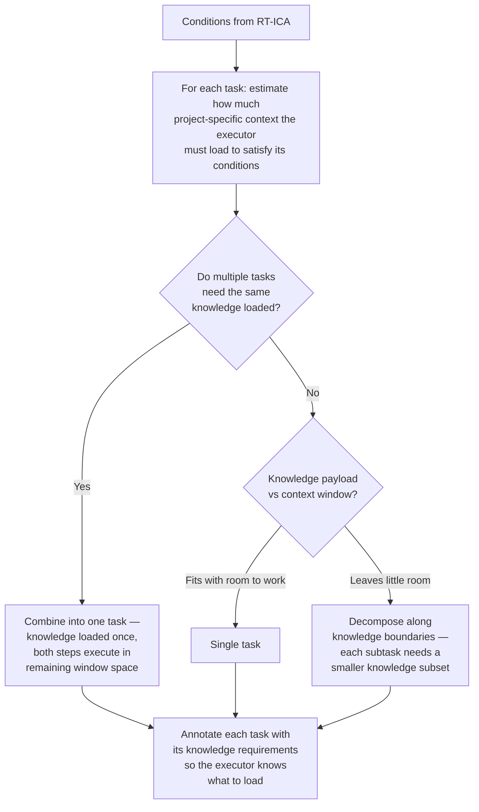

# Planner RT-ICA (Planning-Phase Input Completeness Analysis)

## Sister skill — when to use which

| If you are… | Load |
|---|---|
| Grooming a backlog item, generating a plan, decomposing tasks under uncertainty | **`dh:planner-rt-ica`** (this skill — non-blocking) |
| At the S2 implementation gate where missing inputs must halt the pipeline | **`dh:rt-ica`** (the blocking sister skill) |

`dh:planner-rt-ica` and `dh:rt-ica` are deliberately split: same framework, different cost-of-being-wrong. During planning, a `MISSING` condition is a research task. At the implementation gate, the same `MISSING` is a halt event because the agent would otherwise guess. Do not consolidate.

## Role

This skill adapts RT-ICA for **planning contexts**.

Its purpose is NOT to block planning.
Its purpose is to prevent invented requirements while still allowing a correct
dependency-first plan to be produced.

This skill runs as a **pre-pass** before task decomposition and task writing.

---

## Complexity Model

Task complexity is the ratio of project-specific knowledge required to context window available — not implementation difficulty.

Training data covers craft knowledge (language patterns, tooling, frameworks). That is free. What consumes context budget is project-specific knowledge: schemas, pin-outs, conventions, power constraints, existing interfaces, user preferences. This knowledge must be loaded before an agent can act.

The planner should use this when sizing tasks:



**Step boundaries follow knowledge boundaries, not implementation boundaries.** Two steps sharing the same knowledge payload should be one task. A step requiring a distinct, large knowledge set deserves its own agent and context window.

## Core Principles

1. **No invention**

   - Never fabricate requirements, constraints, interfaces, or acceptance criteria.
   - Missing information must be surfaced explicitly.

2. **Localize uncertainty**

   - Missing inputs block _only the tasks that depend on them_, not the entire plan.

3. **Plan must still exist**

   - The planner must always be able to emit:
     - a dependency graph,
     - task skeletons,
     - and explicit unblock paths.

4. **Execution safety**
   - Any task with missing critical inputs must be marked such that worker agents
     will BLOCK rather than assume.

5. **Well-lit trail, not locked gates**
   - Guidance that illuminates the best path is more durable than enforcement that
     locks a specific route. Every "MUST" carries maintenance cost — when constraints
     become stale, they block good work rather than enabling it. Prefer clear guidance
     over rigid enforcement where the outcome is equivalent.

## Status Vocabulary

Classify each planning input or condition on two axes: evidence status and resolution type.

**Evidence status**

- **PRESENT** - explicitly present in the request, repo, docs, backlog item, or other loaded material.
- **EVIDENCE-DERIVED** - recoverable from existing evidence such as code, tests, docs, schemas, examples, or nearby patterns. The planner must cite the evidence path, inference rule, and contradiction check.
- **PARTIAL** - some evidence exists, but key details remain unresolved.
- **MISSING** - evidence required for planning is absent.
- **HARD-BLOCKED** - planning scope includes destructive, irreversible, external-side-effect, credential, production-data, compliance, or meaning-affecting risk that cannot be treated as an ordinary gap.

**Resolution type for PARTIAL or MISSING inputs**

- **ASK-USER** - product meaning, policy, approvals, security, ownership, or user-visible intent must come from a human.
- **DISCOVER** - repo, runtime, test, or document inspection can resolve the gap.
- **VALIDATION-SPIKE** - an experiment or targeted investigation is needed to resolve uncertainty.
- **SAFE-DEFAULT-PROPOSAL** - a bounded local default may be proposed because every Safe Default Gate criterion passes.

`SAFE-DEFAULT-PROPOSAL` is for local implementation or planning choices, not for missing product intent, external contract decisions, approval ownership, user-visible behavior changes, data semantics, or operational commitments.

## Safe Default Gate

Safe-defaulting is permission to choose a low-risk local implementation detail, not permission to invent a requirement. If the missing detail affects meaning, policy, external behavior, data, security, or user intent, it is not safe-defaultable.

The planner may classify an item as `SAFE-DEFAULT-PROPOSAL` only when **all** of the following are true:

1. The outcome is bounded and the blast radius is known.
2. The blast radius is named: exact files, commands, generated artifacts, tests, and runtime surfaces affected.
3. Existing evidence constrains acceptable options and is cited from this project or loaded context.
4. The action is easily reversible.
5. The choice is a low-impact local change.
6. The choice follows established repository, team, or platform conventions.
7. Multiple valid paths are equivalent for current requirements and risk.
8. A verification method exists before action and can run before merge or release.
9. The change is non-user-visible and does not alter product behavior, public contracts, data formats, persistence, security posture, or integrations.
10. A conservative safe default exists and the planner is following it.
11. Any generated artifact remains regenerable from a known source of truth with a known regeneration path.
12. Failure is recoverable and loud, not hidden or externally damaging.
13. Scope is explicit and narrow.
14. There is no external side effect.
15. Risk is observable before merge, release, deploy, publish, notify, charge, delete, or migrate.
16. The choice affects presentation or equivalent implementation detail, not meaning.

If any check fails, classify the item as `ASK-USER`, `DISCOVER`, `VALIDATION-SPIKE`, or `HARD-BLOCKED`, not `SAFE-DEFAULT-PROPOSAL`.

## Ambiguity Escalation Rules

If ambiguity would increase the risk profile of the work, do not let the planner silently choose a path. Convert the ambiguity into an explicit research item, clarification question, validation spike, or hard block, then return the findings and open decisions to the human in a compact, decision-ready form.

Use the following rules:

1. **Security boundary or credential ambiguity** - any action involving secrets, credentials, tokens, auth rules, permissions, encryption keys, signing keys, customer data, or privilege escalation where the planner cannot prove the change is safe. Stop when access scope, exposure risk, or downstream authority is unclear.
2. **External side effect the agent cannot undo** - sending email, posting publicly, notifying users, charging money, opening tickets against another team, modifying vendor systems, or triggering a workflow outside the repo. If the action leaves the local workspace and cannot be confidently recalled, ask first.
3. **Data migration or schema change with uncertain compatibility** - changing persisted data, migrations, serialization formats, protocol contracts, public APIs, config schemas, or artifact formats when backward or forward compatibility is not proven. Stop when existing consumers may break and the planner cannot verify them.
4. **Policy, legal, compliance, or privacy uncertainty** - anything involving licenses, regulated data, retention rules, audit requirements, user privacy, export controls, employment matters, or contractual obligations. The planner must not infer authority from silence.
5. **Missing rollback path** - a change where the planner cannot describe how to recover the previous known-good state. This includes deployments, infra mutations, dependency upgrades, migrations, and generated artifacts. If rollback is unknown, treat the action as unsafe.
6. **Contradiction with explicit instructions or project conventions** - when the task request conflicts with repository rules, prior decisions, ADRs, coding standards, security policy, or direct user instructions. Stop and surface the conflict instead of silently choosing one.
7. **Insufficient test signal for high-impact behavior** - tests pass, but they do not exercise the behavior being changed, or the planner cannot map the test coverage to the risk. Passing unrelated CI is not permission to proceed.
8. **Authority ambiguity** - the agent can technically perform the action, but it is unclear whether it is allowed to make that decision. This includes changing scope, accepting tradeoffs, redefining requirements, merging, releasing, deleting, or overriding another owner.
9. **Dependency or supply-chain uncertainty** - adding, upgrading, replacing, vendoring, or executing third-party code when license, provenance, security posture, runtime behavior, or maintenance status is unclear. Stop when the planner cannot justify the dependency.
10. **Cost, quota, or resource expansion** - actions that may materially increase spend, consume limited quota, reserve infrastructure, start long-running jobs, or scale resources. If the planner cannot estimate or bound the cost, ask first.
11. **Ambiguous ownership of failure** - when a failure could belong to environment, test data, credentials, infrastructure, product behavior, or the agent’s own change, and proceeding would mask the root cause. Stop and report the ambiguity.
12. **User-visible behavior change without confirmed intent** - UI text, API responses, workflow behavior, permissions, defaults, notifications, error handling, or product semantics that could be valid either way. If users would notice and intent is not explicit, ask.

Default routing for these ambiguity classes:

- `HARD-BLOCKED` for security, privacy, destructive external effects, irreversible data risk, compliance, missing rollback, or unclear authority over consequential actions.
- `ASK-USER` when the ambiguity is about intent, policy, scope, ownership, user-visible behavior, or risk acceptance.
- `DISCOVER` when repository, runtime, test, or architecture evidence could resolve the ambiguity safely before action.
- `VALIDATION-SPIKE` when only experiment or targeted investigation can reduce the uncertainty.

These are provisional routes, not permanent labels. After discovery:

- If evidence resolves the ambiguity, reclassify it as `PRESENT` or `EVIDENCE-DERIVED` and proceed without asking the human.
- If the remaining choice becomes a bounded local default and every Safe Default Gate criterion passes, record it as `SAFE-DEFAULT-PROPOSAL` and proceed without asking the human.
- Ask the human only for ambiguity that remains unresolved after research or still requires human judgment.

Respect the human's attention:

- Never emit one-off user questions. All `ASK-USER` items for the current planning scope must be batched into one clarification packet.
- Do discovery first when the answer may already exist in local evidence, runtime evidence, internet research, or other available tools.
- Before asking the human, explore the repo, docs, tests, runtime artifacts, internet sources, or other relevant tools enough to narrow the question and eliminate avoidable uncertainty.
- If exploration disproves the cautionary assumption or resolves the risk, do not ask the human. Reclassify the item from evidence, answer it directly in the planning output, and continue.
- Present research findings and open choices together so the human can make an educated decision without redoing the investigation.
- Name the question, why it matters to the goal or plan, the affected boundary or side effects, the current constraints, the available options that fit those constraints, the risk of choosing incorrectly, and the recommended path.
- Keep the batch minimal in count but complete in context: ask only the questions that still require human judgment after exploration is exhausted.

## Report Back For Review

Exploration for planning often surfaces issues beyond the current scoped task. These do not automatically block the current work, but they must be reported back to the orchestrator or supervisor agent so they can be tracked, reviewed, and converted into follow-up tasks or backlog items when appropriate.

Create a review report for findings such as:

1. **Tool failure or unreliable tooling** - required tools fail, behave inconsistently, return partial results, time out, produce malformed output, or cannot access expected files, services, commands, APIs, or repositories.
2. **Environmental or configuration failure** - tests fail because of missing dependencies, credentials, paths, services, ports, containers, hardware, permissions, clocks, network access, package versions, or machine-specific state rather than because product behavior is clearly wrong.
3. **Edit, read, or write failure** - the agent cannot read, modify, save, patch, diff, move, delete, or inspect expected files. Include what was attempted, what failed, and whether the final state is known.
4. **Verification gap** - implementation completed but relevant validation could not run, or validation ran but did not exercise the risk being changed.
5. **Suspicious code quality concern** - magic numbers, duplicated logic, non-DRY implementation, non-SOLID architecture, unclear ownership, hidden coupling, excessive complexity, stale abstractions, or brittle tests.
6. **Stale or misleading documentation** - docs, comments, examples, ADRs, READMEs, generated references, or inline guidance appear outdated, contradicted by the code, or likely to mislead future agents or engineers.
7. **TOCTOU or state-race concern** - behavior depends on a check-then-act sequence where state may change between validation and use, especially around files, permissions, credentials, locks, external resources, deployments, or concurrent workflows.
8. **Workaround introduced to achieve the goal** - workaround, shim, bypass, hardcoded assumption, skipped validation, temporary branch, compatibility hack, retry loop, fallback path, or manual step was added to make progress.
9. **Tech debt introduced knowingly** - immediate goal was satisfied but cleanup work, architectural compromise, test debt, duplicated behavior, unclear naming, narrow assumptions, or future migration risk remains.
10. **Unexpected complexity or scope expansion** - the task required touching more systems, files, layers, dependencies, or concepts than expected, even if implementation succeeded.
11. **Inconsistent project conventions** - nearby code uses conflicting patterns and the agent had to choose one without a clear standard.
12. **Ambiguous ownership or boundary friction** - unclear which module, team, interface, service, config layer, or document owns the behavior being changed.
13. **Manual intervention required** - a human must run a command, provide credentials, inspect an environment, approve a change, update an external system, or diagnose a failure before the work can be considered complete.
14. **Partial success** - some parts of the task were completed but others were skipped, blocked, approximated, unverified, or deferred.
15. **Risk accepted locally** - the agent proceeded because the risk was bounded and reversible, but the concern is still worth reviewing before merge, release, or future reuse.

For each report-back item, record:

- Issue category
- What was observed
- Why it matters
- Whether it blocks current work
- Recommended owner or destination
- Recommended follow-up action or backlog item

When such findings exist, emit them in a literal `<concerns>...</concerns>` block so the orchestrator or supervisor can append them into backlog `## Concerns` using the plugin's existing concern-ingestion flow. Do not bury these findings only inside prose.

---

## Inputs Analyzed

Question discovery is recursive:

- During exploration, research, or subagent work, new unknowns may appear.
- Any newly discovered unknown that matters to the plan must be added to the active question queue.
- For each queued question, first attempt resolution through repo evidence, runtime evidence, tests, internet research, or other available tools.
- If research answers the question, close it from the queue and record the evidence.
- If research narrows but does not resolve it, keep it in the queue with updated constraints, options, and risks.
- If it still requires human judgment after exploration, include it in the batched clarification packet.
- Repeat until each queued question is either answered from evidence or escalated to the human.

For the given planning scope (entire plan or a specific task/workstream), identify
whether the following are PRESENT, EVIDENCE-DERIVED, PARTIAL, MISSING, or HARD-BLOCKED:

- Functional intent (what outcome is desired)
- Scope boundaries (in-scope / out-of-scope)
- External interfaces (APIs, CLIs, files, services)
- Constraints (performance, security, compliance, environment)
- Existing system context (repo, architecture, runtime)
- Verification expectations (how correctness will be proven)

---

## Output Contract (Planning-Oriented)

Produce a structured analysis with the following sections:

### 1. Completeness Summary

- APPROVED-FOR-PLANNING
- APPROVED-WITH-GAPS
- BLOCKED-FOR-PLANNING (only if literally no planning signal exists)

> APPROVED-WITH-GAPS is the expected and normal outcome for brownfield,
> refactor, and discovery scenarios.

---

### 2. Missing Inputs (By Dependency)

For each `PARTIAL`, `MISSING`, or `HARD-BLOCKED` input, emit:

- Input name
- Evidence status
- Resolution type
- Affected tasks or workstreams
- Impact if assumed incorrectly
- Whether the input is:
  - required before execution
  - required before detailed design
  - optional / refinement-level
- Safe Default Gate result, if proposing a default
- Execution gate: whether a worker must block before implementation

---

### 3. Autonomous Decisions and Derivations

For each `EVIDENCE-DERIVED` or `SAFE-DEFAULT-PROPOSAL` item, emit:

- Input or condition name
- Evidence status or proposal type
- Evidence path or nearby pattern used
- Proposed inference or choice
- Why it is allowed
- Validation method that surfaces risk before external impact

### 3A. Report Back For Review

For each out-of-scope but review-worthy finding, emit:

- Issue category
- Observation
- Why it matters
- Whether it blocks current work
- Recommended owner or destination
- Recommended follow-up action or backlog item

Emit the final review findings as:

```xml
<concerns>
[Issue category]
  Observation: [what was found]
  Why it matters: [impact]
  Blocks current work: [yes/no]
  Recommended owner/destination: [owner, supervisor, backlog, or task stream]
  Recommended follow-up: [task/backlog/escalation]
</concerns>
```

---

### 4. Required Unblock Actions

For each missing input, specify one of:

- Direct question to user
- Discovery task (e.g. repo scan, architecture trace)
- Validation spike / investigation task

When ambiguity escalation rules apply, the unblock action must preserve the distinction between:

- facts to gather,
- decisions the human must make,
- and risks that make execution unsafe until resolved.

If any unblock actions are `ASK-USER`, combine them into one batched clarification artifact instead of scattering them across tasks.

These MUST be expressible as planner tasks.

---

### 5. Planning Annotations to Apply

The planner MUST apply the following annotations downstream:

- Add explicit **Dependencies** on unblock tasks
- Populate **Required Inputs** fields in task blocks
- Elevate **Accuracy Risk** for affected tasks
- Add **Unblock Questions** sections to tasks that cannot execute yet
- Record **Safe Default Proposals** for any bounded local default
- Record **Evidence Basis** for any `EVIDENCE-DERIVED` choice

---

## Behavioral Rules for the Planner

When this skill reports missing inputs:

- The planner MUST:

  - create explicit input-collection or discovery tasks,
  - wire them as dependencies,
  - allow unaffected tasks to proceed in parallel.
  - preserve a compact human decision packet for ambiguities that require human judgment
  - batch all remaining human questions for the same planning scope into one clarification packet after discovery is complete
  - emit any review-worthy out-of-scope findings in a `<concerns>` block for backlog ingestion

- When the planner catches itself generating an unsourced value or constraint:
  - Classify evidence first: `PRESENT`, `EVIDENCE-DERIVED`, `PARTIAL`, `MISSING`, or `HARD-BLOCKED`
  - If the evidence is incomplete, evaluate the Safe Default Gate
  - It may be listed as a `SAFE-DEFAULT-PROPOSAL` only if every gate criterion passes
  - Otherwise, redirect it as an unresolved input and classify it as `ASK-USER`, `DISCOVER`, `VALIDATION-SPIKE`, or `HARD-BLOCKED`
  - If research resolves the ambiguity, reclassify it from evidence and continue without human interruption
  - Do not present unsourced content as verified fact
  - Do not silently downgrade requirements or remove tasks to avoid uncertainty
  - **Reflection checkpoint:** Before classifying each input, answer in writing: "Is this present, evidence-derived, partial, missing, or hard-blocked? If unresolved, is the right next step ask-user, discovery, validation spike, or safe-default proposal?" If a dedicated reasoning tool exists, use it. If not, still record the written reflection explicitly in the analysis.
  - If the ambiguity increases risk, record what research should happen before the human is interrupted and what exact decision remains for the human afterward.
  - If any `ASK-USER` items remain after research, present them together as a batched clarification packet with findings, impact, constraints, options, risk, and recommendation.

- **Data Deletion Fidelity is not a gap — it is a hard block.** When the planning scope describes a task that deletes source data AND the acceptance criteria lack a content completeness check against real production data: do NOT classify this as `APPROVED-WITH-GAPS`; do NOT emit unblock tasks and proceed; emit `BLOCKED-FOR-PLANNING` with the reason: "Task deletes source data without a real-data fidelity gate. Add: (1) content completeness assertion against real production records, (2) explicit deletion gate requiring zero-data-loss confirmation before deletion is permitted." This rule takes precedence over the general APPROVED-WITH-GAPS path. Data loss is not a gap that can be resolved later — it is irreversible.

---

## Relationship to RT-ICA (Execution)

This skill does NOT replace rt-ica.

- `planner-rt-ica`:

  - Enables safe planning under uncertainty.
  - Localizes gaps.
  - Records evidence-backed derivations separately from safe-default proposals.
  - Produces unblock paths.

- `rt-ica`:
  - Is used before delegating execution to worker agents.
  - Blocks execution if required inputs remain missing.

Any task produced under APPROVED-WITH-GAPS MUST still pass `rt-ica`
before being executed by a specialist agent.

---

## Success Criteria

This skill is successful if:

- A dependency-correct plan can be produced without invented facts.
- Every missing input is visible, localized, and actionable.
- No worker task can execute without required inputs being explicit.
