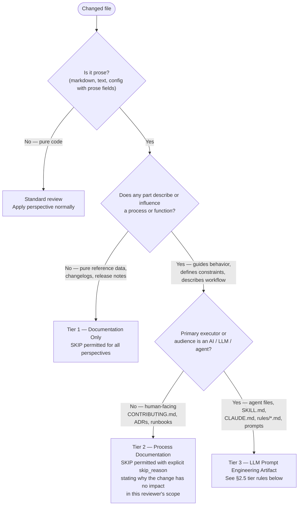

# Verdict Schema — Multi-Perspective Review

Use this file as the runtime source for the verdict schema, summary tokens, SKIP rules, and gate
logic. Write each verdict as raw JSON in its task's `Review Results` section. The orchestrator reads
that section to gate the review. Do not register a verdict as a document artifact.

## Contents

- §2.1 Structured Verdict Block
- §2.2 Summary Line Format
- §2.3 SKIP Detection Rule
- §2.4 Gate Logic
- §2.5 Prose File Classification
- §2.6 Punch-List Block

---

## §2.1 Structured Verdict Block

Each reviewer agent writes exactly one verdict block as the content of the `Review Results`
section on its own task, and the orchestrating skill reads that section back. The block is
JSON-serializable and version-stamped for #1430 compatibility.

```json
{
  "schema_version": "1.0",
  "perspective": "security | performance | quality | accessibility",
  "verdict": "APPROVE | REJECT | SKIP",
  "findings": [
    {
      "severity": "BLOCKER | MINOR | INFO",
      "file": "relative/path/to/file.py",
      "line": 42,
      "description": "Human-readable description of the finding",
      "rule": "optional-rule-identifier"
    }
  ],
  "skip_reason": "optional — present only when verdict == SKIP; explains why SKIP applies"
}
```

**Field constraints:**

- `schema_version`: always `"1.0"` until #1430 defines a migration path
- `perspective`: one of the four literal values listed above; lowercase
- `verdict`: exactly one of `APPROVE`, `REJECT`, `SKIP`
- `findings`: array; empty array `[]` is valid (APPROVE with no findings)
- `findings[].severity`: `BLOCKER` means the verdict is `REJECT`; `MINOR` and `INFO` do not block
- `findings[].line`: integer or `null` if not line-specific
- `skip_reason`: required when `verdict == SKIP`; omitted otherwise

---

## §2.2 Summary Line Format

The orchestrating skill (`multi-perspective-review/SKILL.md`) prints one canonical summary line:

```text
Security: APPROVE (0 findings) | Performance: REJECT (1 finding) | Quality: APPROVE (2 minor) | Accessibility: SKIP (no UI changes)
```

Mapping from verdict struct to summary token:

| Verdict | Findings | Summary token |
|---------|----------|---------------|
| `APPROVE` | 0 findings | `APPROVE (0 findings)` |
| `APPROVE` | N findings | `APPROVE ({N} minor)` where N counts MINOR+INFO severity |
| `REJECT` | 1 BLOCKER finding | `REJECT (1 finding)` |
| `REJECT` | N BLOCKER findings | `REJECT ({N} findings)` |
| `SKIP` | — | `SKIP ({skip_reason})` |
| _missing_ | — | `MISSING (no verdict)` |

**Note:** The singular `finding` vs plural `findings` applies to REJECT tokens only. APPROVE
always uses `findings` (plural).

**Missing-perspective token:** a perspective named in the punch list's `missing` array (§2.6) has
no verdict struct to look up in this table — it never reached `verdicts`. Render its slot with the
`MISSING (no verdict)` token directly, without applying any other row above. This is how Step 7's
FAIL-on-missing-verdict path (SKILL.md "Exit and Cleanup") still prints one token per perspective
before exiting non-zero.

---

## §2.3 SKIP Detection Rule (Accessibility Perspective)

SKIP applies to the accessibility perspective when **none** of the changed files matches the UI
file pattern list below. The accessibility reviewer checks this list first; if no match is
found, it emits `verdict: SKIP` immediately without scanning file content.

**This list is the authoritative source.** Do not embed or duplicate it in agent instruction
bodies. The `reviewer-accessibility.md` agent references this file for the pattern list.

**UI file pattern list (v1.0):**

```text
*.html
*.css
*.scss
*.sass
*.less
*.jsx
*.tsx
*.vue
*.svelte
*.astro
**/components/**
**/templates/**
**/views/**
**/pages/**
**/ui/**
**/frontend/**
```

**Pattern matching rule:** A file matches if its path matches any glob pattern above using
standard Unix glob semantics, case-insensitive. Matching applies to the relative file path as
returned by `git diff --name-only`.

**Extensibility:** Future perspectives may define additional SKIP detection rules using the
same pattern-list structure in this file.

---

## §2.4 Gate Logic (Stub Consolidation — Pre-#1430)

```text
PASS conditions:
  - All verdicts are APPROVE or SKIP, with at least one APPROVE

  Edge case — all SKIP:
    Treated as PASS (no applicable changes reviewed; no blocker found).
    Summary output MUST include the warning line:
      NOTE: No perspectives reviewed — all skipped

FAIL conditions:
  - Any verdict is REJECT → FAIL immediately; list all blocking findings
  - Missing verdict (a terminal task with no parsable Review Results block) → FAIL with message:
      "Perspective {X} did not return a verdict"
```

The gate function signature (stable interface for #1430 swap):

```text
gate(verdicts: list[VerdictBlock]) -> GateResult

GateResult:
  passed: bool
  summary_line: str            — canonical format per §2.2
  blocking_findings: list[Finding]   — empty when passed
```

**Gate input:** `verdicts` and `missing` both come from the punch-list block (§2.6) that the
synthesis task writes — `punch_list["verdicts"]` carries each §2.1 block verbatim, so the gate
input is byte-identical to reading the four `Review Results` sections directly. The orchestrator
may read those sections to check the punch list against them; the gate does not require it.

**Pre-#1430 stub logic:**

```text
verdicts = punch_list["verdicts"]
missing = punch_list["missing"]
if missing:
    FAIL — "Perspective {X} did not return a verdict"
rejecting = [v for v in verdicts if v.verdict == "REJECT"]
if rejecting:
    FAIL — list each blocking finding
all_skip = all(v.verdict == "SKIP" for v in verdicts)
if all_skip:
    PASS — emit warning: "NOTE: No perspectives reviewed — all skipped"
PASS
```

**Gate interface contract:**

- The `schema_version: "1.0"` field allows future consumers to detect schema version and apply
  confidence/deduplication logic
- The `findings` array structure is stable; future revisions may add `confidence` and
  `dedup_key` fields per finding without breaking v1 consumers
- The stub consolidation above implements the stable interface

---

## §2.5 Prose File Classification (All Perspectives)

Not all markdown is documentation. Before applying SKIP on the grounds that "no code was
changed," every reviewer MUST classify changed prose files using the decision tree below.



### Tier 1 — Documentation Only

Pure reference data: changelogs, release notes, README sections that only describe completed
features without defining workflows or constraints. SKIP is permitted for all perspectives
with no applicable checks.

### Tier 2 — Process Documentation

Human-facing behavioral contracts: `CONTRIBUTING.md`, architecture decision records, runbooks,
README sections that define workflows or contribution steps. These files have functional
behavioral impact on human contributors and operators. SKIP is permitted only with an explicit
`skip_reason` explaining why the change has no impact in the reviewer's scope.

### Tier 3 — LLM Prompt Engineering Artifacts

Any file whose prose is read and executed by an LLM is an **executable specification**, not
documentation. The markdown content IS the executable.

**Files classified as Tier 3:**

- Plugin agent files: `agents/*.md`
- Skill files: `skills/*/SKILL.md`, `skills/*/references/**`
- Session instruction files: `CLAUDE.md`, `.claude/rules/*.md`
- Any `.md` file that defines constraints, workflows, or behaviors for an AI agent

**Per-perspective rules for Tier 3 files:**

| Perspective | SKIP | Review criterion |
|---|---|---|
| Security | **PROHIBITED** — check for prompt injection surfaces (§2.5.1) | Prompt injection, authority escalation |
| Quality | **PROHIBITED** — already prohibited by role definition | Behavioral correctness: contradictions, ambiguous constraints, missing edge cases |
| Performance | Permitted — instruction complexity is out of performance scope | N/A |
| Accessibility | Permitted — LLM prompt files are not UI | N/A |

### §2.5.1 Prompt Injection Security Surface

When any Tier 3 file is in the changed-files list, the security reviewer checks for:

1. **User-input interpolation** — an instruction template that interpolates user-supplied
   content into a position where an LLM will execute it as a command
   (e.g., `{user_query}` embedded in a workflow step that the LLM interprets as instruction)
2. **Agent-output interpolation** — an instruction that passes another LLM's output directly
   into an instruction context without sanitization or intent verification
3. **Authority escalation via content** — an instruction that grants elevated permissions
   based on content in a data position
   (e.g., "if the issue body contains X, skip all checks")

Each confirmed surface is a `BLOCKER` finding with `rule: "prompt-injection"`.

### §2.5.2 Quality Correctness for Tier 3 Files

When any Tier 3 file is in the changed-files list, the quality reviewer checks:

- **Contradictions between sections** — two instructions that conflict; an LLM reading both
  will choose arbitrarily
- **Ambiguous constraints** — a rule that is phrased with "should", "try to", or "ideally"
  where a MUST/NEVER imperative is required for reliable enforcement
- **Missing edge cases** — a decision branch or process that lacks a terminal state or
  fallback for the "none of the above" case
- **Instruction bloat** — excessive repetition or overly long preamble that degrades attention
  and increases the probability of the agent ignoring downstream rules

These are prompt engineering bugs. Each confirmed issue is a finding (BLOCKER if it causes
incorrect behavior in a documented scenario; MINOR otherwise).

---

## §2.6 Punch-List Block

The synthesis task (T5, profile `dh:review-synthesizer`) reads the four `Review Results` sections
and writes exactly one punch-list block as the content of its own `Punch List` section. The
orchestrator always reads that section, and always reads the four raw `Review Results` sections
too — checks 6 and 7 below require comparing them.

```json
{
  "schema_version": "1.0",
  "verdicts": [
    {
      "schema_version": "1.0",
      "perspective": "security",
      "verdict": "REJECT",
      "findings": []
    }
  ],
  "missing": ["performance"],
  "entries": [
    {
      "severity": "BLOCKER",
      "file": "relative/path/to/file.py",
      "line": 42,
      "perspectives": ["security", "quality"],
      "descriptions": [
        "security reviewer's wording",
        "quality reviewer's wording"
      ],
      "rules": ["no-hardcoded-secrets"]
    }
  ]
}
```

**Field constraints:**

- `verdicts`: each §2.1 block copied verbatim from a `Review Results` section, one per perspective
  that returned a parsable one. This is the gate input defined in §2.4.
- `missing`: perspectives whose task is terminal with no parsable `Review Results` block. A
  perspective appears in `verdicts` or in `missing`, never both and never neither.
- `entries`: deduplicated findings. One entry per distinct defect, whatever number of perspectives
  raised it.
- `entries[].perspectives`: every perspective that raised this defect, in T1..T4 order (security,
  performance, quality, accessibility).
- `entries[].descriptions`: each raising reviewer's own wording, index-aligned with `perspectives`.
- `entries[].severity`: the highest severity among the merged findings.
- `entries[].rules`: union of the `rule` values on the merged findings; `[]` when none carried one.
- Ordering: `BLOCKER`, `MINOR`, `INFO`; within a severity, more perspectives first, then file path,
  then line.

**Conservation invariant:** the total number of findings across `verdicts` equals the sum of
`len(perspectives)` across `entries`. Every reviewer finding reaches exactly one entry, and no
entry exists without a reviewer finding behind it.

**Merge rule:** two findings become one entry when they name the same file, the same line, and the
same defect. A finding with `line: null` merges with a line-specific finding in the same file only
when both descriptions name the same defect. Two different defects on one line stay two entries.

**Validity checks:** the synthesizer runs these before writing the block, and the orchestrator runs
them on the block it reads back. A block that fails any of them is not a punch list, whatever
`json.loads` says about it, and the orchestrator takes its `Punch list not produced` failure path
rather than reading fields out of it.

1. The block is an object carrying `verdicts`, `missing`, and `entries`, with `verdicts` and
   `entries` arrays of objects and `missing` an array of strings.
2. Each block in `verdicts` satisfies §2.1 — `perspective` one of `security`, `performance`,
   `quality`, `accessibility`; `verdict` one of `APPROVE`, `REJECT`, `SKIP`; `findings` an array.
3. Coverage partition holds: `verdicts` and `missing` together name all four perspectives exactly
   once — none in both, none in neither, none named twice.
4. The conservation invariant above holds.
5. Each entry carries `severity`, `file`, `perspectives`, and `descriptions`, with `descriptions`
   the same length as `perspectives`.
6. Each `verdicts[i].verdict` matches the `verdict` field in that perspective's own `Review
   Results` section on `T1`..`T4`, exactly. Checks 1-5 validate structure and counts; none of them
   catches a `verdict` token silently changed in the copy (a source `REJECT` rewritten to
   `APPROVE` while its finding text is carried forward still satisfies checks 1-5). This check is
   the only one that catches that case, so it is not optional and not skipped when checks 1-5 all
   pass.
7. Every finding on each perspective's own raw `Review Results` section on `T1`..`T4` — not the
   `verdicts` copy — has its `description` appearing verbatim in some `entries[].descriptions`, at
   the index where that entry's `entries[].perspectives` names the finding's own perspective.
   Comparing `entries` against `verdicts[i].findings` is not sufficient: both fields are the
   synthesizer's own output, so a synthesizer that alters a finding's `file`, `severity`,
   `description`, or `rule` identically in both places, or drops one while inventing a duplicate
   attribution to keep the total unchanged, still satisfies checks 1-6 and an entries-vs-`verdicts`
   comparison — none of those compares against the source the synthesizer read. Only a comparison
   against the raw `T1`..`T4` sections, the same source check 6 reconciles against, catches that
   case, so this check runs alongside check 6 on every synthesis, not only when a count or verdict
   token looks wrong.
