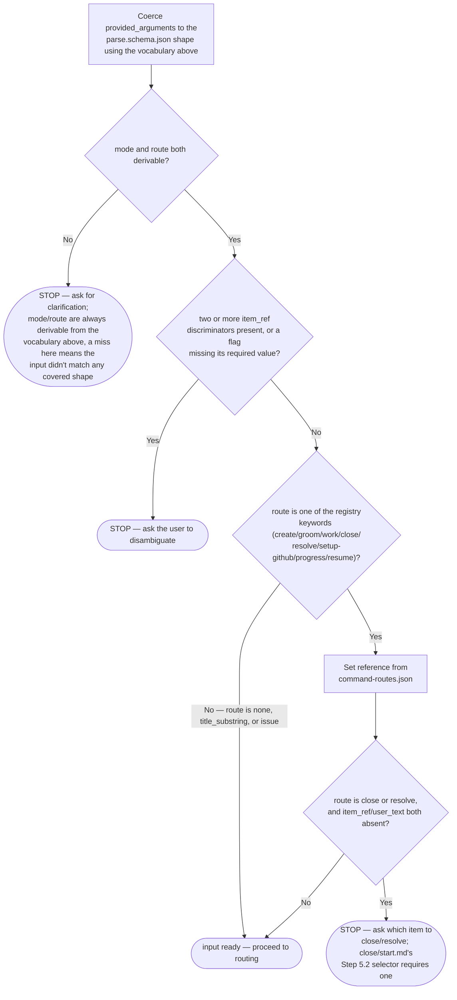
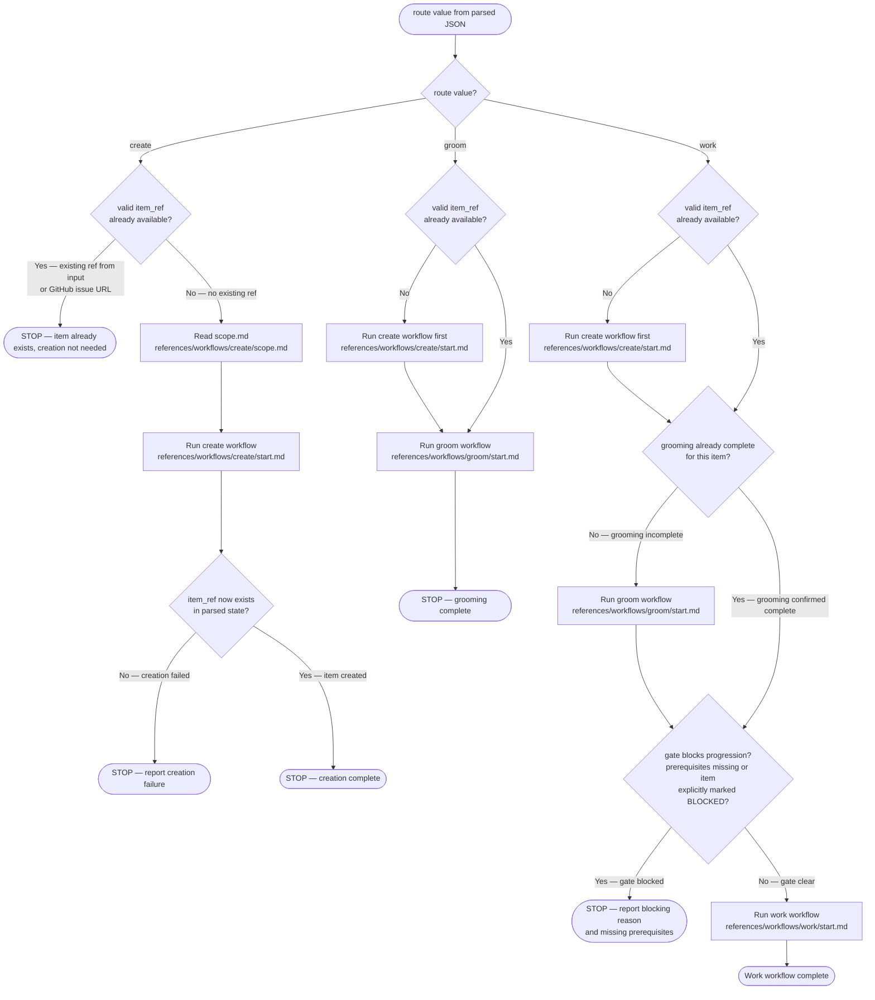

<gate_token>
!`node "${CLAUDE_PLUGIN_ROOT}/skills/work-backlog-item/scripts/get-gate-token.mjs"`
</gate_token>

<provided_arguments>
$ARGUMENTS
</provided_arguments>

<provided_arguments/> is free-text — flags, positional values, and/or a freetext suffix — either
typed by a human invoking `/dh:work-backlog-item ...` directly, or already known to you when you
are initiating this action yourself (e.g. a "capture a backlog item" or "groom/work item #N"
decision you made in this session). In the self-initiated case you already know every field below
directly — go straight to producing the coerced result; there is nothing in <provided_arguments/>
you don't already know, and no reason to route it through anything else.

Coerce <provided_arguments/> to match this schema yourself, then treat the result as `<input/>`:
[parse.schema.json](./scripts/parser/parse.schema.json). Never embed <provided_arguments/> in a
`` !`...` `` line or any other shell-interpreted string to produce `<input/>` — reasoning it out
against the vocabulary below is the only safe path.

Argument vocabulary:

- **Route** — the first positional word only, when it matches one of the keys registered in [command-routes.json](./scripts/parser/command-routes.json): `create`, `groom`, `work`, `close`, `resolve`, `setup-github`, `progress`, `resume`. Because only the first positional is ever checked, at most one route keyword can ever be found in a single invocation — there is no such thing as a "two routes" conflict. The same word appearing later (e.g. inside a title) is not a route. No match on the first positional → `route` is `title_substring` (positionals or freetext remain) or `none` (nothing at all — no flags, no positionals, no freetext).
- **item_ref discriminator** — any positional matching `#N`, bare digits, or a GitHub issue URL (`https://github.com/{owner}/{repo}/issues/N`) → normalize to `#N` (keep a URL verbatim). Checked across *all* positionals, not just the first — including one embedded inside an otherwise-ordinary title (verified: `Fix bug on line 42` → `{"route":"issue","item_ref":"#42","user_text":"Fix bug on line"}` — the "42" is consumed as `item_ref` and removed from `user_text`, and `route` becomes `issue` rather than `title_substring`; be alert to this when a title happens to end in a number). When it is the *only* discriminator found (no registry route word present), `route` is the literal string `issue` — not `title_substring` — and no `reference` key is set (verified: `#42` alone → `{"mode":"interactive","route":"issue","item_ref":"#42"}`). A route word and one item_ref may both be present (e.g. `groom #50`, `close #42`) — that is `route` + `item_ref` together (registry route wins as `route`, `reference` is set per the route table above), not a conflict. **Two or more item_ref discriminators** in one invocation (e.g. `close #42 #55`) is the one real conflict case — ask the user to disambiguate rather than picking one.
- **Freetext delimiter** — `--`, or a bare `—`/`–` (em/en dash — a mobile-autocorrect artifact; normalize a leading `—`/`–` on any token to `--`). Everything after the delimiter is `user_text` verbatim, regardless of content (quotes, code, punctuation — do not further tokenize it). No delimiter → `user_text` is whatever positionals remain after removing the route/item_ref tokens, space-joined.
- **Flags** — `--language <value>`, `--stack <value>`: both take the *next* token as their value, but only when that next token does not itself start with `-` — a next token starting with `-` (including no next token at all) means the value is missing, a stop-and-ask condition, not "consume the next flag as this flag's value" (verified: `--language --stack python-fastapi` treats `--language` as missing its value; it does not consume `--stack` as the value). `--force`, `--auto`, `--quick` (boolean, no value). `mode` is `auto` only when `--auto` is present, otherwise `interactive`.
- `--help`/`-h` present → show usage (this vocabulary plus `argument-hint` in the frontmatter) and stop; do not route.

Route → reference file: see [command-routes.json](./scripts/parser/command-routes.json) — one JSON object, `route` keyword to reference-file path, do not hand-copy it here; if it changes, this vocabulary section does not need to.

For every placeholder in the form <key/>, substitute the value of that key from `<input/>`.

<sam_cli>
uv run "${CLAUDE_PLUGIN_ROOT}/sam_schema/cli.py"
</sam_cli>

The `references/workflows/*.md` files loaded by this skill are plain files, not substituted — they show bare SAM CLI subcommands and args only (e.g. `backlog view --selector "..."`), never the invocation prefix. Prepend the command in <sam_cli/> above to every one of them.

> [!IMPORTANT]
> When provided a process map or Mermaid diagram, treat it as the authoritative procedure. Execute steps in the exact order shown, including branches, decision points, and stop conditions.
> A Mermaid process diagram is an executable instruction set. Follow it exactly as written: respect sequence, conditions, loops, parallel paths, and terminal states. Do not improvise, reorder, or skip steps. If any node is ambiguous or missing required detail, pause and ask a clarifying question before continuing.
> When interacting with a user, report before acting the interpreted path you will follow from the diagram, then execute.

The following diagram is the authoritative procedure for coercing <provided_arguments/> into `<input/>`. Execute steps in the exact order shown, including branches, decision points, and stop conditions.



Input contract — keys available after coercion:

- `mode`: optional; allowed values are `auto` or `interactive` (default when absent: `interactive`)
- `route`: required; allowed values are `none`, `title_substring`, `issue` (sole discriminator is an item_ref), or a registry keyword — `create`, `groom`, `work`, `close`, `resolve`, `setup-github`, `progress`, `resume`
- `reference`: present only when `route` is a registry keyword — the file from the route table above
- `user_text`: optional free text supplied by the user
- `item_ref`: optional backlog reference such as `#887`

In `auto` mode, do not call `AskUserQuestion`. Log each would-be interactive decision as `[AUTO] {decision} - {evidence}`.

Backlog item detection from `user_text`:

- Free text describing work to be done → new inbound backlog item
- Issue reference matching `/#\d+/` or a GitHub issue URL → existing backlog item
- Both reference and descriptive text present → reference is existing item identifier; remaining text is additional context

The following diagram is the authoritative procedure for pipeline stage execution. Execute steps in the exact order shown, including branches, decision points, and stop conditions.



# Work Backlog Item

Bridge a backlog item into the SAM planning pipeline via `/dh:add-new-feature` (default). Optional `--language` and `--stack` select Layer 1/2 profiles — see [sdlc-layers](../../docs/sdlc-layers/).

See the [Backlog Lifecycle reference](../../docs/backlog-lifecycle.md) for the complete state machine, handoff protocol, and data architecture.

**Phase separation**: Grooming (Step 3.1) is autonomous research — the agent verifies facts, maps resources, estimates effort, and surfaces blockers. Planning (Step 4.2) is solution design — architecture, tasks, implementation. The human sets priorities and resolves blockers; the agent handles research and fact-checking autonomously.

**SAM** — Stateless Agent Methodology. See [sam-definition.md](./references/workflows/work/sam-definition.md) for what SAM is and how to embody it. SAM lives in `../stateless-agent-methodology/` (or `bitflight-devops/stateless-agent-methodology` on GitHub).
The configured backend is authoritative for its native work records. For Beads-backed projects, use `bd` directly for issue creation, inspection, status, dependencies, readiness, labels, notes, and metadata. Use MCP or the provider-neutral CLI for structured plans, dispatch, artifacts, validation, and handoffs that Beads does not provide. Do not describe MCP or CLI as an exclusive proxy layer.

**MCP server availability**: Both `plugin:dh:backlog` and `plugin:dh:sam` initialize in ~1–2 seconds after a session restart. Claude Code handles connection waiting automatically. If a tool is unavailable, see [mcp-connection-check.md](../backlog/references/mcp-connection-check.md) for troubleshooting.

When invoked with no arguments, shows an interactive browser. When invoked with `#N` or a title substring, proceeds directly to the planning workflow.

**To capture a new backlog item**: `/dh:work-backlog-item create -- "<what and why of the problem that triggered the need for a backlog issue>"`

## Arguments

`route` is `none` only when argv is empty (no flags, no positionals, no freetext suffix): follow **Step 1.1 — Interactive Browser** below. It is not the same as `mode: "interactive"` (which only means `--auto` was not passed).

On `backend=beads`: a beads ID (`bd-a3f8`) coerces to `title_substring`/`user_text`, not `item_ref` — `find_item()` still resolves it via its string-ID exact-match branch, so this is a routing detail, not a functional gap.

**Optional flags** (when `route` is `title_substring`, `issue`, or a pipeline route): `--language <lang>` selects language plugin (default: python); `--stack <profile>` selects stack profile (e.g., python-fastapi, python-cli). See [sdlc-layers](../../docs/sdlc-layers/).

```text
/work-backlog-item                                    # interactive browser
/work-backlog-item #42                               # issue-first → planning
/work-backlog-item 42                                # issue-first (bare number) → planning
/work-backlog-item https://github.com/{OWNER}/{REPO}/issues/42  # URL → planning
/work-backlog-item Error Recovery                    # direct match → planning
/work-backlog-item --auto                            # autonomous → auto-select first open P0/P1
/work-backlog-item --auto vercel skills npm package  # autonomous → planning
/work-backlog-item close Error Recovery              # dismiss by title
/work-backlog-item close #42                         # dismiss by issue number
/work-backlog-item resolve Error Recovery            # mark completed by title
/work-backlog-item resolve #42                       # mark completed by issue number
/work-backlog-item --language python --stack python-fastapi Add auth  # Layer 2 stack profile
```

### --quick mode

Loads [references/workflows/quick/start.md](./references/workflows/quick/start.md) with `flags.quick = true` (parser flag) and `item_ref` set to the supplied title or issue reference (e.g. `#N`).

**Proactive fix routing**: The Proactive Fix Gate in `.claude/CLAUDE.md` (Proactive Fix Gate section) routes trivial discovered issues to this `--quick` path autonomously.
Invocation form: `flags.quick = true` (parser flag). The gate, not the user, authorizes the
routing decision.

### --auto mode rules

All interactive `AskUserQuestion` calls are replaced with evidence-derived decisions. Load [auto-mode.md](./references/workflows/work/auto-mode.md) for the full substitution table.

## Workflow

### Routing (evaluated first, before any step)

The following diagram is the authoritative procedure for route dispatch. Execute steps in the exact order shown, including branches, decision points, and stop conditions.

```mermaid
flowchart TD
    %% Dispatch runs once <input/> is ready. flags.quick takes priority over route.
    %% Dispatch is entirely on the route field — never on flags.auto/flags.quick, which
    %% are independent boolean modifiers, not route values (verified: `--auto` alone
    %% produces route="title_substring", flags={auto:true} — never route="auto").
    Start(["input ready"]) --> QuickCheck{"flags.quick present?"}
    QuickCheck -->|"Yes"| SQ["Load references/workflows/quick/start.md<br>item_ref = item_ref field, or user_text as title"]
    SQ --> SQEnd(["STOP — quick workflow handles session"])
    QuickCheck -->|"No"| Q1{"route value?"}

    Q1 -->|"none"| S0["Load references/workflows/work/interactive-browser.md<br>Step 1.1 — interactive browser"]
    S0 --> S0End(["STOP — interactive browser handles session"])

    Q1 -->|"create"| PipelineCreate(["Continue to pipeline stage execution<br>(route = create)"])
    Q1 -->|"groom"| PipelineGroom(["Continue to pipeline stage execution<br>(route = groom)"])
    Q1 -->|"work"| PipelineWork(["Continue to pipeline stage execution<br>(route = work)"])
    Q1 -->|"issue or title_substring"| PipelineEntry(["Continue to pipeline stage execution<br>as if route = work — item_ref or user_text<br>identifies the item; its own<br>create-if-missing / groom-if-incomplete<br>chain handles the rest"])

    Q1 -->|"progress"| SP["Load references/workflows/progress/start.md<br>item_ref = item_ref field, if present"]
    SP --> SPEnd(["STOP — progress report handles session"])

    Q1 -->|"resume"| SR["Load references/workflows/resume/start.md<br>item_ref = item_ref field, if present"]
    SR --> SREnd(["STOP — resume workflow handles session"])

    Q1 -->|"close"| S9c["Load references/workflows/close/start.md<br>item_ref = item_ref field, or user_text as title"]
    S9c --> S9cEnd(["STOP — close workflow handles session"])

    Q1 -->|"resolve"| S9r["Load references/workflows/close/start.md<br>item_ref = item_ref field, or user_text as title"]
    S9r --> S9rEnd(["STOP — resolve workflow handles session"])

    Q1 -->|"setup-github"| SGH["Load references/workflows/setup-github/start.md"]
    SGH --> SGHEnd(["STOP — setup-github workflow handles session"])
```



**When <mode/> is `auto`**: all `AskUserQuestion` calls are replaced with evidence-derived decisions. Load [auto-mode.md](./references/workflows/work/auto-mode.md) for the substitution table. BLOCKED states (RT-ICA MISSING conditions, feasibility gate BLOCKED) require human resolution regardless of mode.
