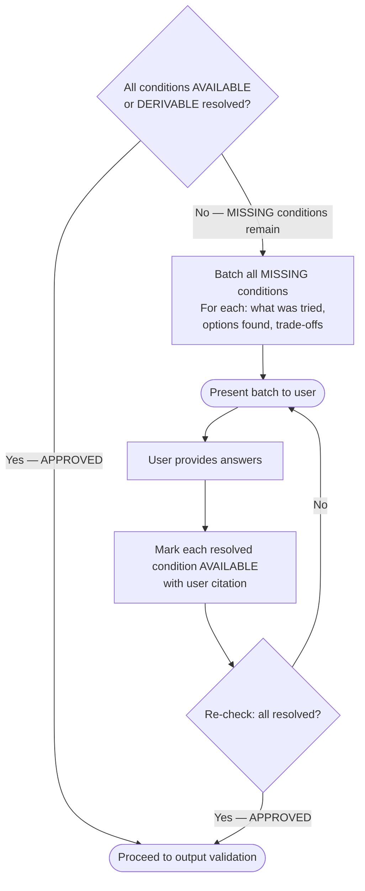
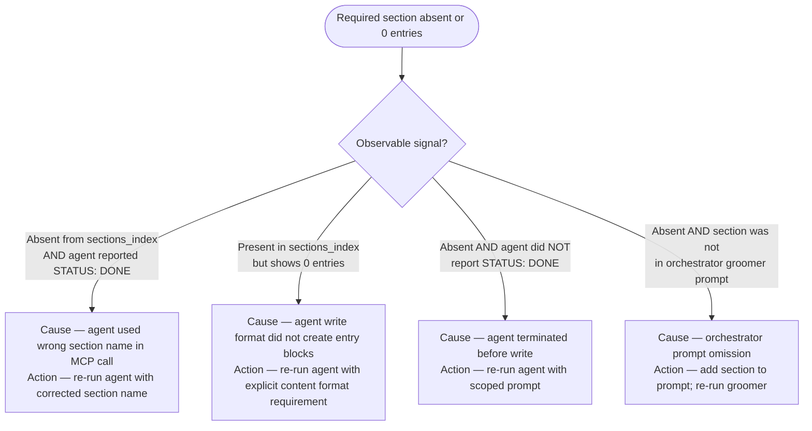
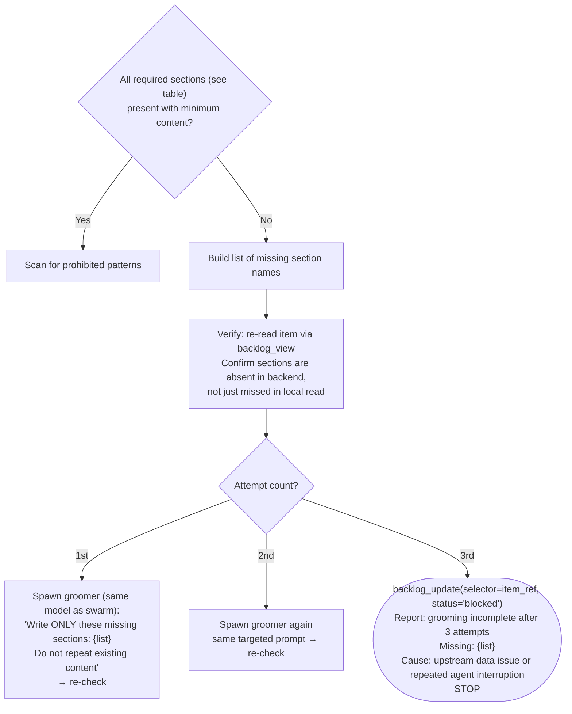

# Groom: Finalize

Post-swarm gates and final write. Runs after `swarm.md` completes.

## Contents

- [RT-ICA Final Pass](#rt-ica-final-pass) — re-assess conditions, self-resolve, write final report
- [Output Validation Gate](#output-validation-gate) — verify required sections before write
- [Hypothesis Resolution](#hypothesis-resolution) — rewrite a resolved creation-time hypothesis marker
- [Canonical Write-Back](#canonical-write-back) — a correction rewrites the section it corrects, not a side section
- [Write Groomed Content](#write-groomed-content) — batch or incremental write with `mark_groomed=True`
- [Terminal States](#terminal-states) — Groomed, Blocked, Skipped, Drift

## RT-ICA Final Pass

Runs after the grooming swarm completes. The orchestrator (not a subagent) executes this.

1. Read all sections now written to the item via MCP:

```bash
backlog view --selector "{item_ref}"
```

Extract: Impact Radius, Fact-Check, Issue Classification, Research (if Wave 0 ran), groomed subsections.

2. Re-assess every condition from the initial RT-ICA snapshot:
   - Compare snapshot status to current status per condition.
   - Apply categorization rule: deliverables are not conditions (filter out any that leaked in).
   - When the Fact-Check section records REFUTED: mark condition MISSING.
   - When the Impact Radius section records new scope: add new conditions.

3. Self-resolution pass — for each MISSING or DERIVABLE condition:
   - Attempt tool-based resolution: Grep, Read, WebSearch, Bash.
   - Every resolution must cite the tool result — session context or training data recall is not a valid citation.
   - If the tool returns no result, the condition remains DERIVABLE.
   - For a MISSING condition resolved by the user instead, paste the exact user message as the citation.
   - If resolved: mark AVAILABLE with the citation. No condition changes to AVAILABLE without one.

4. Build RT-ICA Final report:

```text
RT-ICA Final: {item title}
Date: {YYYY-MM-DD}
Goal: {same as snapshot}
Conditions:
1. {condition} | Snapshot: {status} → Final: {status} | Citation: {tool result}
...
Changes from snapshot:
- {condition X}: DERIVABLE → AVAILABLE (resolved by fact-checker — cite: {tool result})
- {condition Y}: AVAILABLE → MISSING (refuted by fact-checker)
- {condition Z}: (new) MISSING (discovered by impact-analyst)
Decision: {APPROVED|BLOCKED}
```

5. Write final RT-ICA to item (replaces the initial snapshot). Store the report content as
   `{rt_ica_final_content}` — it will be included in the batch write at the end of this workflow
   to ensure atomic persistence with `mark_groomed=True`:

```bash
backlog groom --selector "{item_ref}" --section "RT-ICA" --content "{final report}"
```

   Retain `{rt_ica_final_content}` in scope for the Write Groomed Content step.

6. Final decision:



#### BLOCKED batch format

```text
RT-ICA: BLOCKED

The following inputs could not be resolved autonomously.

[Category]:
- Question: {what is unknown}
  Tried: {tools used, what they returned}
  Options found: {a) option with trade-off | b) option with trade-off | c) open-ended}

Answer what you can — skip what you don't know.
Grooming will not proceed to output validation with unresolved gaps.
```

#### When `<mode/>` is `auto` (RT-ICA BLOCKED only)

BLOCKED conditions with exactly one viable option are auto-resolved with `[AUTO] Resolved {condition} — {option} — {evidence}`. Conditions with multiple options or no options remain BLOCKED and halt the workflow. This auto-resolution applies only to the RT-ICA BLOCKED state above — output validation retries always use the same model regardless of mode.

## Output Validation Gate

Runs when RT-ICA Final Decision is APPROVED, before the final write with `mark_groomed=True`.

1. Check section presence — Step 1: query summary:

```text
backlog_view(selector='{item_ref}', summary=True)
```

Read the `sections_index` field. A section is PRESENT if its name appears in `sections_index`. A section is ABSENT if its name does not appear.

**Success signal**: `sections_index` contains all required section names from the table below.
**Failure signal**: one or more required section names missing from `sections_index` — proceed to retry logic.

2. Verify minimum content — Step 2: for each required section that appears in `sections_index`, verify content:

```text
backlog_view(selector='{item_ref}', summary=False, section='{section-name}')
```

Use the `section` filter to read each required section individually. The `sections_index` from Step 1 is the authoritative presence check — a full `summary=False` read without a `section` filter is not the right tool for individual section presence.

#### Required sections and minimum content

| Section | Minimum content |
|---|---|
| `RT-ICA` | Contains `Decision: APPROVED` or `Decision: BLOCKED` and `Date: YYYY-MM-DD` |
| `Impact Radius` | At least one entry under `Systems Inventory` |
| `Fact-Check` | At least one claim with `verdict:` field |
| `Acceptance Criteria` | Non-empty — at least one criterion listed |
| `Reproducibility` | Non-empty — "N/A for feature items" is acceptable but must be present |
| `Issue Classification` | Contains `Type:` field with valid type value |
| `Priority` | Contains `Effort:` field |
| `Design Intent Alignment` | Contains `Alignment assessment:` field with ALIGNED/DIVERGENT/NOT_APPLICABLE |

Optional sections (not validated for presence): `Root-Cause Analysis`, `Impact`, `Benefits`,
`Expected Behavior`, `Files`, `Resources`, `Dependencies`, `Scope`, `Decision`.

**Research section**: intentionally absent from required sections. Wave 0 (`technical-researcher`) is skippable — bug/fix items, items with no researchable technology, and administrative items all bypass it. If Wave 0 was expected to run but `Research` is absent from `sections_index`, log a warning: "Wave 0 completed but Research section not found — check technical-researcher STATUS output." Do not block the groom.

### Diagnostic Gate — Before Retry or Direct Write

When a required section is absent or has 0 entries, identify the cause before acting.



The orchestrator must NOT write a required section directly unless `finalize.md` explicitly designates it as an orchestrator responsibility (e.g., RT-ICA Final Pass). For all other sections, the correct recovery is re-running the appropriate agent with a targeted prompt.

3. If sections are missing — retry with same model, refined prompt:



4. Scope boundary check — scan groomer-produced sections for implementation-prescriptive
   language. Apply these prohibited patterns to all sections except `Issue Classification`
   and `Root-Cause Analysis`:

```text
use \w+ framework
implement \w+ using
architecture:
the solution (should|will|must) (use|implement|call)
```

Scope violations do NOT block the write. Log violations as notes:

```bash
backlog groom \
  --selector "{item_ref}" \
  --section "Grooming Notes" \
  --content "Scope violation: {pattern} in {section}"
```

5. When validation passes (all required sections present, scope check logged) → proceed to write.

## Hypothesis Resolution

Runs only when the item's `description` (read in RT-ICA Final Pass Step 1) contains one or more
`**Hypothesis**: {text}` lines — a creation-time speculative cause the `create/scope.md` rule
requires to be labeled, not stated as fact. If `description` has no such line, skip this section
entirely. A description can carry more than one speculative cause; resolve every line found,
independently — do not stop after the first.

Rewrite `description` in place — not only a groomed section — so the resolution is visible even
to an agent reading just a truncated glimpse of the item.

1. For each `**Hypothesis**: {text}` line found, determine its resolution in this precedence
   order:
   - `description` contains exactly one `**Hypothesis**` line, AND `Root-Cause Analysis` section
     is present and contains a `**Root cause**: {statement}` line (RCA ran via the `defect`
     5-whys path, see `swarm.md`'s Root-Cause Analysis step) — this is authoritative regardless of
     whether it matches the original guess. New text: `**Confirmed cause**: {statement}`. (RCA
     analyzes one root cause for the item — with multiple hypothesis lines there is no reliable
     way to attribute that single finding to one specific line over another, so this precedence
     tier applies only when exactly one hypothesis line exists.)
   - Else, `Fact-Check` section contains a claim prefixed `HYPOTHESIS:` whose text exactly matches
     this line's `{text}` (per `swarm.md`'s fact-checker instruction, which prefixes every
     hypothesis claim with `HYPOTHESIS:` using the claim's own exact text so each verdict maps
     back to its originating line) — read its `verdict`:
     - `VERIFIED` → `**Confirmed cause**: {original hypothesis text}`
     - `REFUTED` → `**Hypothesis (refuted — see Fact-Check section)**: {original hypothesis text}`
     - `INCONCLUSIVE` → no rewrite; the marker already correctly signals "not yet confirmed"
   - Else (RCA tier doesn't apply and no matching Fact-Check claim exists for this line) → no
     rewrite for this line.

2. When a rewrite applies, replace that specific `**Hypothesis**: {text}` line within
   `description` with its own resolved text from Step 1 — leave every other line unchanged,
   including any hypothesis line that had no matching resolution — and write the result back
   **before** the Write Groomed Content step below, in this same finalize pass:

```bash
mcp__plugin_dh_backlog__backlog_update(selector='{item_ref}', description='{description with the Hypothesis line replaced}')
```

   `description` updates do not sync to a remote provider on their own — run this call before the
   batch write below, not after. That write's reconciliation re-fetches the item (now including
   this rewrite) and pushes its full state, carrying the resolved text to the remote record.

3. `--quick` items never reach this step — `--quick` skips grooming entirely, so a hypothesis
   written there is never resolved. Accepted scope limitation, not a bug.

## Canonical Write-Back

The Hypothesis Resolution rule above generalizes: when a correction contradicts a groomed
section or `description`, rewrite that section in place — as Hypothesis Resolution rewrites
`description` rather than appending a note elsewhere. Append to a side section only when the
canonical section cannot be edited directly. #2498 hit this three times (entries 7 and 19):
corrections landed in Dependencies/Concerns instead of the Implementation Plan section they
corrected, so every later pass re-discovered the same stale facts. This rule applies to backlog
sections and registered artifacts; it does not apply to SAM task bodies, which keep the
append-amendment pattern until `set_fields_json`'s replace-not-merge behavior on list fields is
fixed (see entries 24-25) — rewriting a SAM task body in place today risks silently dropping the
rest of an unrelated list field in the same write.

## Write Groomed Content

Final step — write groomed content via MCP and mark the item as groomed. None of `sections=`
(batch write), `mark_groomed=True`, or `replace_section=True` have a CLI equivalent — `backlog
groom`'s CLI form accepts only a single `--section`/`--content` pair with no equivalent flags —
so every call below is left as MCP.

#### Preferred: batch write with atomic status transition

When all groomer subsections are ready (end of swarm), write them in a single call using the
`sections` parameter combined with `mark_groomed=True`. This writes all content and advances
status atomically via the active backend.

RT-ICA MUST be included in this batch write. The `{rt_ica_final_content}` produced during
the RT-ICA Final Pass above must be passed here — this guarantees the RT-ICA section is always
present after grooming and the rt-ica-gate can find it fresh without re-running:

```text
mcp__plugin_dh_backlog__backlog_groom(
    selector='{item_ref}',
    sections={
        "RT-ICA": "{rt_ica_final_content}",
        "Reproducibility": "{reproducibility section text}",
        "Priority": "{priority section text}",
        "Acceptance Criteria": "{acceptance criteria text}",
        "Files": "{files section text}",
        "Resources": "{resources section text}",
        "Dependencies": "{dependencies section text}",
        "Effort": "{effort section text}"
    },
    mark_groomed=True
)
```

After the batch write, verify the RT-ICA section was persisted:

```bash
backlog view --selector "{item_ref}"
```

Check `response["sections"]["RT-ICA"]` is non-empty and contains `Date: YYYY-MM-DD` and
`Decision: APPROVED`. If absent or malformed, write it again individually before proceeding:

```bash
backlog groom --selector "{item_ref}" --section "RT-ICA" --content "{rt_ica_final_content}"
```

`mark_groomed=True` performs these transitions via the active backend:

- Advances the item's status from `needs-grooming` to `groomed`
- Safe to call multiple times — idempotent if already in `groomed` status

**Check the result for `mark_groomed_skipped`**: After the batch write, verify the response dict does not contain `mark_groomed_skipped: true` (see `backlog_groom`'s own docstring for when this field is set). When present, the status advance did NOT happen — re-run `backlog_groom(selector='{item_ref}', mark_groomed=True)` once to retry the status transition:

```text
# Verify status advanced — if mark_groomed_skipped is present, retry once
if response.get("mark_groomed_skipped"):
    mcp__plugin_dh_backlog__backlog_groom(selector='{item_ref}', mark_groomed=True)
```

**Alternative: incremental section updates**

When sections become available during the swarm (not at the end), write each immediately:

```bash
backlog groom --selector "{item_ref}" --section "Fact-Check" --content "{fact-check}"
backlog groom --selector "{item_ref}" --section "RT-ICA" --content "{rt-ica}"
# ... each section as it completes ...
```

Call the final status transition together with a content write in the same call — never
`mark_groomed=True` alone. A `mark_groomed=True` call with no `section`/`content` skips
`update_item()` entirely and only updates the local status and remote labels, so it never
reconciles the Hypothesis Resolution rewrite (or anything else written locally since the last
content call) to the remote provider:

```text
mcp__plugin_dh_backlog__backlog_groom(selector='{item_ref}', section='RT-ICA', content='{rt_ica_final_content}', replace_section=True, mark_groomed=True)
```

#### Handoff

After grooming completes, the item is ready for SAM planning. The caller
(`work-backlog-item`) routes to the planning phase based on user request or whether <mode/> is auto.

## Terminal States

| State | Condition | Action |
|---|---|---|
| Groomed | Output validation passed, `mark_groomed=True` called | Report completion to caller |
| Blocked (RT-ICA) | MISSING conditions unresolved after user batch | `backlog_update(selector='{item_ref}', status='blocked')`, report, stop |
| Blocked (validation) | 3 retry attempts failed to produce required sections | `backlog_update(selector='{item_ref}', status='blocked')`, report, stop |
| Skipped | Pre-groom check returned SKIP | Report reason, next item |
| Drift | Already groomed today | Route to [groom-drift.md](./groom-drift.md), report, stop |
