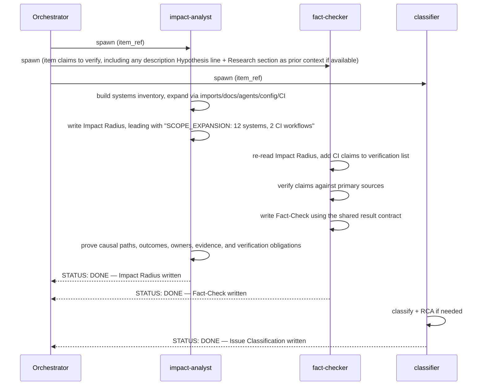
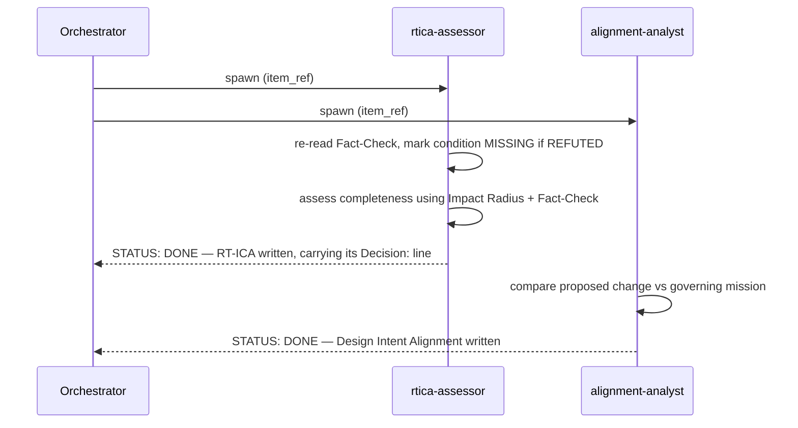
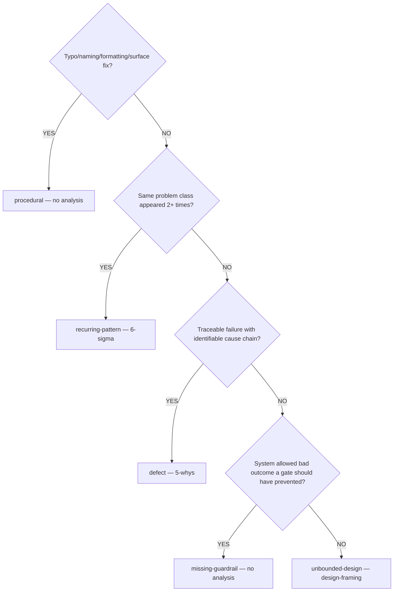

# Groom: Swarm

Grooming agents dispatched in waves after `analyze.md`.
Each agent writes to a different `section` via MCP `backlog_groom` — no clobbering.
Each agent's section is how the others reach its findings — an agent that must react to another's output re-reads that section rather than waiting on a message.

## Agents

1. **impact-analyst** — Build the starting impact set, expand it through causal dependency and
   control paths, then write the canonical Systems Inventory to `section="Impact Radius"`. Lead
   the section with a `SCOPE_EXPANSION:` line when systems beyond the starting set are found.

2. **fact-checker** — Verify item claims against primary sources. Training data recall is NOT
   evidence. Valid evidence: WebFetch, WebSearch, command output, source code, MCP tool output.
   If `description` contains one or more `**Hypothesis**: {text}` lines, include each one as its
   own separate claim to verify, every one prefixed `HYPOTHESIS:` using that claim's own exact
   text, so `finalize.md` can match each verdict back to its originating line by exact-text
   comparison (see Fact-Checker output contract below). Write to `section="Fact-Check"`, recording
   each `verdict: REFUTED` claim there (they become MISSING in RT-ICA).

3. **rtica-assessor** — Assess information completeness using impact-analyst and fact-checker
   output. Write to `section="RT-ICA"`. Re-read Impact Radius and Fact-Check before
   finalizing: a `verdict: REFUTED` claim marks its condition MISSING, a `SCOPE_EXPANSION:` line adds
   conditions.

4. **classifier** — Classify issue type and run root-cause analysis if `defect` or
   `recurring-pattern`. Write to `section="Issue Classification"` and
   `section="Root-Cause Analysis"`.

5. **groomer** — Produce subsections: Reproducibility, Priority, Impact, Benefits, Expected
   Behavior, Acceptance Criteria, Files, Resources, Dependencies, Effort. Runs AFTER all
   other agents complete. Write each via `section="{name}"`.

6. **alignment-analyst** — Compare the item's proposed change against the mission and historical
   direction governing the paths it touches. Depends on impact-analyst: it reads the affected-path
   list to resolve the governing docs nearest-first, and does not read the implementation files
   themselves. Write to section="Design Intent Alignment", leading the section with a
   MISSION_ALIGNED, MISSION_DIVERGENT, or MISSION_UNASSESSED verdict line.

## Dispatch sequence

Each agent is a standalone `Agent()` call — no team, no `SendMessage` between
agents. An agent that depends on another's output re-reads that agent's
section from the item via MCP rather than waiting on a message; the
orchestrator only needs to wait for each dispatched agent's own result
before deciding when to spawn the next wave.

#### Wave 0 — pre-swarm research (skip for bug/fix items)

Invoke the `technical-researcher` agent with the item's technology and concern.

**Pass:**
- `technology`: the primary library, protocol, or internal module the item targets (e.g., `"FastMCP 3.2.4"`, `"backlog_core server.py"`, `"work-backlog-item groom SKILL.md flow"`)
- `concern`: the item's research question, derived from its RT-ICA DERIVABLE/MISSING conditions or description
- `depth`: `overview` for procedural/fix items, `standard` for features and refactors, `deep` for `unbounded-design` items
- `item_ref`: the item's `#N` reference — the agent writes the Research section directly to the backlog item

When `technical-researcher` completes, the item's Research section is populated. Read it as prior context before spawning Wave 1 agents.

**If `technical-researcher` returns `STATUS: BLOCKED`** (all four angles returned only gaps): proceed to Wave 1 without research prior context — do not halt the groom.

**Skip Wave 0 when:**
- Item type is `type:bug` or `type:fix` — fact-checker covers the primary research need
- Item has no identifiable technology, library, or internal module to research
- Item description is a pure administrative or labelling task with no research questions

#### Wave 1 — parallel



After Wave 1: read Impact Radius and Fact-Check. If scope expanded, spawn a second fact-checker.

#### Wave 2 — depends on Wave 1



#### Wave 2 gate — read the verdict, not the delivery signal

Two different signals come back from `rtica-assessor` and they mean different things:

- Its terminal `STATUS:` line is the `dh:subagent-contract` delivery signal. `STATUS: BLOCKED`
  means it could not write an assessment at all — its upstream sections never appeared. Route that
  to [error.md](./error.md) as an agent failure; there is no verdict to read.
- Its verdict is the `Decision:` line inside the RT-ICA section it wrote. Read it with
  `backlog_view(selector='{item_ref}', summary=False, section='RT-ICA')`. The response still
  contains the struck snapshot entry and its `Decision:` line. Take the last entry in
  `sections['RT-ICA'].entries` whose `struck` is `false`. Match the plain `Decision: <TOKEN>` line
  in that entry.

Gate on the `Decision:` token, using the vocabulary `dh:planner-rt-ica` owns:

| `Decision:` token | Action |
|---|---|
| `APPROVED-FOR-PLANNING` | Proceed to Wave 3. |
| `APPROVED-WITH-GAPS` | Proceed to Wave 3. Pass the MISSING rows of the conditions table to the groomer so it can populate Blockers, Human Input, and Questions for Human. This is the expected outcome for a brownfield or refactor item. |
| `BLOCKED-FOR-PLANNING` | Stop. Present the MISSING conditions. Do not proceed to Wave 3. |
| anything else, or no `Decision:` line | Route to [error.md](./error.md) naming the token found. Do not guess. |

An unrecognised token is an error, not a block and not a pass. Reading an unknown verdict as
"blocked" is how a producer and a consumer stay split without anyone noticing: the pipeline halts
on every run and the halt looks like a correct gate doing its job.

#### Wave 3 — depends on Wave 2

- groomer → all groomed subsections (reads every section written by prior waves)

## Impact Radius — what the impact-analyst produces

The reusable analysis procedure lives in `dh:analyze-change-impact`. The canonical DH output and
persistence schema lives in [impact-radius-result.md](./impact-radius-result.md). The impact-analyst
agent is the workflow adapter between them. Do not restate or narrow either contract here.

Downstream stages must treat the `### Systems Inventory` rows as the authoritative estimated
impact set. Categorized lists are human-readable views. `pattern:` and `pattern_count:` fields are
optional lexical staleness probes for one inventory row; their grep results never replace the
inventory count, prove impact, or determine risk.

The agent runs before implementation. Any post-change observation in the supporting principles is
an owned verification obligation and review trigger, not a completion condition for grooming.

## Fact-Checker output contract

Read the [Fact-Check result contract](./fact-check-result.md) for the result fields,
exact hypothesis identity, evidence handling and RT-ICA mapping. The fact-checker and
finalizer use the same contract; do not supply a second output template in dispatch.

## Issue Classification



Write classification:

```bash
backlog groom \
  --selector "{item_ref}" \
  --section "Issue Classification" \
  --content "**Type**: {type}\n**Rationale**: {explanation}\n**Analysis Method**: {method}\n**Scenario Target**: {scenario} -> {improvement}"
```

#### Root-Cause Analysis — only for `defect` or `recurring-pattern`

- `defect`: invoke `Skill(skill='dh:root-cause-tracing-process', args='{description}')`, write evidence chain
  to `section="Root-Cause Analysis"`.
- `recurring-pattern`: search `backlog_list(status='resolved')` for keyword matches, count
  frequency, write measurement + analysis + improvement to `section="Root-Cause Analysis"`.

## Groomer prompt

The groomer agent receives all prior agents' output and produces groomed subsections.

#### Scope boundary

Problem space and outcomes only. Do NOT include implementation steps, architecture decisions, code design, or proposed solutions. Acceptance criteria must be observable checks — not implementation steps.

#### Description / AC separation

Description is the problem statement. Acceptance Criteria are verifiable success conditions. Do not restate description inside ACs. If the description already contains checkboxes or an Acceptance header, treat them as informal notes — write formal, non-overlapping ACs that complement rather than duplicate them.

#### Scope-gate ACs and repo hooks

When an AC limits scope (e.g. "no other file changes", "only file X is modified"), scope it to changes the agent makes by hand. A repo's own hooks (pre-commit, husky, prek, lint-staged, or similar) may rewrite other files as an enforced side effect of committing — that is the hook doing its job, not a scope violation. Do not word the criterion to fail on a mutation the agent did not make itself.

Groomer agent: `subagent_type="dh:backlog-item-groomer"`, model=sonnet.

Input to groomer: `item_ref` only, per `dh:dispatch-contract`. The groomer fetches title,
description, and every section prior swarm waves wrote (Impact Radius, Fact-Check, Issue
Classification, Root-Cause Analysis, RT-ICA, Design Intent Alignment, Research) itself — see
`backlog-item-groomer.md` Step 0.0. Do not paste any of those sections into the dispatch prompt.

Orchestrator: before dispatching the groomer, verify your prompt names all required subsections: Reproducibility, Priority, Impact, Benefits, Expected Behavior, Acceptance Criteria, Files, Resources, Dependencies, Effort. A prompt that omits a subsection produces a missing section that cannot be recovered by retry alone.

## Outputs

On completion, all agent sections are written to the item via MCP.
Pass to `finalize.md` for post-swarm gates and final write.
