# Feasibility Gate Reference

**Location in workflow**: Phase 3, Step 3.4 — runs immediately after the RT-ICA gate (Steps 3.2 and 3.3),
before Step 4.1 (Compose Feature Request).

**Purpose**: Determine whether the item should proceed to SAM planning. RT-ICA answers "do we have enough
information?" — the feasibility gate answers "should we do this and can it be done?"

---

## Gate Logic

Evaluate the criteria below in order. A single BLOCKED terminal stops the workflow.

```mermaid
flowchart TD
    RTICAPass(["RT-ICA: APPROVED — proceed to feasibility gate"]) --> Load["Load feasibility-gate.md and evaluate all criteria"]

    Load --> C1{"Criterion 1 — Technical feasibility<br>Does suggested_location exist in codebase?<br>Glob(suggested_location) returns results?<br>Do referenced APIs resolve via Grep?"}
    C1 -->|"Paths resolve"| C2
    C1 -->|"suggested_location missing AND no alternative identifiable"| FBlock1(["BLOCKED: technical path unclear<br>Required: add suggested_location to item or re-groom"])

    C2{"Criterion 2 — Effort proportionality<br>Does backlog_view.sections['Priority'] contain Effort field?<br>Is effort proportionate to item's priority tier?"}
    C2 -->|"Effort present AND proportionate"| C3
    C2 -->|"Effort field absent"| EffortWarn["WARN: effort not estimated — proceed with warning logged"]
    C2 -->|"Effort=FULL for P2 or Ideas item"| FBlock2(["BLOCKED: effort/priority mismatch<br>P2/Ideas with FULL effort requires human confirmation"])
    EffortWarn --> C3

    C3(["Criterion 3 — Blast radius check"]) --> InventoryCount["Count distinct Systems Inventory rows<br>or legacy affected-system rows<br>as estimated_impact_count"]
    InventoryCount --> PatternCheck
    PatternCheck{"Any Systems Inventory row contains<br>pattern: and pattern_count: fields?"}
    PatternCheck -->|"No complete pattern annotations"| C3Decision
    PatternCheck -->|"Yes — complete annotation found"| RunRg["For each annotated row:<br>hidden-inclusive fixed-string rg scan; capture output and status<br>Count matched files as current_pattern_count"]
    RunRg --> Compare{"Any current_pattern_count > 1.5 * recorded pattern_count?"}
    Compare -->|"Yes — count diverged"| FBlock3b(["Emit STALE_GROOM warning<br>Require re-grooming before proceeding"])
    Compare -->|"No — annotations remain current"| C3Decision
    C3Decision{"estimated_impact_count?"}
    C3Decision -->|"0 to 10 systems"| C4
    C3Decision -->|"11 to 20 systems"| RiskWarn["WARN: large impact set — proceed with warning logged"]
    C3Decision -->|"Over 20 systems"| FBlock3(["BLOCKED: coordination threshold exceeded<br>Over 20 affected systems requires human confirmation"])
    RiskWarn --> C4

    C4{"Criterion 4 — Prior attempt check<br>Does item body contain 'tried', 'previous attempt', or 'failed'?<br>Does Systems Inventory (or Resources fallback) list exactly 1 affected file AND Effort lists 4 or more tasks?"}
    C4 -->|"No prior failure refs, scope appropriate"| PASS(["FEASIBILITY: PASS<br>Proceed to Step 4.1 — Compose Feature Request"])
    C4 -->|"Prior failure reference found"| AltWarn["WARN: prior attempt referenced — include in feature request"]
    C4 -->|"Impact Radius (or Resources fallback) = 1 file total AND task count >= 4"| AltBlock(["BLOCKED: potential over-engineering<br>1-file scope with 4+ tasks — offer --quick path"])
    AltWarn --> PASS
```



**Criterion 3 — estimated impact count:**

- Count every distinct row under `### Systems Inventory`, including non-file systems. This is the
  estimated impact set used for the 10-system and 20-system blast-radius thresholds.
- When a legacy Impact Radius has no `Systems Inventory`, count distinct affected-system rows from
  its legacy categories.
- Do not count categorized views, evidence, excluded candidates, or unknown-frontier entries.
- `pattern_count` is only the lexical-staleness baseline for its own row; it never replaces or
  increments `estimated_impact_count`. It uses the same matched-file unit and search semantics as
  `current_pattern_count`.
- For every complete annotation, run
  `rg --hidden --glob '!**/.git/**' -F -l -- "$pattern"` and capture its output and exit status
  before counting lines. This includes tracked hidden paths while excluding Git internals at any
  depth. Exit status 0 means matches, and Exit status 1 means zero matches. An
  exit status greater than 1 is a scan failure: report the exact error and stop instead of using a
  count. Do not pipe `rg` directly to `wc`, because the pipeline can hide the scan failure.
- The 10-system and 20-system thresholds are coordination-policy signals. They do not determine a
  system's risk level; use the Impact Radius risk assessment for that judgment.

**Criterion 4 — observable thresholds:**

Extract affected file paths using the same priority order as [groom-check.md](./groom-check.md)'s
"Extract Impact Radius files" step:

1. Primary key: `sections["Impact Radius"]` — count only distinct file-valued rows under
   `### Systems Inventory`. Do not count paths in evidence, categorized views, excluded candidates,
   or unknown-frontier notes. If the heading is absent, count distinct leading file paths from the
   legacy affected-system categories.
2. Fallback key: `sections["Resources"]` (used by older grooming templates that wrote file lists to a Resources section instead of Impact Radius) — count rows here only when the primary key is absent or empty.

- Count task entries in the item's Effort section (lines starting with `- [ ]` or `- [x]`) to get the estimated task count.
- BLOCKED condition: `impact_radius_file_count == 1 AND estimated_task_count >= 4`. Both conditions must be true simultaneously.
- If the Effort section is absent, treat task count as 0 — the BLOCKED condition cannot be met, proceed.
- If neither the Impact Radius section nor its Resources fallback is present, treat file count as 0 — the BLOCKED condition cannot be met, proceed.

---

## PASS Output Contract

When all criteria pass (or result in WARN), append the following to the feature request at Step 4.1:

```text
### Feasibility Assessment

**Technical path**: VERIFIED — suggested_location resolves, Impact Radius systems accessible
**Effort tier**: {effort from grooming OR "Not estimated — proceed with caution"}
**Blast radius**: {N} systems in the estimated impact set
**Prior attempts**: {None OR description of prior attempt from item body}
**Warnings**: {list of WARN conditions OR "None"}
**Pattern refresh**: {pattern: recorded N, current M | "Not applicable — no complete pattern annotations"}
```

All fields shown above are required. Do not omit fields with empty values — use `"None"`,
`"Not estimated"`, or `"Not applicable — no complete pattern annotations"` as appropriate. The
**Pattern refresh** field reports lexical staleness only. It never changes the blast-radius value,
which is the distinct `Systems Inventory` row count, or the legacy affected-system row count when
the canonical heading is absent.

---

## STALE_GROOM Output Contract

When a row's `current_pattern_count > 1.5 * pattern_count` (Criterion 3 pattern path), do NOT
proceed. Report the following and stop:

```text
STALE_GROOM: Impact Radius count stale
  pattern: {literal from the annotated Systems Inventory row}
  recorded_pattern_count: {M} (groomed {date})
  current_pattern_count: {N} (matched-file count from fixed-string rg)
  ratio: {ratio:.1f}x (threshold: 1.5x)

Required action: Re-groom this item to refresh the Impact Radius count before proceeding.
Run: /dh:work-backlog-item groom {item title}
```

The fields `pattern`, `recorded_pattern_count`, `current_pattern_count`, `ratio`, and
`Required action` are all required. Do not omit any field or substitute prose explanations. This
warning means the lexical baseline for one row is stale; it does not redefine the estimated impact
set.

---

## BLOCKED Output Contract

When the feasibility gate blocks, do NOT proceed to Phase 4. Report the following and stop:

```text
FEASIBILITY GATE: BLOCKED

Criterion: {which criterion failed}
Observable check: {exact check that failed — file path, count, field value}
Required action: {what must happen before retrying}

To retry: re-groom the item (adds missing fields), then re-run /work-backlog-item {title}
```

Do not substitute prose explanations for the structured fields. Each field must be populated with an
observable fact, not an inference.
