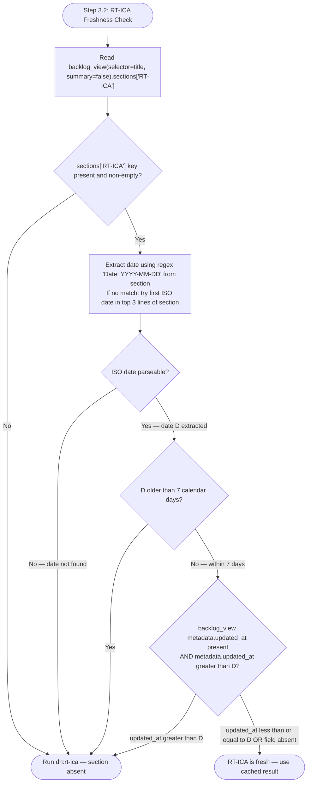

# RT-ICA Gate (Step 3.2)

## RT-ICA Staleness Policy

An RT-ICA result is stale and must be re-run if either condition is true: (a) the `Date:` header in the RT-ICA section is older than 7 calendar days, or (b) the item's `metadata.updated_at` field is newer than the RT-ICA section date. A stale RT-ICA result is treated as absent — `dh:rt-ica` is re-run before proceeding to [feasibility-gate.md](./feasibility-gate.md). The 7-day threshold applies regardless of whether the item description has changed, because codebase context may have changed even if the item text has not.



When the flowchart routes to "Run dh:rt-ica":

```text
Skill(skill: "dh:rt-ica", args: "{item_ref}")
```

Pass `{item_ref}` (the `#N` identifier) so the skill can load item context via `backlog_view`
before running — without it the skill returns BLOCKED immediately asking for context.

Log re-run reason: `RT-ICA re-run: {staleness reason — date older than 7 days / updated_at
newer than RT-ICA date}` to the item's RT-ICA section as a prefix before the new result.

- **Present and fresh** — read the plain `Decision:` line from the cached result and act on its
  token. Carry DERIVABLE items forward as "Assumptions to confirm" in the feature request.

The persisted `RT-ICA` section can have been written by either sister skill, and their token sets
are disjoint on purpose so you can tell which one wrote it:

| `Decision:` token | Written by | Action |
|---|---|---|
| `APPROVED` | `dh:rt-ica` (implementation gate) | Proceed to [feasibility-gate.md](./feasibility-gate.md). |
| `BLOCKED` | `dh:rt-ica` (implementation gate) | Stop. Do not proceed until all MISSING conditions are resolved. |
| `APPROVED-FOR-PLANNING` | `dh:planner-rt-ica` (groom stage) | Proceed. |
| `APPROVED-WITH-GAPS` | `dh:planner-rt-ica` (groom stage) | The groom stage's approval does not clear this gate: re-run `dh:rt-ica` so the recorded gaps are re-assessed under implementation-gate rules, then act on the token it writes. Any task groomed under `APPROVED-WITH-GAPS` must still pass `dh:rt-ica` before execution. |
| `BLOCKED-FOR-PLANNING` | `dh:planner-rt-ica` (groom stage) | Stop. The item could not be planned at all; re-running the gate will not change that. |
| anything else, or no `Decision:` line | — | Treat the section as malformed, not as a decision. Re-run `dh:rt-ica` and log the token found. Never read an unrecognised token as approval, and never read it as a block. |
