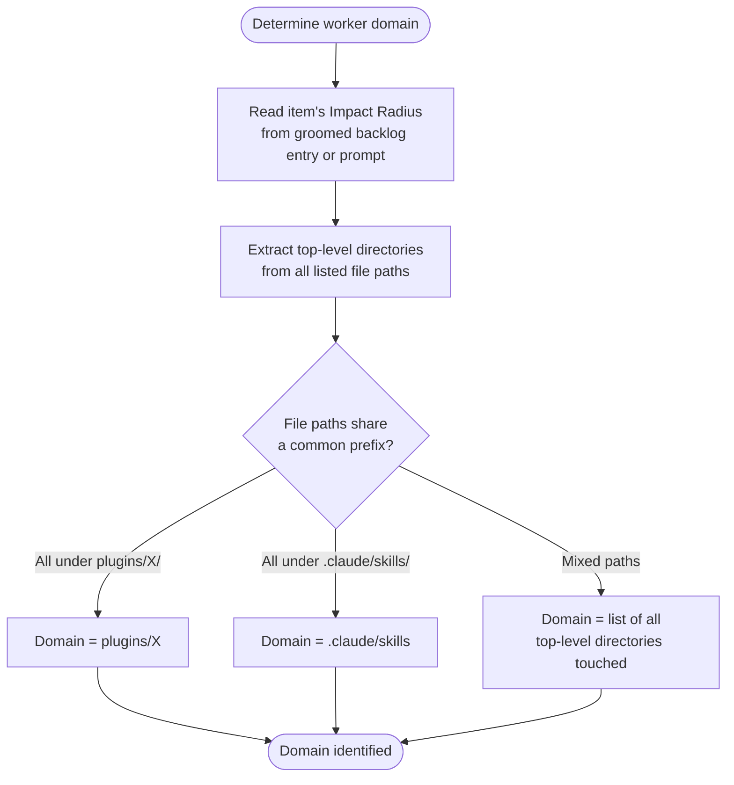

# Worktree Worker Protocol

Each worktree worker is spawned by the milestone orchestrator as an isolated `Agent(isolation: "worktree")` subagent branched from the integration branch. This protocol governs the full lifecycle from setup through completion reporting.

**Critical constraint**: Worktree workers have NO Agent tool. All work is executed directly — no delegation to subagents or the SAM pipeline. Workers self-discover task lists, acceptance criteria, and skills after spawning: the backlog item through `backlog_view`, and the plan and its tasks through the SAM CLI's `plan` group.

## Full Protocol (Steps M1, M2, M4, M8, M9)

```mermaid
flowchart TD
    Start(["Worktree worker spawned<br>in isolated worktree on integration branch"]) --> M1["M1: Setup<br>Verify worktree is on integration branch.<br>Enable constant commits."]

    M1 --> M2["M2: Self-Discovery<br>backlog_view(selector='#{issue}') — description + AC.<br>plan list — find the plan_ref.<br>plan status --plan-address {plan_ref} — inspect progress.<br>plan read --address {plan_ref}/{task_id} --attempt {n} — task, skills, orchestrator response.<br>Load each skill: Skill(skill='{name}'). Warn and continue on failure."]

    M2 --> SkillLoad["Skill Loading complete.<br>Task list and AC in context."]

    SkillLoad --> M4["M4: Execute Work<br>Execute each task sequentially:<br>1. Read task acceptance criteria<br>2. Implement required changes<br>3. Run task verification commands<br>4. Commit changes<br>Record state on the ledger:<br>plan update --attempt {n} — Completion Report + Verification Results.<br>plan finish --attempt {n} --result … closes the attempt."]

    M4 --> M8{"M8: Item Complete?<br>All tasks in task list done?"}

    M8 -->|"Not yet"| M4
    M8 -->|"Complete"| M9["M9: Pre-Verify<br>Run quality gate commands from prompt.<br>Fix any failures.<br>Commit all remaining changes."]

    M9 --> GateResult{"Quality gates pass?"}
    GateResult -->|"Fail — fix and re-run"| M9
    GateResult -->|"Pass"| Report["Output Completion Report<br>(see Completion Report Format)"]

    Report --> Done(["Worker exits"])
```



## Skill Loading

During M2 self-discovery, read the SAM task metadata to find the skills list, then load each skill:

```text
For each skill_name found in SAM task metadata:
    Skill(skill="{skill_name}")
```

If a skill fails to load, warn and continue with remaining skills. Skill loading failure is non-fatal — the worker proceeds with whatever skills loaded successfully.

If no SAM plan exists, no skill loading is required unless the backlog item explicitly lists skills.

## Constant Commits Protocol

Commit frequently within the worktree:

- After each task completes
- After each significant file write or edit operation
- Before outputting the completion report
- Commit messages follow conventional commits: `type(scope): description`

Do not batch all changes into a single commit. Frequent commits preserve progress and make merge conflict resolution easier for the orchestrator.

## Domain Detection

Domain is derived from the item's Impact Radius and the worker's files planned and touched:



Domain detection is informational — it is used in the completion report `NOTES` field to describe what was changed. No coordination with other workers is needed: items in the same wave are guaranteed non-overlapping by the dispatch plan's conflict group analysis.

## Blocker Handling

Worktree workers cannot message the orchestrator mid-flight. When a blocker is encountered:

1. Complete as many tasks as possible, skipping only the blocked task
2. Commit all completed work with conventional commit messages
3. Close the blocked task on the ledger — `plan finish --address P{N}/T{M} --attempt {n} --result
   blocked --note "<what blocks it, and what would unblock it>"`, or `--result needs-input` when
   what you need is an answer rather than a change
4. Report as below

A mixed outcome needs no token of its own. Each task carries its own `finish --result`, so "three
complete, one blocked" is already recorded, one row per task, and the orchestrator reads it from
the ledger rather than parsing a count out of your prose. There is no `--result partial` — see
`dh_core/ledger_spec.py` for the values `finish --result` accepts — and inventing a `STATUS:`
token for a state the ledger cannot hold would put the outcome somewhere no later session can
query.

Do not wait for resolution. Do not stop all work because one task is blocked — complete everything
else and report.

## Completion Report Format

The `STATUS:` line follows `/dh:subagent-contract` unchanged: `STATUS: DONE` once `finish` was
recorded, whatever its `--result`, and `STATUS: BLOCKED` when no `finish` was possible at all — a
setup failure, an unreachable ledger, a worktree that never came up. It reports whether you closed
your attempts, not how they turned out.

This report and the ledger carry different things, and each needs the other. The report is what the
orchestrator reads the moment your launch returns, and it records it against your attempt as the
attempt's return text; `plan finish --result` is the durable outcome the orchestrator queries, and
the only thing that moves the task. Send both: `finish` as your last ledger command, and the report
as your response. Where a plan exists, append the same body as this attempt's `Completion Report`
section before you finish, since `finish --result complete` requires it.

Output this as the final response. Everything below the `STATUS:` line is report body — field
names, not status tokens:

```text
STATUS: DONE
BRANCH: {worktree branch name — from git branch --show-current, or 'none' if no commits exist}
TASKS_COMPLETED: {count, and the IDs finished with --result complete}
TASKS_BLOCKED: {count and IDs closed with --result blocked or needs-input, or 'none'}
BLOCKER: {what blocked each one — omit the field when TASKS_BLOCKED is none}
FILES_CHANGED: {list of files modified, one per line}
COMMITS: {list of commit hashes and messages, one per line}
NOTES: {any design decisions, deviations from spec, or domain observations}
```

## SAM Task Status Tracking

Task state lives in the work ledger, and the SAM CLI is how you reach it. It needs no MCP server,
which matters here: a worktree worker runs where the orchestrator's session state does not reach,
and the CLI resolves the same ledger from a linked worktree as from the main checkout.

```bash
uv run "${CLAUDE_PLUGIN_ROOT}/sam_schema/cli.py" plan <command> …
```

Your prompt names an address `P{N}/T{M}` and the attempt number the orchestrator opened. Carry the
attempt on every command; it is what proves the command belongs to this dispatch.

For each task:

1. Read it, naming the attempt. This is also what pushes out your lease:
   `plan read --address P{N}/T{M} --attempt {n}`. Act on any `Orchestrator Response` first.
2. Before anything long — a full test suite, a build — push the lease out again:
   `plan renew --address P{N}/T{M} --attempt {n}`. It prints `renew_by`, the instant the lease next
   expires. A lease left to run out lets the orchestrator hand the task to another runner, and your
   later commands are then refused with `stale-attempt`.
3. After the work and its verification: append `Completion Report` and `Verification Results` for
   this attempt with `plan update --plan-address P{N} --task-id T{M} --attempt {n}
   --append-section … --section-content …`, then close it once with
   `plan finish --address P{N}/T{M} --attempt {n} --result complete|failed|blocked|needs-input`.

There is nothing to claim: `dispatch` opened your attempt and set the task in-progress before you
were launched. The CLI's `plan claim` command writes to the content store rather than the ledger,
so a task claimed that way leaves the ledger row where it was and the orchestrator watching a task
that never moved.

If no plan is found during M2 self-discovery, skip these commands — the worker executes against the
item's acceptance criteria directly and reports in text only.
