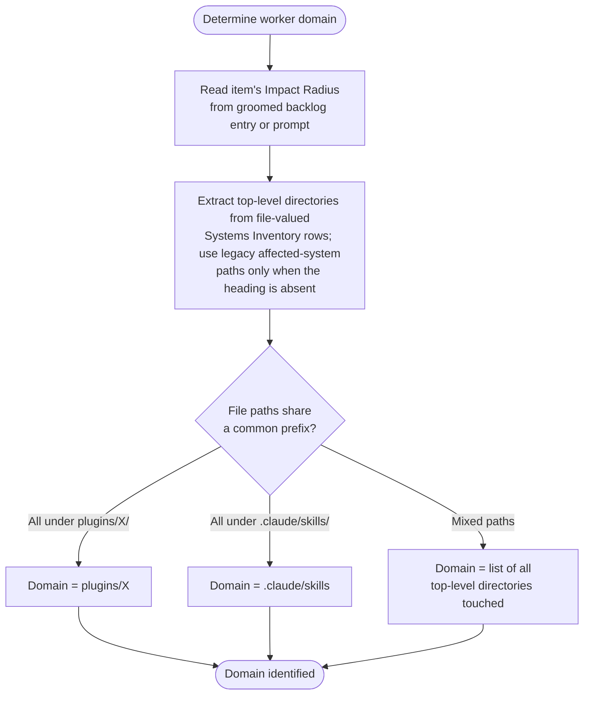

# Worktree Worker Protocol

Load `dh:dh-cli-usage` before using `<sam_cli/>` or `<dh_scripts/>`.

When self-discovery finds a SAM plan and your dispatch names an attempt, read
[the runner contract](../../../docs/work-ledger/runner-contract.md) in full before your first task
ledger command. It owns attempt identity, leases, reports, outcome selection, closure and
refusals. Before reporting your return, load `dh:subagent-contract` for response destination and
ledger versus text-only status semantics.

Each worktree worker is spawned by the milestone orchestrator as an isolated `Agent(isolation: "worktree")` subagent branched from the integration branch. This protocol governs the full lifecycle from setup through completion reporting.

**Critical constraint**: Worktree workers have NO Agent tool. All work is executed directly — no delegation to subagents or the SAM pipeline. Workers self-discover task lists, acceptance criteria, and skills after spawning: the backlog item through `backlog_view`, and the plan and its tasks through the SAM CLI's `plan` group.

## Full Protocol (Steps M1, M2, M4, M8, M9)


```mermaid
flowchart TD
    Start(["Worktree worker spawned<br>in isolated worktree on integration branch"]) --> M1["M1: Setup<br>Verify worktree is on integration branch.<br>Enable constant commits."]

    M1 --> M2["M2: Self-Discovery<br>backlog_view(selector='#{issue}') — description + AC.<br>plan list — find the plan_ref.<br>plan status --plan-address {plan_ref} — inspect progress.<br>plan read --address {plan_ref}/{task_id} --attempt {n} — task, skills, orchestrator response.<br>Load each skill: Skill(skill='{name}'). Warn and continue on failure."]

    M2 --> SkillLoad["Skill Loading complete.<br>Task list and AC in context."]

    SkillLoad --> M4["M4: Execute Work<br>Execute each task sequentially:<br>1. Read task acceptance criteria<br>2. Implement required changes<br>3. Run task verification commands<br>4. Commit changes<br>Record state on the ledger:<br>plan update --attempt {n} — Completion Report + Verification Results.<br>plan finish --attempt {n} --result … closes the attempt."]

    M4 --> M8{"M8: Item Complete?<br>All tasks in task list done?"}

    M8 -->|"Not yet"| M4
    M8 -->|"Complete"| M9["M9: Pre-Verify<br>Run quality gate commands from prompt.<br>Fix any failures.<br>Commit all remaining changes."]

    M9 --> GateResult{"Quality gates pass?"}
    GateResult -->|"Fail — fix and re-run"| M9
    GateResult -->|"Pass"| Report["Output Completion Report<br>(see Completion Report Format)"]

    Report --> Done(["Worker exits"])
```

## Skill Loading

During M2 self-discovery, read the SAM task metadata to find the skills list, then load each skill:

```text
For each skill_name found in SAM task metadata:
    Skill(skill="{skill_name}")
```

If a skill fails to load, warn and continue with remaining skills. Skill loading failure is non-fatal — the worker proceeds with whatever skills loaded successfully.

If no SAM plan exists, no skill loading is required unless the backlog item explicitly lists skills.

## Constant Commits Protocol

Commit frequently within the worktree:

- After each task completes
- After each significant file write or edit operation
- Before outputting the completion report
- Commit messages follow conventional commits: `type(scope): description`

Do not batch all changes into a single commit. Frequent commits preserve progress and make merge conflict resolution easier for the orchestrator.

## Domain Detection

Domain is derived from the item's Impact Radius and the worker's files planned and touched:


```mermaid
flowchart TD
    Start(["Determine worker domain"]) --> IR["Read item's Impact Radius<br>from groomed backlog entry or prompt"]
    IR --> Extract["Extract top-level directories from file-valued<br>Systems Inventory rows; use legacy affected-system<br>paths only when the heading is absent"]
    Extract --> Classify{"File paths share<br>a common prefix?"}
    Classify -->|"All under plugins/X/"| SinglePlugin["Domain = plugins/X"]
    Classify -->|"All under .claude/skills/"| Skills["Domain = .claude/skills"]
    Classify -->|"Mixed paths"| Multi["Domain = list of all<br>top-level directories touched"]
    SinglePlugin --> Done(["Domain identified"])
    Skills --> Done
    Multi --> Done
```

Domain detection is informational — it is used in the completion report `NOTES` field to describe what was changed. No coordination with other workers is needed: items in the same wave are guaranteed non-overlapping by the dispatch plan's conflict group analysis.

Do not derive the domain from evidence citations, categorized views, excluded candidates, or
unknown-frontier paths. Non-file inventory systems remain planning obligations but do not define a
filesystem worktree domain.

## Blocker Handling

Worktree workers cannot message the orchestrator mid-flight. When a blocker is encountered:

1. Complete as many tasks as possible, skipping only the blocked task
2. Commit all completed work with conventional commit messages
3. For a ledger task, follow the runner contract's closure steps with result `blocked`, or
   `needs-input` when an answer is needed rather than a change. For a text-only item, include
   the blocker and what would unblock it in the response.
4. Report as below

Do not wait for resolution. Do not stop all work because one task is blocked — complete everything
else and report.

## Completion Report Format

Use the first-line status selected under `dh:subagent-contract`. For each ledger task, append its
task-specific report under the runner contract, including `TASK:` identity; include the item-level
fields below in that report body too. Return the aggregate body below to the milestone caller.
When no plan exists, return this body as text only, with the nonledger status from that contract.

Output this as the final response. Everything below the `STATUS:` line is report body — field
names, not status tokens:

```text
STATUS: {DONE or BLOCKED under dh:subagent-contract}
BRANCH: {worktree branch name — from git branch --show-current, or 'none' if no commits exist}
TASKS_COMPLETED: {count, and the IDs whose durable result is complete, or work meeting the item criteria when no plan exists}
TASKS_BLOCKED: {count and IDs with durable result blocked or needs-input; unresolved work when no plan exists; or 'none'}
BLOCKER: {what blocked each one — omit the field when TASKS_BLOCKED is none}
FILES_CHANGED: {list of files modified, one per line}
COMMITS: {list of commit hashes and messages, one per line}
NOTES: {any design decisions, deviations from spec, or domain observations}
```

## SAM Task Status Tracking

Task state lives in the work ledger, and the SAM CLI is how you reach it. It needs no MCP server,
which matters here: a worktree worker runs where the orchestrator's session state does not reach,
and the CLI resolves the same ledger from a linked worktree as from the main checkout.

```bash
<sam_cli/> plan <command> …
```

Your prompt names an address `P{N}/T{M}` and the attempt number the orchestrator opened. Carry the
attempt on every command; it is what proves the command belongs to this dispatch.

For each task, run the full runner-contract sequence using that task's address and dispatched
attempt. The aggregate item report does not replace the attempt's required task report.

There is nothing to claim: `dispatch` opened your attempt and set the task in-progress before you
were launched. The CLI's `plan claim` command writes to the content store rather than the ledger,
so a task claimed that way leaves the ledger row where it was and the orchestrator watching a task
that never moved.

If no plan is found during M2 self-discovery, skip these commands — the worker executes against the
item's acceptance criteria directly and reports in text only.
