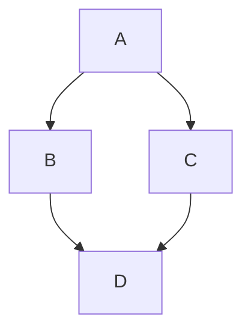

# GitLab Flavored Markdown Syntax

This reference covers syntax verified in the current [GitLab Flavored Markdown documentation](https://docs.gitlab.com/user/markdown/). GitLab Docs and the GitLab handbook use different Markdown implementations.

## Alerts

Use blockquote syntax followed by one of the five documented alert types. Text on the marker line replaces the alert title.

```markdown
> [!note]
> The following information is useful.

> [!warning] Data deletion
> The following instructions will make your data unrecoverable.
```

The five alert types are `note`, `tip`, `important`, `caution`, and `warning`. GitLab documentation uses lowercase alert markers; keep examples lowercase and explicitly use `> [!warning]` for warnings.

SOURCE: <https://docs.gitlab.com/user/markdown/#alerts> (accessed 2026-09-21)

## Collapsible Content

`details` and `summary` elements create collapsible content. Markdown is supported inside these elements when Markdown lines are separated onto their own lines and have blank lines before and after them.

````html
<details>
<summary>

Click to _expand._

</summary>

These details _remain_ **hidden** until expanded.
```
PASTE LOGS HERE
```

</details>
````

SOURCE: <https://docs.gitlab.com/user/markdown/#collapsible-section> (accessed 2026-09-21)

## Mermaid

GitLab supports Mermaid version 11. Declare `mermaid` on a fenced block to generate a diagram or flowchart.

````markdown

````

SOURCE: <https://docs.gitlab.com/user/markdown/#mermaid> (accessed 2026-09-21)

## Task Lists

Tasks can be complete, inapplicable, or incomplete.

```markdown
- [x] Completed task
- [~] Inapplicable task
- [ ] Incomplete task
```

SOURCE: <https://docs.gitlab.com/user/markdown/#task-lists> (accessed 2026-09-21)

## Table of Contents

Place either tag on its own line:

```markdown
[[_TOC_]]
```

```markdown
[TOC]
```

Tables of contents are supported in Markdown files, wiki pages, and issue, merge request, and epic descriptions. They are not supported in notes or comments.

SOURCE: <https://docs.gitlab.com/user/markdown/#table-of-contents> (accessed 2026-09-21)

## GitLab References

Common GitLab-specific reference forms include:

| Object | Form |
|---|---|
| User | `@user_name` |
| Issue | `#123` |
| Merge request | `!123` |
| Label | `~bug` |
| Milestone | `%v1.23` |
| Snippet | `$123` |

GitLab-specific references are not supported in Markdown snippet files.

SOURCE: <https://docs.gitlab.com/user/markdown/#gitlab-specific-references> (accessed 2026-09-21)

## Math and Colors

GitLab renders a subset of LaTeX through KaTeX. For inline math, wrap a backtick code span with dollar signs as shown below; use a `$$` block for display math.

```markdown
This math is inline: $`a^2+b^2=c^2`$.

$$
a^2+b^2=c^2
$$
```

In the GitLab application, but not GitLab documentation, backticked HEX, RGB, and HSL values display a color chip.

```markdown
- `#FF0000`
- `RGB(0,255,0)`
- `HSL(540,70%,50%)`
```

SOURCE: <https://docs.gitlab.com/user/markdown/#math> (accessed 2026-09-21)
SOURCE: <https://docs.gitlab.com/user/markdown/#colors> (accessed 2026-09-21)

## Code, Tables, Footnotes, and Emoji

Append a language to an opening code fence to apply syntax highlighting. A block with no declared language has no syntax highlighting.

````markdown
```yaml
stages: [test]
```
````

Add colons to the separator row to align table columns.

```markdown
| Left | Center | Right |
| :--- | :----: | ----: |
| Text | Text | Text |
```

A footnote requires a reference and a separate definition line.

```markdown
Text with a footnote[^1].

[^1]: The note content.
```

Emoji use `:name:` shortcodes, such as `:smile:`.

SOURCE: <https://docs.gitlab.com/user/markdown/#code-spans-and-blocks> (accessed 2026-09-21)
SOURCE: <https://docs.gitlab.com/user/markdown/#tables> (accessed 2026-09-21)
SOURCE: <https://docs.gitlab.com/user/markdown/#footnotes> (accessed 2026-09-21)
SOURCE: <https://docs.gitlab.com/user/markdown/#emoji> (accessed 2026-09-21)

## Front Matter

Front matter is supported only in Markdown files and wiki pages. It must be at the top of the document between delimiters, and GitLab displays it as-is in a box above the content.

```yaml
---
title: About Front Matter
example:
  language: yaml
---
```

SOURCE: <https://docs.gitlab.com/user/markdown/#front-matter> (accessed 2026-09-21)

## Inline HTML and Sanitization

GitLab permits raw HTML through an allowlist sanitizer. In addition to the default sanitizer allowlist, GitLab documents `span`, `abbr`, `details`, and `summary` as allowed elements. The sanitizer rejects unsafe protocols and restricts attributes, classes, IDs, and inputs.

SOURCE: <https://docs.gitlab.com/user/markdown/#inline-html> (accessed 2026-09-21)
SOURCE: <https://gitlab.com/gitlab-org/gitlab/-/blob/master/lib/banzai/filter/base_sanitization_filter.rb> (accessed 2026-09-21)
SOURCE: <https://gitlab.com/gitlab-org/gitlab/-/blob/master/lib/banzai/filter/sanitization_filter.rb> (accessed 2026-09-21)

## Accessibility

Use one `h1`, do not skip heading levels, and nest headings correctly. Give images and videos accurate, succinct, unique alt text.

SOURCE: <https://docs.gitlab.com/user/markdown/#accessibility> (accessed 2026-09-21)
