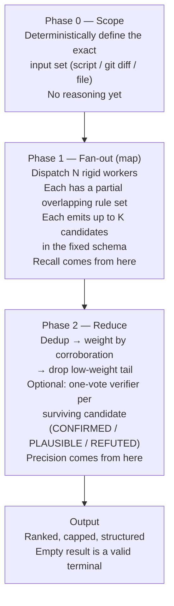
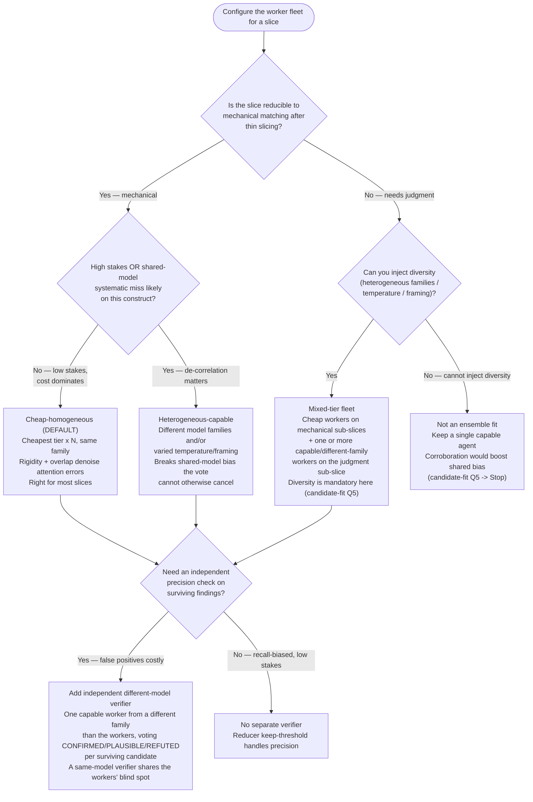

# Ensemble Rule Review

A skill-design pattern for rule-following work. Instead of one agent holding the whole ruleset
in a single pass, partition the ruleset across multiple rigid, parallel sub-agents whose
coverage deliberately overlaps. Collect findings in a fixed schema, then weight by
cross-agent corroboration and drop the low-weight tail. Worker model tier is a knob: the cheapest
tier is the default for mechanical-matching slices; escalate to a more capable tier or
heterogeneous families when a slice needs judgment or when de-correlating shared-model bias
matters more than cost.

## The Problem It Solves

A single agent holding a large ruleset (10+ criteria) and reviewing non-trivial input:

- Is slow (it reasons across the whole rubric serially).
- Silently drops criteria — attention degrades as the rule list grows, so coverage is
  incomplete and you cannot tell which rules were actually applied.

This is the same failure mode as instruction bloat: more rules in one context window means
higher probability each individual rule is under-applied.

## The Mechanism (6 Parts)

1. **Control header.** One line at the top compiles an effort/scale parameter into concrete
   knobs: worker count, candidates per worker, verify policy, output cap. The same skill body
   scales rigor by the parameter. Two further knobs — **worker model tier** and **worker
   diversity** (homogeneous vs heterogeneous families / temperature / prompt framing) — are
   selected separately, by error-correlation structure and stakes rather than by the effort
   parameter, so they do not auto-scale with it. See "Model and Effort Guidance" for their
   selection criteria.

2. **Deliberate overlap, not just partition.** Worker scenarios are engineered so their goals
   INTERSECT. A genuine finding falls inside multiple workers' coverage and is reported more
   than once. A hallucination falls inside one worker's blank-filling and is reported once.
   Overlap converts N cheap opinions into a signal-to-noise instrument. Pure non-overlapping
   partition gives speed but NOT denoising. For the overlap construction, use a balanced rotating
   assignment (cyclic block design — N groups, N agents, each agent a window of w groups) so every
   rule gets equal redundancy; see the playbook's "Balanced rotating overlap" section.

3. **Zero-creativity workers.** Each sub-agent gets a rigid, explicit process and a PARTIAL
   rule set — stated methodology, fixed output schema, no interpretation latitude. Shrink each
   worker's job until it is mechanical matching, which is the band where a cheap model is
   reliable.

4. **Match worker tier to inference load.** The load-bearing invariants are *rigid + partial
   ruleset + parallel* — they are what make this pattern work, and they hold at any tier. Worker
   tier is a knob layered on top: the cheapest tier is the default because the design has already
   removed inference from the worker's job, so a model that is unreliable at open-ended inference
   is reliable at mechanical matching. Cheapness is an **economics enabler** — it makes running
   several overlapping workers over the same input affordable — not a core mechanism. Escalate the
   tier (or go heterogeneous) when a slice still requires judgment or when shared-model error must
   be de-correlated; the invariants stay fixed, only the tier knob moves.

5. **Fixed candidate schema.** Every worker emits the same shape (e.g., `rule_id, location,
   verdict, evidence`). This contract makes dedup, corroboration counting, and merge possible.

6. **Corroboration weighting + drop the tail (the reducer).** The orchestrator collects all
   findings, deduplicates near-identical ones, raises weight for findings corroborated across
   overlapping workers and sinks lone-worker findings, trashes the low-weight tail, keeps the
   high-weight set. A single worker's *random* hallucination sinks below the keep threshold ONLY
   when the precision gate is set (`keep_threshold = window`); the default `keep_threshold = 1` is
   recall-biased — it dedups and ranks but drops nothing. Caveat: the precision gate drops lone
   findings of ALL kinds, including a true critical that only one worker's slice happened to cover —
   so exempt `critical`/`high` severity from the tail cut and surface them flagged-but-uncorroborated
   rather than silently dropping them.

## Why It Works

More total facts pass through cheap/fast workers, and corroboration weighting cancels the noise —
for ONE of two error sources. Overlapping rule slices denoise *coverage / attention* variance: a
rule a worker under-applies in one pass is caught by another worker holding an overlapping slice.
This is bagging / majority-vote ensembling applied to LLM rule-checking, and it is the genuine win.

It does NOT cancel *shared-model bias*. A construct the worker model systematically misreads is
misread the same way by every worker that shares that model, so corroboration weighting *boosts*
that shared
error instead of cancelling it. The variance of an N-worker average floors at the correlated-error
term ρσ² — the part adding workers cannot average away (the random-forest / correlated-Condorcet
result). Net: the surviving set is more reliable than one cheap agent on attention errors, and no
more reliable on systematic ones. The rule partition is a real de-correlation axis, but it varies
*which rules* each worker checks, not *how* it reasons over the shared input — so to denoise the
second source it must be paired with diversity on the axes it does NOT vary (worker model family,
temperature, prompt framing) and a keep threshold calibrated on labelled data.

SOURCE: User-reported result (conversation 2026-05-30, not independently reproduced): a
scientific-journal review skill — one Sonnet agent holding the full ruleset took 14-18 minutes
on a 300-line file and returned 13 findings. Splitting the rules into 4 categories and running
4 Haiku agents (each with a partial rule list) on the same file returned 14 findings in
25 seconds — comparable recall, ~35x faster.

## Pipeline Phases

## Degrees of Freedom

| Component | Freedom | Reason |
|-----------|---------|--------|
| Worker process & schema | HIGH rigidity / LOW freedom | Rigid rule list, fixed schema; shrinks job to mechanical matching |
| Worker model tier & diversity | TUNABLE knob — select by criterion | Cheapest homogeneous tier is the default for mechanical-matching slices; escalate to a more capable tier or heterogeneous families for judgment-heavy / high-stakes / very-large-ruleset slices to de-correlate shared-model error |
| Reducer + output contract | LOW freedom | Fixed verdict set, fixed schema, hard cap |

## Model and Effort Guidance

Tier and worker diversity are **knobs**, not fixed values. Select them by matching to
per-rule competence, error-correlation structure, and stakes — the same axis the experiment
matrix names as THE de-correlation lever ([./references/experiment-matrix.md](./references/experiment-matrix.md),
"worker model" row) and the fit gate tests as a mandatory converse ([./references/candidate-fit.md](./references/candidate-fit.md),
Q5 + rubric #5). Set the chosen tier in the worker agent's frontmatter `model:` field — never as
a prose mandate ([./references/instruction-hygiene.md](./references/instruction-hygiene.md) §3).

- **Workers — cost default (mechanical-matching slices):** cheapest tier, effort low. When the
  design has shrunk the job to mechanical matching, a homogeneous fleet at the cheapest tier is
  correct: the rigidity makes it reliable and the overlap denoises single-worker attention errors.
  This is the right default for most slices. **Don't overpay for mechanical work.**
- **Workers — escalate (judgment-heavy slices, high-stakes review, very large rulesets):** raise
  to a more capable tier and/or use heterogeneous model families (and varied temperature / prompt
  framing) to de-correlate shared-model error. Escalate when a slice cannot be reduced to
  mechanical matching, when the cost of a shared systematic miss exceeds the cost of stronger
  workers, or when the ruleset is large enough that even a strong single agent's attention
  degrades across it. **Don't underpay for judgment work** — a cheap homogeneous fleet on a
  judgment slice just corroborates the same blind spot.
- **Reducer / orchestrator:** mid tier, effort medium. It weights and merges; this job needs
  more inference than a worker slice and is not parallelized N-fold, so the cost case differs.
- The economics rule is **"match worker tier to inference load,"** not "always cheapest." Running
  one capable or different-family worker alongside cheap workers is a deliberate de-correlation
  choice, not waste.

SOURCE: `/plugin-creator:agentskills` — degrees-of-freedom guidance and model selection by
task cognitive requirement. Tier/diversity-as-knob criteria: `./references/experiment-matrix.md`
(worker-model de-correlation lever) and `./references/candidate-fit.md` (Q5 + rubric #5 diversity gate).

## Composition Framework (tier × diversity × stage)

A compact selection aid: pick a fleet composition by matching the dominant error source and the
stakes of the slice, not by a blanket cost rule. The flowchart branches on the discriminator
(error-correlation structure / stakes / cost); the four compositions below are the leaves.

**Diversity is multi-axis.** Worker diversity is not only model family / temperature / prompt
framing — it ALSO includes **role / persona / expert-framework diversity** (e.g. distinct advisor
personas, each carrying a different expert lens, over one unbounded problem). Treat role/persona as
a first-class diversity axis alongside the model-level axes when de-correlation matters.

**Reduce method follows boundedness.** Bounded / mechanical rule-checking → corroboration-weight +
drop-tail over a cheap homogeneous swarm (this skill); unbounded / judgment problems → escalate to
synthesis across diverse lenses (a capable, role-diverse panel), whose reduce step is synthesis, not
corroboration counting (see [./references/methodology-selection.md](./references/methodology-selection.md)).
Example: a cheap mechanical codebase-rule swarm (this skill) vs a role-diverse strong advisor panel
on an open design question (synthesis, not this skill's reducer).

**The four compositions, by selection criterion:**

- **Cheap-homogeneous (the default):** mechanical-matching slice, low stakes, cost dominates.
  Cheapest tier, one family, N workers. The rigidity plus overlap denoise attention errors; this
  is correct for most slices.
- **Heterogeneous-capable:** mechanical or near-mechanical slice where a *shared-model systematic
  miss* is the dominant risk, or stakes are high. Vary model family / temperature / prompt framing
  to de-correlate the error the vote cannot otherwise cancel (the floor at ρσ²; see "Why It Works").
- **Mixed-tier fleet:** the slice has both mechanical and judgment sub-parts. Run cheap workers on
  the mechanical sub-slices and one or more capable / different-family workers on the judgment
  sub-slice. Per `candidate-fit.md` Q5, diversity is mandatory once judgment is involved.
- **Independent different-model verifier (Phase 2 add-on):** when false positives are costly, add
  one capable verifier from a *different family than the workers* to vote on each surviving
  candidate. A same-family verifier shares the workers' blind spot and adds little.

Criterion in one line: **mechanical + low-stakes → cheap-homogeneous; shared-bias risk or high
stakes → heterogeneous; mixed work → mixed-tier; costly false positives → add an independent
different-model verifier.** Set the chosen tiers via each worker agent's frontmatter `model:`
field. Full factor sweep: [./references/experiment-matrix.md](./references/experiment-matrix.md).

## When to Use / When Not to Use

For the full go/no-go decision — candidate signals, the ensemble-denoising-vs-other-flavor
alignment check, and the fit-killer where corroboration boosts shared-model bias — load
[./references/candidate-fit.md](./references/candidate-fit.md). To choose among the wider family of
fan-out methodologies (work-partition, Best-of-N, debate, DAG) when this skill is not the right one,
load [./references/methodology-selection.md](./references/methodology-selection.md).

**Use when:**

- Rule-following / checklist / rubric work with 10+ independent criteria.
- A single agent currently applies the whole ruleset in one pass (slow + silent drops).
- The ruleset can be split into scenario-bound jobs with some overlap.

**Do NOT use when:**

- Single-pass transforms with no ruleset (map-reduce overhead exceeds the return).
- Tasks needing one coherent creative judgment that cannot be partitioned without losing whole-picture context.
- Rulesets under ~5 criteria (splitting yields little).

**Multi-phase / sequential workflows are NOT disqualified.** Do not score the whole pipeline as
one unit — score each phase. A sequential workflow is the conductor; each rule-following phase
becomes its own internal ensemble and each independent-work phase becomes a work-partition
fan-out, while the phase ordering stays sequential. There are two fan-out flavors:

- **Ensemble-denoising** (this skill's core) — same input, overlapping rule slices, corroboration
  weighting. For checking / review / rubric phases.
- **Work-partition** — disjoint independent work items in parallel, no corroboration, pure
  speedup. For generative phases (implement N functions, write N test files, scan N docs).

See [./references/composing-in-workflows.md](./references/composing-in-workflows.md) for the
per-phase classification rule and a worked map of a 9-phase workflow.

## How to Partition the Ruleset

**Explicit lists — partition is free.** When the ruleset already names its categories, those
categories ARE the worker boundaries. Examples:

- Named principle frameworks: the 12 factors of twelve-factor; the 5 SOLID principles;
  OWASP categories for a security review; WCAG criteria for accessibility; Nielsen's 10
  usability heuristics for a UI critique.
- An enumerated `## Checklist` or `## Quality Criteria` section.

**Implicit lists — enumerate first, then partition.** A rubric is named but not enumerated;
make it explicit, then split. Examples:

- "look for modernization opportunities" → an explicit PEP roster (585 generics, 604 unions,
  572 walrus, 634 match, 673 Self, StrEnum, tomllib, pathlib, dataclasses) → buckets.
- "ensure it's pythonic / idiomatic" → comprehensions, context managers, EAFP,
  enumerate/zip, mutable-default-arg, truthiness.
- "review for quality" → correctness / error-handling / naming / dead-code / structure.
- "follow best practices" / "avoid anti-patterns" → enumerate the named patterns.

**The tell:** any instruction containing "ensure … follows", "review for", "look for …
opportunities", or a named framework is an implicit (or pre-partitioned) checklist.

For the full typology of implicit-checklist patterns grouped by partition-readiness — named
principle sets, "modernization / idiomatic / pythonic", "review X for quality", and
prompt-engineering / skill-quality self-review (with per-pattern examples) — load
[./references/partitioning-patterns.md](./references/partitioning-patterns.md).

## Operational Use

Two procedures and one reusable contract turn this pattern from concept into action:

- **Convert an existing single-pass skill into the ensemble form** — follow
  [./references/conversion-workflow.md](./references/conversion-workflow.md). (Also the recipe for
  standardizing the `multi-perspective-review` prior art below.)
- **Run an ensemble ad hoc, mid-task, as an orchestrator** — follow
  [./references/orchestrator-playbook.md](./references/orchestrator-playbook.md): the
  recognize → decompose → dispatch → reduce loop, the partition knobs, and the
  corroboration-weighting reducer algorithm.
- **Reusable worker contract** — copy
  [./assets/worker-prompt-skeleton.md](./assets/worker-prompt-skeleton.md): the rigid worker
  prompt and the fixed candidate schema both procedures share.
- **Planner script** — run `./scripts/plan_ensemble.py RULES.json --report-dir /abs/dir` (tested;
  `./scripts/test_plan_ensemble.py`) to compute the rotating-overlap assignment deterministically.
  It assigns each worker its groups + an absolute OUTFILE, tags rules per-group, verifies uniform
  redundancy, and prints the recommended `--keep-threshold` — removing the manual bookkeeping that
  caused this session's bugs (wrong paths, drifted group ids, ad-hoc overlap, per-worker tagging).
- **Reducer script** — run `./scripts/reduce.py` (tested; `./scripts/test_reduce.py`) over the
  worker output files to dedup, corroboration-weight on `(group, location)`, drop the tail, and
  rank. Workers emit a stable `group` id (the corroboration key) plus a free-form `rule` slug
  (descriptive only) — keying on the slug would never corroborate, since workers name rules
  differently.
- **Measure whether it actually works** — follow
  [./references/measuring-success.md](./references/measuring-success.md): the free no-gold-set
  weight-distribution diagnostic, precision/recall/F1 against a labelled set, and the falsification
  tests. Never measure by finding count.
- **Tune weighting, workers, prompts, and output schema** — use the factor matrix and cheapest-first
  ablation order in [./references/experiment-matrix.md](./references/experiment-matrix.md).
- **Keep prompts, skills, and agents clean before shipping** — run the pre-ship checklist in
  [./references/instruction-hygiene.md](./references/instruction-hygiene.md) on every prompt, skill,
  and agent (and any A/B harness arms) to catch leaked implementation detail and inconsistent
  instruction sets.

The two scripts are deterministic bookends around the only fuzzy step (the LLM workers' rule
matching): **plan_ensemble.py → spawn focused-reviewer ×N → reduce.py**.

### The worker agent

Spawn the `plugin-creator:focused-reviewer` agent as each map worker — a lean haiku agent with
minimal tools (`Read, Grep, Glob, Bash, Write`) and no inherited skills, built to apply one rule
slice and emit the fixed schema. Do NOT use `general-purpose` workers: they inherit every skill
and MCP tool description, adding a large constant token cost to every one of the N parallel
workers. For web/API targets, the spawner adds the one specific MCP tool to the worker's tools.

### Partition the ruleset, not the input

Every worker reviews the SAME input; only its rule slice differs. The denoising comes from
overlapping rule coverage on shared input — multiple workers independently reaching the same
finding, which the reducer counts as corroboration. Sharding the input instead (different files
per worker) buys speed but NOT denoising, because no two workers can corroborate the same
location. Shard input only as a secondary axis when one worker cannot hold the whole input, and
keep rule-overlap within each shard.

## Prior Art and Reference Implementation

The pattern is already running in-repo as a partial implementation:

- `plugins/development-harness/skills/multi-perspective-review/SKILL.md` — a working 4-worker
  parallel review fan-out (Security, Performance, Quality, Accessibility) with per-worker SOPs
  and a merge gate.
- `plugins/development-harness/agents/reviewer-{security,quality,performance,accessibility}.md`
  — the rigid worker agents.

It lacks two pieces vs the full pattern: a fixed candidate schema and an explicit
corroboration-weight reducer (it merges by any-REJECT, not corroboration weighting).

The control-header + finder-angles + constrained-verdict-verify + capped-output structure
originates in the Anthropic-bundled `/code-review` built-in skill.

SOURCE: `/plugin-creator:agentskills` — progressive disclosure, lean SKILL.md, skill packaging
discipline.

For the ranked catalog of in-repo conversion candidates (Tier 0-3, clusters C1-C9), load
[./references/conversion-candidates.md](./references/conversion-candidates.md).
