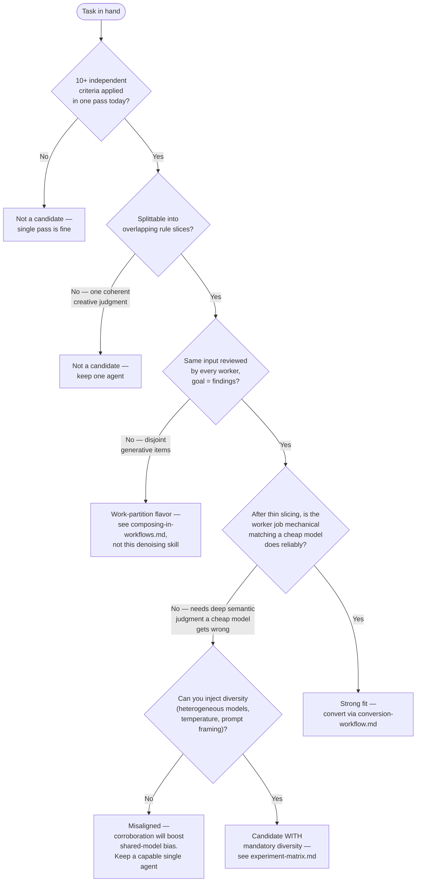

# Candidate Fit — Is This Task a Good Candidate, and Will It Align?

Two questions, answered in order. First: is this task the kind of work the ensemble pattern helps
at all? Second: does it align with the ensemble-DENOISING flavor specifically, or with one of the
other fan-out families? A task can be a fine fan-out candidate and still be the wrong fit for
corroboration weighting.

## Question 1 — Is this a good candidate?

The pattern pays off only when three things are all true. If any is false, the map-reduce overhead
exceeds the return.

| Signal | Good candidate | Poor candidate |
|---|---|---|
| Rule count | 10+ independent criteria applied per pass | Under ~5 criteria (splitting yields little) |
| Current execution | One agent holds the whole ruleset in one pass (slow, silent criteria-drops) | Already fast and reliable single-pass |
| Partition-ability | Ruleset splits into scenario-bound slices that can overlap | One coherent judgment that loses meaning when split |
| Worker job after partition | Shrinks to mechanical matching a cheap model does reliably | Requires deep semantic inference no matter how thin the slice |

The recognition tell: any instruction containing "ensure … follows", "review for", "look for …
opportunities", or a named framework (OWASP, WCAG, SOLID, the 12 factors, Nielsen's heuristics) is
an explicit or implicit checklist — a candidate. For the full implicit-checklist typology, see
[./partitioning-patterns.md](./partitioning-patterns.md).

## Question 2 — Will it align with ensemble-denoising specifically?

This is the question that catches the expensive mistake. There are two fan-out flavors, and they
are not interchangeable:

- Ensemble-denoising (this skill): same input to every worker, overlapping rule slices,
  corroboration weighting. For checking / review / rubric work where the goal is recall + precision
  on findings.
- Work-partition: disjoint independent items in parallel, no corroboration, pure speedup. For
  generative work (implement N functions, write N test files, scan N docs).

If the task is generative or its items are independent, you want work-partition, not this skill —
the corroboration machinery has nothing to count. See
[./composing-in-workflows.md](./composing-in-workflows.md) for the per-phase classification, and
[./methodology-selection.md](./methodology-selection.md) to route to other families (Best-of-N,
debate, DAG).

## The fit-killer — when corroboration manufactures false confidence

Even a clean checklist candidate misaligns with this pattern when the rules require judgment a
cheap model systematically gets wrong on the shared input. Corroboration weighting denoises
*independent attention lapses* (one worker happens to under-apply a rule it holds) but cannot
denoise *shared-model bias* (a construct the cheap model reliably misreads is misread identically
by every worker that sees it). Agreement among workers that share a model and an input is not
independent evidence on those constructs — it is shared bias, and the reducer boosts it.

SOURCE: Bagging reduces variance not bias, with the N-estimator average floored at the
correlated-error term ρσ² (Breiman, *Bagging Predictors*, 1996; *Random Forests*, 2001; Hastie/
Tibshirani/Friedman, *Elements of Statistical Learning* §15.2). Majority-vote competence stops
converging to truth under positively correlated voters (Kaniovski, *Aggregation of correlated
votes and Condorcet's Jury Theorem*, Theory and Decision 69:453-468, 2010).

Disqualifying smell: the rules need whole-input semantic reasoning that a Haiku-tier worker fails
on, AND you cannot supply diversity (heterogeneous worker models, varied temperature/prompt
framing) to de-correlate that failure. In that case either keep a single capable agent, or pair
the partition with diversity on the axes it does not vary (see the parent SKILL.md "Why It Works"
and [./experiment-matrix.md](./experiment-matrix.md)).

## Go / no-go decision

## Quick scoring rubric

Score each 0/1; 4-5 is a strong fit, 2-3 convert only with diversity injected, 0-1 do not use:

1. Ruleset has 10+ independent, enumerable criteria.
2. Currently applied in a single pass that drops criteria or is slow.
3. Rules split into slices that stay in the mechanical-matching band.
4. Every worker reviews the same input and the goal is findings (not generation).
5. Either the work is low-inference, OR worker diversity is available to de-correlate shared errors.
