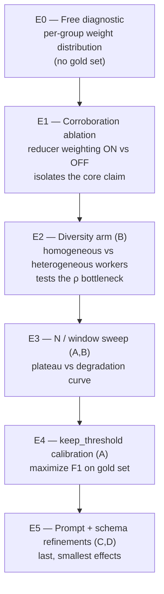

# Experiment Matrix — Optimizing Weighting, Reviews, Instructions, and Output

A design-of-experiments matrix for tuning an ensemble. Four factor groups map to the four things
worth optimizing: the weighting (reducer), the reviews (workers), the task instructions (prompts),
and the output structure (schema). Vary one group at a time against the metrics in
[./measuring-success.md](./measuring-success.md); never change several at once (the origin anecdote
confounded model tier, architecture, and measurement and proved nothing).

## Factors and levels

### A. Weighting (the reducer)

| Factor | Levels | Effect to watch |
|---|---|---|
| keep_threshold | 1 (recall) / 2 / majority `ceil(window/2)+` / `window` (strict) | Precision-recall trade; calibrate on gold set |
| window `w` (overlap degree) | 2 / 3 / higher | Higher = stronger denoising + cost; raises uniform redundancy `r=w` |
| weight function | distinct-agent count / count blended with severity / count blended with evidence presence | Whether severity or evidence should lift weak-corroboration findings |
| corroboration key | `(group, location)` / `(group, normalized location)` | Path normalization granularity; never key on the free-form rule slug |
| minority-report carve-out | off / exempt critical+high from tail cut | Recovers lone true criticals; risks surfacing lone systematic false positives (guard with verifier) |

### B. Reviews (the workers)

| Factor | Levels | Effect to watch |
|---|---|---|
| worker model | homogeneous cheap (Haiku x N) / heterogeneous families | THE de-correlation lever; heterogeneous lowers shared-error ρ |
| temperature | fixed low / varied across workers | Restores independent error patterns the vote can cancel |
| worker count N | 3 / 5 / 7 | Interacts with window; watch for F1 degradation (correlated voters) |
| slice size | 1 group / `w/N` of rules / broad | Too broad returns the worker to silent criteria-dropping |
| effort | low / medium | Low keeps cost down but suppresses sampling diversity |

### C. Task instructions (the prompts)

| Factor | Levels | Effect to watch |
|---|---|---|
| within-group prompt framing | identical / varied reasoning framing across workers sharing a group | Stops sibling workers reasoning into the same blind spot on shared input |
| rigidity | strict mechanical-matching / some latitude | Latitude reintroduces inference cost and error variance |
| detection method spec | implicit / explicit per-rule detection steps | Explicit steps raise recall and cut hallucination |
| out-of-scope blocker field | absent / single bounded field | Recovers severe out-of-slice findings without free reasoning |

### D. Output structure (the schema)

| Factor | Levels | Effect to watch |
|---|---|---|
| schema fields | minimal `(group, location, verdict, evidence)` / + severity / + confidence | Confidence only as a tiebreaker behind weight+evidence; never a primary gate |
| candidates cap per worker | none / ≤ K | Bounds a confused worker from flooding the reducer |
| verdict set | VIOLATION/PASS / + PLAUSIBLE | Richer verdicts enable a verifier second pass |
| schema versioning | none / version header + contract test on worker output | Prevents silent zero-findings when a worker drifts its output shape |

## Ablation order (cheapest and most diagnostic first)

Run E0 before building any gold corpus — if weight is near-degenerate, fix worker diversity (E2
factors) before spending on labels. E1 and E2 answer whether the pattern beats a plain dedup pass
at all; do them before fine-tuning thresholds or prompts.

## Design-of-experiments notes

- One factor group at a time. With a gold set, a fractional-factorial design can test main effects
  of A-D efficiently, but only after E1/E2 confirm the core mechanism works — optimizing a
  degenerate instrument wastes runs.
- Control confounds: hold model tier, input, and metric fixed while varying one factor. The headline
  speed/quality conflation in the origin anecdote is the anti-pattern.
- Repeat each cell 5+ times for variance; LLM runs are non-deterministic.
- Score every cell on F1, precision, recall, false-positive rate on injected systematic errors,
  latency, and cost — the full metric set in [./measuring-success.md](./measuring-success.md), not
  finding count.

## What to optimize toward

The objective is not "more findings." It is: highest F1 against the gold set at acceptable cost,
with the corroboration step demonstrably adding F1 over dedup-only (E1) and the weight distribution
demonstrably discriminating (E0). If E1 shows no lift, ship the cheaper dedup-only reducer and drop
the weighting; if E2 shows heterogeneous workers win, make worker diversity part of the skill's
default, not an option.
