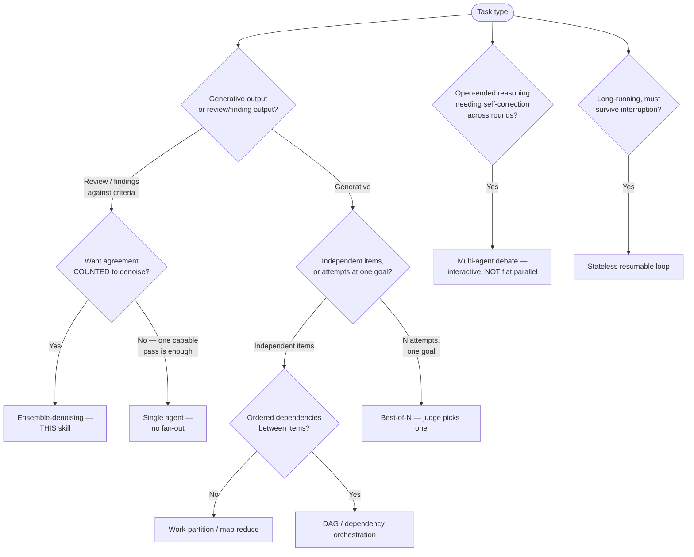

# Methodology Selection — Which Fan-Out Family Fits My Task Type?

Ensemble-rule-review is one member of a family of multi-agent fan-out methodologies. They share a
map-reduce skeleton (run several agents, then merge) but differ in what the workers do and how the
merge works. Picking the wrong member is the common failure: applying corroboration weighting to a
generative task, or a single-judge tournament to a task that needed agreement counting.

This guide routes a task type to the right methodology. Use it before reaching for this skill — if
another family fits better, this skill is the wrong tool.

PROVENANCE: the six-family framing below is the convergent taxonomy from a colleague's internal
design reference (the "thesis"; uncited design-opinion, used here only as the organizing frame).
Each family's mechanics and trade-offs are grounded in the cited literature, not the reference doc.

## The families

| Family | Workers do | Merge step | Best for | Anchor |
|---|---|---|---|---|
| Ensemble-denoising (this skill) | Apply overlapping rule slices to the SAME input | Count corroboration on `(group, location)`, drop tail | Review / checklist / rubric where recall + precision on findings matter | Self-consistency vote (Wang 2022); bagging (Breiman 1996) |
| Work-partition / map-reduce | Each handles a DISJOINT item independently | Concatenate / collect, no agreement count | Generative breadth: implement N functions, write N tests, scan N docs | [./composing-in-workflows.md](./composing-in-workflows.md) |
| Best-of-N / tournament | N attempts at the SAME goal | A judge selects ONE winner (selection, not vote) | Generation where you want the single best of several attempts | Best-of-N selection (verifier/reward family; e.g. Cobbe et al. verifiers) |
| Multi-agent debate | Propose, then critique and revise across ROUNDS | Converge / majority after interaction | Open-ended reasoning, factuality, hard problems needing self-correction | Du et al. 2023 (arXiv:2305.14325); Liang et al. 2023 (arXiv:2305.19118) |
| DAG / dependency orchestration | Specialized roles on ORDERED dependent subtasks | Coordinator composes results | Multi-stage work with dependencies and distinct roles | Work-partition with ordering; coordinator/synthesizer roles |
| Stateless resumable loop | One agent iterates with externalized state | Reduce accumulated state, resume on failure | Long-running or iterative work that must survive interruption | (orchestration pattern; design-opinion) |

## The discriminator that matters most

The single question that separates this skill from its nearest neighbours:

Does the merge step COUNT AGREEMENT across independently produced outputs, and upweight findings
that appear in multiple workers? If yes, you want ensemble-denoising (this skill). If the merge
just picks one winner (Best-of-N), synthesizes free text (Mixture-of-Agents), or runs an agent at
a time (debate, reflection), you do not — and forcing this skill's reducer onto those tasks adds
machinery with nothing to count.

SOURCE: across surveyed OSS frameworks (AutoGen, CrewAI, CAMEL, LangGraph, OpenAI Agents SDK,
Together MoA, 2026-06-03), only AutoGen's multi-agent-debate pattern ships a true majority-vote
reducer, and only for extractable (math) answers. MoA uses a generative-synthesis aggregator, not
an agreement count; OpenAI's parallelization and CAMEL's CriticAgent pick best-of-N. The
engineered-overlap + rigid-workers (cheap by default for mechanical slices; escalate tier or
diversify when judgment or shared-error risk warrants) + fixed-schema + frequency-weighted-reducer
combination is this skill's distinct contribution.

## Selection flow

## Families can compose within one workflow

A sequential workflow is the conductor; each phase picks its own family. A review phase becomes an
internal ensemble-denoising fan-out; a generative phase becomes a work-partition fan-out; a
selection phase becomes Best-of-N. Do not score the whole pipeline as one unit — classify per
phase. See [./composing-in-workflows.md](./composing-in-workflows.md) for the per-phase rule and a
worked multi-phase map.

## Why debate and Mixture-of-Agents are NOT this skill

They are cited in the wider literature as multi-agent wins, but they map poorly onto ensemble-
denoising and should not be used as justification for it: both are interactive/layered — agents
read each other and revise — whereas this skill's workers are flat, parallel, and non-communicating
by design. Their value comes from inter-agent exchange and model diversity introduced through
sequential, layered interaction — not from flat, parallel agreement counting. This skill's workers
are flat and non-communicating by design; worker model diversity is a separate knob (see
experiment-matrix.md §B) that this skill uses for de-correlation, not for inter-agent reasoning.

SOURCE: Du et al. 2023; Liang et al. 2023 (debate is sequential/interactive); Wang et al. 2024
*Mixture-of-Agents* (arXiv:2406.04692, layered with cross-layer conditioning and deliberately
heterogeneous models).
