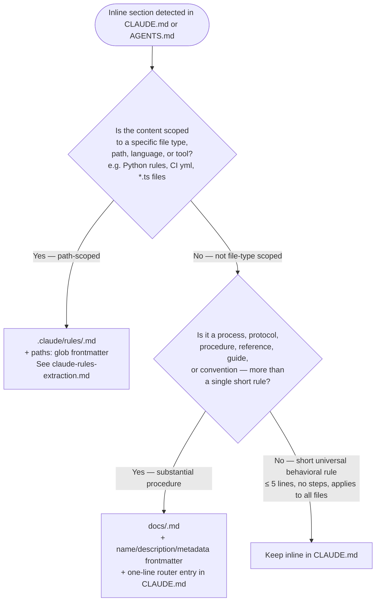

# Index Discipline Reference

`CLAUDE.md` and `AGENTS.md` are **indexes**, not instruction documents. Every entry is a
routing decision that lets an agent decide "is this relevant to my current task?" without
opening the file. The linked document owns all rules, rationale, examples, commands, and
edge cases.

---

## Table of Contents

1. [The two extraction mechanisms](#the-two-extraction-mechanisms)
2. [When to use each mechanism (discriminator)](#when-to-use-each-mechanism-discriminator)
3. [Two-step saving process](#two-step-saving-process)
4. [Router entry format](#router-entry-format)
5. [Index discipline rules](#index-discipline-rules)
6. [Index audit checks (binary pass/fail)](#index-audit-checks-binary-passfall)
7. [Good vs bad router entries](#good-vs-bad-router-entries)

---

## The two extraction mechanisms

This project has two mechanisms for moving content out of `CLAUDE.md`/`AGENTS.md`. They are
**not interchangeable** — use the discriminator below to choose.

| Mechanism | Destination | Frontmatter | Auto-loaded? | Route in CLAUDE.md |
|-----------|-------------|-------------|-------------|-------------------|
| Path-conditional rules | `.claude/rules/<slug>.md` | `paths: [glob]` | Yes — by Claude Code when editing matching files | Plain bullet: `- Topic: .claude/rules/file.md` |
| Process / protocol docs | `docs/<slug>.md` | `name`, `description`, `metadata.type` | No — agent decides relevance from router entry hook | One-line hook: `[Title](docs/file.md) — <operative fact>` |

The extraction procedure for `.claude/rules/` is in
[`./claude-rules-extraction.md`](./claude-rules-extraction.md).
This document covers the `docs/` index-routing mechanism only.

---

## When to use each mechanism (discriminator)



**Test cases against this partition:**

| Content | Decision | Reason |
|---------|----------|--------|
| Python coding rules | `.claude/rules/` | Activates when editing `**/*.py` |
| CI workflow rules | `.claude/rules/` | Activates when editing `.github/workflows/**/*.yml` |
| Debugging Protocol | `docs/` | Not file-scoped; substantial multi-step procedure |
| Release Verification | `docs/` | Not file-scoped; substantial protocol |
| Lock Hardware Terminology | `docs/` | Not file-scoped; reference with distinct concepts |
| "Be concise" | Keep inline | Short universal behavioral directive |
| "Never suppress exceptions" | Keep inline | Short universal constraint, no path scope |

---

## Two-step saving process

Saving a process or protocol is a two-step atomic operation. Both steps must complete — do
not write one without the other.

**Step 1 — Write the document to `docs/`:**

```markdown
---
name: {{short-kebab-case-slug}}
description: {{one-line summary — specific enough to decide relevance without opening the file}}
metadata:
  type: {{process | protocol | project | reference}}
---

{{full instruction content — all rules, rationale, examples, commands, edge cases}}
```

**Step 2 — Add the router entry to `CLAUDE.md` or `AGENTS.md`:**

```markdown
- [Title](docs/file.md) — <operative fact — the rule itself, compressed>
```

The entry format is: markdown link + em dash + hook stating the operative fact. No "Load when
X" — if the hook states the rule, the load condition is self-evident. No summaries, no
procedure steps, no multi-line entries.

---

## Router entry format

| Element | Requirement |
|---------|-------------|
| Title | Operational noun phrase — "Debugging Protocol", "Release Verification Protocol" |
| Path | Relative markdown link to `docs/` file |
| Hook | The operative fact itself, compressed — not a description of what the document covers |
| Length | One line, ≤150 characters max |

### Examples

`MEMORY.md` is the authoritative source of correct hook format. Every entry in that file is a
correctly-formed hook — state the operative fact, no "Load when X", ≤150 characters.
`MEMORY.md` is always loaded in context; read it directly for live examples.

---

## Index discipline rules

These are the canonical rules for CLAUDE.md/AGENTS.md index health. Used as the rubric
in Phase 2 index audit scoring and Phase 3 delegation template checks.

1. **Index, not encyclopedia.** No full processes, protocols, examples, rationales, or
   implementation details directly inline. Put detailed instructions in `docs/` documents.

2. **Every process in its own document.** A process, protocol, convention, domain rule,
   debugging workflow, release procedure, testing rule, or architecture guide gets its
   own `docs/` file.

3. **Entries are routing decisions, not summaries.** Each entry answers: Is this relevant
   to my current task? Should I open this file now? What mistake does this prevent?
   The entry must not try to teach the process.

4. **One-line routing entries.** Format: `- [Title](docs/file.md) — <operative fact>`

5. **Keep each entry short.** Aim for one line, ≤150 characters max. Every line competes
   for always-loaded context — every character must earn its place.

6. **The hook is the rule itself, compressed — not a description of it.** Write the
   operative fact so densely an agent recognizes relevance on sight. Write what the
   document would tell it, not what the document covers.

7. **Never write "Load when X."** If the hook states the rule, the load condition is
   self-evident. Appending "Load when X" signals you summarized instead of stated.

8. **No procedure steps in the router.** Names the operative constraint only.

9. **Preserve important distinctions in the hook.** If a document prevents confusion
   between similar concepts, include that distinction in the router entry.

10. **Keep the detailed document as the source of truth.** The linked document owns all
    rules, rationale, examples, anti-patterns, commands, verification steps, edge cases,
    and related documents. CLAUDE.md/AGENTS.md owns only discoverability and routing.

11. **Add a router entry whenever a new `docs/` file is created.** A document not linked
    from the router is invisible to agents.

12. **Remove or update stale routes.** A stale route is worse than no route — it wastes
    context and misleads agents. If a document is deleted, renamed, merged, or superseded,
    update the router immediately.

13. **Prefer operational titles.** Good: "Release Verification Protocol", "Debugging
    Protocol", "CI Publishing Rules". Weak: "Notes", "Misc", "Process".

14. **Optimize for selective context loading.** The router must make unrelated documents
    easy to skip — agents should not load every process for every task.

15. **Audit the router as a context budget.** CLAUDE.md/AGENTS.md is always-loaded context.
    Remove entries that are redundant, vague, stale, too long, or not operationally useful.

---

## Index audit checks (binary pass/fail)

These six checks produce a binary score used in Phase 2 baseline measurement for
CLAUDE.md/AGENTS.md targets. Score = number of checks passing (0–6).

| Check | Pass condition | Fail condition |
|-------|---------------|----------------|
| **Entry length** | All entries ≤ ~150 chars | Any entry exceeds ~150 chars |
| **No procedure steps** | No entry contains numbered steps or multi-sentence procedures | Any entry enumerates procedure steps |
| **Operative-fact hooks** | All hooks state the rule/constraint/value directly; no entry contains "Load when" | Any hook describes what the document covers rather than stating the operative fact; any entry contains "Load when" |
| **No inline processes** | No substantial process/protocol body appears directly inline | Any inline process/protocol found |
| **No stale routes** | All linked `docs/` files exist | Any entry links to a non-existent file |
| **No missing routes** | All `docs/` files have a router entry | Any `docs/` file lacks a router entry |
