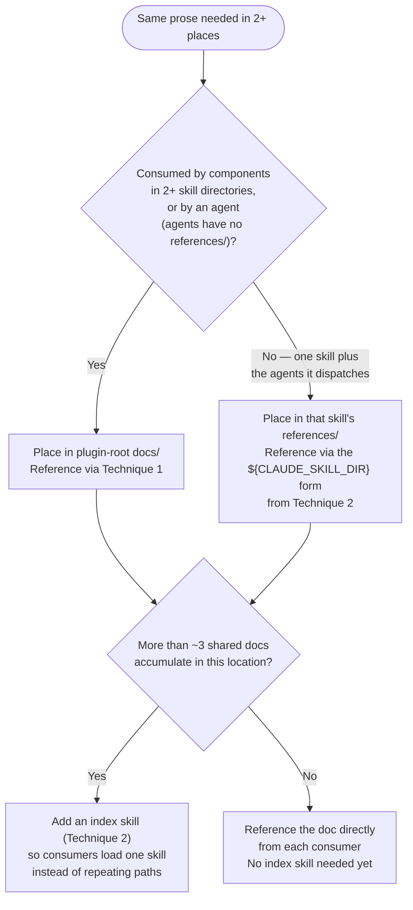

# Shared Content References

Resolve "where does the shared copy live?" for prose duplicated across two or more `SKILL.md` or
agent files inside one plugin.

## 1. Scope Gate

Applies when the same prose is needed by 2+ `SKILL.md` or agent files in one plugin.

Does not apply — route elsewhere instead:

- One skill's own content is too long → activate the `/plugin-creator:refactor-skill` skill
  (SK006/SK007 token thresholds).
- Deciding whether content belongs in a skill's `SKILL.md` body or its own `references/`
  directory (a single-skill boundary, not a cross-skill one) → activate the
  `/plugin-creator:optimize` skill or the `/plugin-creator:agentskills` skill.
- Sharing executable code (scripts, shell utilities) rather than prose → activate the
  `/plugin-creator:component-patterns` skill, §Shared Resources (`lib/` at the plugin root,
  accessed via `${CLAUDE_PLUGIN_ROOT}/lib/`).

## 2. Placement Decision



## 3. Technique 1 — Plugin-Root Shared Doc

```markdown
[<doc name>](${CLAUDE_PLUGIN_ROOT}/docs/<doc>.md) — contains <what>; read before <when>.
```

`${CLAUDE_PLUGIN_ROOT}` resolves in plain `SKILL.md` prose and markdown link targets, not only
`` !`bash` `` injection lines — confirmed by canary test, 2026-08-06. Use this as the primary
form for a doc consumed across 2+ skill directories. Load
[verification.md](./references/verification.md) before relying on this in a new, unverified
runtime.

## 4. Technique 2 — The Index-Skill Pattern

An index skill's own `SKILL.md` lists each shared doc with the annotation contract from
[annotation-format.md](./references/annotation-format.md):

```markdown
[<doc name>](${CLAUDE_SKILL_DIR}/references/<doc>.md) — contains <what>; read before <when>.
```

Every consumer skill or agent writes one sentence and never repeats a path:

```text
For <topic>, activate the /plugin-name:index-skill-name skill.
```

Moving or renaming a shared doc becomes a one-file edit inside the index skill.

## 5. Reference Files

Load [annotation-format.md](./references/annotation-format.md) before writing any reference
link created by Technique 1 or 2 — defines what every reference must state and why.

Load [what-not-to-use.md](./references/what-not-to-use.md) before reaching for a symlink, a
`../` path, or copy-paste to share content across components — each fails for a documented
reason.

Load [verification.md](./references/verification.md) after adding or changing any shared
reference — canary, `skilllint`, and target-existence checks.

## 6. Related Skills

- `/plugin-creator:optimize` — the SKILL.md-vs-`references/` boundary within one skill; load
  first if the question is about one skill's own structure, not sharing across skills.
- `/plugin-creator:agentskills` — the Agent Skills Open Standard for cross-agent-product
  portability. `${CLAUDE_PLUGIN_ROOT}` and `${CLAUDE_SKILL_DIR}` are Claude-Code-specific and do
  not carry over to a portable skill.
- `/plugin-creator:refactor-skill` — one skill exceeding SK006/SK007 token thresholds; a
  different problem from N skills sharing content.
- `/plugin-creator:component-patterns` — §Shared Resources covers shared executable code
  (`lib/` at the plugin root), the code counterpart to this skill's shared prose.
- The `refactor-validator` agent's `No duplicate content across skills` checklist item routes
  here for the remedy.
- The `start-refactor-task` skill's `CREATE shared references if specified` step routes here for
  what a shared reference is and how to create one.
