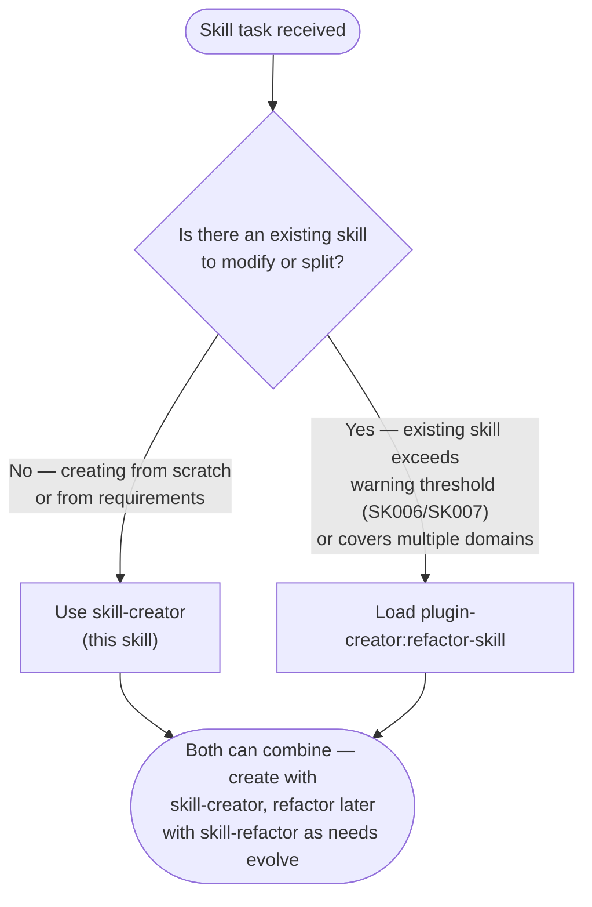
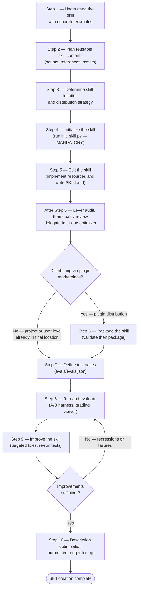
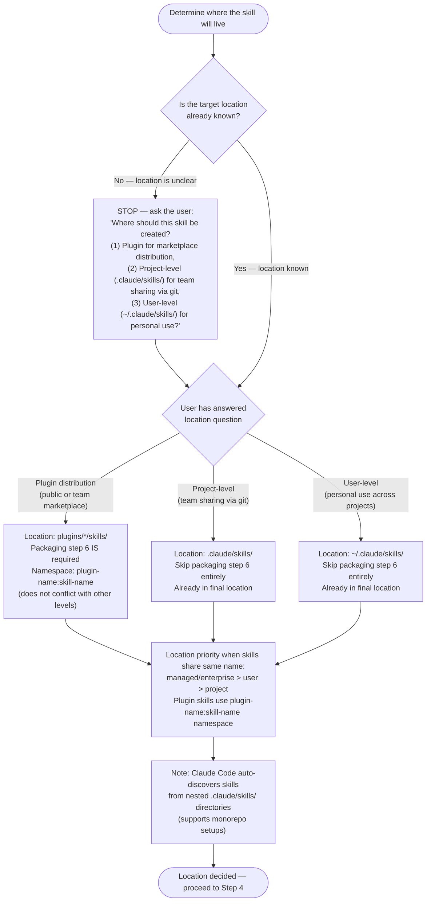
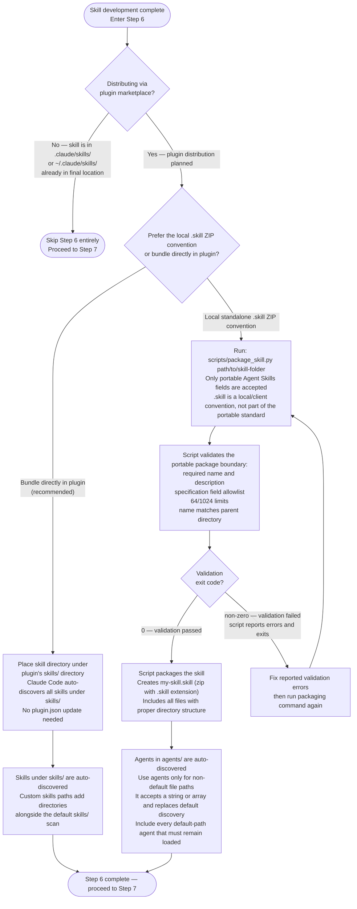

# Skill Creator

## About Skills

Skills are modular, self-contained packages that extend Claude's capabilities by providing
specialized knowledge, workflows, and tools. Think of them as "onboarding guides" for specific
domains or tasks—they transform Claude from a general-purpose agent into a specialized agent
equipped with procedural knowledge that no model can fully possess.

**This skill is for creating NEW skills from scratch.** For refactoring EXISTING skills (splitting oversized skills, reorganizing multi-domain skills), use the skill-refactor skill:

Load `plugin-creator:refactor-skill`.

**When to use skill-creator vs skill-refactor:**

The following diagram is the authoritative procedure for skill tool selection (skill-creator vs skill-refactor). Execute steps in the exact order shown, including branches, decision points, and stop conditions.



### What Skills Provide

1. Specialized workflows - Multi-step procedures for specific domains
2. Tool integrations - Instructions for working with specific file formats or APIs
3. Domain expertise - Company-specific knowledge, schemas, business logic
4. Bundled resources - Scripts, references, and assets for complex and repetitive tasks

## Core Principles

### Reference only what ships with the skill

Confirm each path, command, fact, or cross-plugin reference is present in every environment, bundled and reached by a relative path inside the plugin, or inlined; otherwise inline, bundle, guard, or delete it. A harness variable counts only where that harness substitutes it.

### Concise is Key

The context window is a public good. Skills share the context window with everything else Claude needs: system prompt, conversation history, other Skills' metadata, and the actual user request.

**Default assumption: Claude is already very smart.** Only add context Claude doesn't already have. Challenge each piece of information: "Does Claude really need this explanation?" and "Does this paragraph justify its token cost?"

For token budget limits, truncation behavior, and fallback strategy, activate the `/plugin-creator:claude-skills-overview-2026` skill — it is the authoritative source for this section.

### Set Appropriate Degrees of Freedom

Match the level of specificity to the task's fragility and variability:

**High freedom (text-based instructions)**: Use when multiple approaches are valid, decisions depend on context, or heuristics guide the approach.

**Medium freedom (pseudocode or scripts with parameters)**: Use when a preferred pattern exists, some variation is acceptable, or configuration affects behavior.

**Low freedom (specific scripts, few parameters)**: Use when operations are fragile and error-prone, consistency is critical, or a specific sequence must be followed.

Think of Claude as exploring a path: a narrow bridge with cliffs needs specific guardrails (low freedom), while an open field allows many routes (high freedom).

### Skill Format and Runtime Branches

- **Portable schema, validation, resources, and progressive disclosure**: Load
  `plugin-creator:agentskills` and its specification or best-practices branch.
- **Claude Code frontmatter, invocation, substitutions, forks, and loading**: Load
  `plugin-creator:claude-skills-overview-2026` and its official reference.
- **Skill hooks**: Load `plugin-creator:hooks-guide`.
- **Host package distinctions and OpenCode `mcp:` preservation**: Read
  [agent-plugin-ecosystem.md](./references/agent-plugin-ecosystem.md).
- **Workflow disclosure patterns**: Read [workflows.md](./references/workflows.md).
- **AI-facing prose and reference layout**: Read
  [ai-audience-writing-rules.md](./references/ai-audience-writing-rules.md).
- **Skippable quality gates**: Read
  [anti-rationalization-pattern.md](./references/anti-rationalization-pattern.md).

## Skill Creation Process

The following diagram is the authoritative procedure for skill creation. Execute steps in the exact order shown, including branches, decision points, and stop conditions.



Follow these steps in order, skipping only if there is a clear reason why they are not applicable.

### Step 1: Understanding the Skill with Concrete Examples

Skip this step only when the skill's usage patterns are already clearly understood. It remains valuable even when working with an existing skill.

To create an effective skill, clearly understand concrete examples of how the skill will be used. This understanding can come from either direct user examples or generated examples that are validated with user feedback.

For example, when building an image-editor skill, relevant questions include:

- "What functionality should the image-editor skill support? Editing, rotating, anything else?"
- "Can you give some examples of how this skill would be used?"
- "I can imagine users asking for things like 'Remove the red-eye from this image' or 'Rotate this image'. Are there other ways you imagine this skill being used?"
- "What would a user say that should trigger this skill?"

To avoid overwhelming users, avoid asking too many questions in a single message. Start with the most important questions and follow up as needed for better effectiveness.

Conclude this step when there is a clear sense of the functionality the skill should support.

### Step 2: Planning the Reusable Skill Contents

To turn concrete examples into an effective skill, analyze each example by:

1. Considering how to execute on the example from scratch
2. Identifying what scripts, references, and assets would be helpful when executing these workflows repeatedly

Example: When building a `pdf-editor` skill to handle queries like "Help me rotate this PDF," the analysis shows:

1. Rotating a PDF requires re-writing the same code each time
2. A `scripts/rotate_pdf.py` script would be helpful to store in the skill

Example: When designing a `frontend-webapp-builder` skill for queries like "Build me a todo app" or "Build me a dashboard to track my steps," the analysis shows:

1. Writing a frontend webapp requires the same boilerplate HTML/React each time
2. An `assets/hello-world/` template containing the boilerplate HTML/React project files would be helpful to store in the skill

Example: When building a `big-query` skill to handle queries like "How many users have logged in today?" the analysis shows:

1. Querying BigQuery requires re-discovering the table schemas and relationships each time
2. A `references/schema.md` file documenting the table schemas would be helpful to store in the skill

To establish the skill's contents, analyze each concrete example to create a list of the reusable resources to include: scripts, references, and assets.

If the skill wraps external documentation that changes independently of the skill, activate
`/plugin-creator:add-doc-updater` before implementation to add the maintained sync branch.

### Step 3: Determine Skill Location and Distribution Strategy

The following diagram is the authoritative procedure for skill location and distribution strategy selection. Execute steps in the exact order shown, including branches, decision points, and stop conditions.



**SOURCE:**
[Claude Code skills official reference](../claude-skills-overview-2026/resources/claude-code-skills-official.md#where-skills-live).

For capability restrictions per destination (plugin/project/user/headless/fork), load [destination-capabilities.md](./references/destination-capabilities.md).

### Step 4: Initializing the Skill

**CRITICAL: This is the MANDATORY first step for creating ANY skill. Do NOT skip this step.**

**For ALL skills (plugin, project, and user):**

Run the `init_skill.py` script. This script generates a complete template skill directory with:

- Proper SKILL.md frontmatter with TODO placeholders
- Guidance on skill structure patterns
- Example resource directories (`scripts/`, `references/`, `assets/`)
- Example files demonstrating best practices

**Usage:**

```bash
# The script has executable permissions and a shebang - run it directly
${CLAUDE_PLUGIN_ROOT}/skills/skill-creator/scripts/init_skill.py <skill-name> --path <output-directory>
```

**Examples:**

```bash
# Plugin skill
${CLAUDE_PLUGIN_ROOT}/skills/skill-creator/scripts/init_skill.py my-new-skill --path plugins/my-plugin/skills

# Project skill
${CLAUDE_PLUGIN_ROOT}/skills/skill-creator/scripts/init_skill.py my-skill --path .claude/skills

# User skill
${CLAUDE_PLUGIN_ROOT}/skills/skill-creator/scripts/init_skill.py my-skill --path ~/.claude/skills
```

**What the script does:**

- NFKC-normalizes and validates portable skill names (lowercase Unicode alphanumeric characters and hyphens, max 64 characters after normalization)
- Creates skill directory at specified path
- Generates SKILL.md template with proper frontmatter and TODO placeholders
- Creates `scripts/`, `references/`, `assets/` directories
- Adds example files in each directory with guidance comments
- Sets executable permissions on example scripts
- Prints next steps

**IMPORTANT:** Do NOT manually create skill directories. The script provides essential scaffolding, validation, and examples that manual creation misses.

**Only skip if:** The skill directory already exists and you're iterating on an existing skill.

After initialization, customize or remove the generated SKILL.md and example files as needed.

### Step 5: Edit the Skill

When editing the (newly-generated or existing) skill, remember that the skill is being created for another instance of Claude to use. Include information that would be beneficial and non-obvious to Claude. Consider what procedural knowledge, domain-specific details, or reusable assets would help another Claude instance execute these tasks more effectively.

#### Learn Proven Design Patterns

Consult these helpful guides based on your skill's needs:

- **Multi-step processes**: Load [workflows.md](./references/workflows.md) for sequential workflows and conditional logic
- **Output formats, examples, anti-patterns, and quality standards**: Load [best-practices.md](../agentskills/references/best-practices.md)
- **Upstream best practices (evaluation-first, MCP tool qualification, script error handling, plan-validate-execute)**: Load [best-practices-upstream.md](./references/best-practices-upstream.md)

These files contain established best practices for effective skill design.

- **Claude Code runtime specification**: Read
  [claude-code-skills-official.md](../claude-skills-overview-2026/resources/claude-code-skills-official.md)
  for frontmatter, discovery, invocation, substitution, fork, and budget behavior.

#### Start with Reusable Skill Contents

To begin implementation, start with the reusable resources identified above: `scripts/`, `references/`, and `assets/` files. Note that this step may require user input. For example, when implementing a `brand-guidelines` skill, the user may need to provide brand assets or templates to store in `assets/`, or documentation to store in `references/`.

Added scripts must be tested by actually running them to ensure there are no bugs and that the output matches what is expected. If there are many similar scripts, only a representative sample needs to be tested to ensure confidence that they all work while balancing time to completion.

Any example files and directories not needed for the skill should be deleted. The initialization script creates example files in `scripts/`, `references/`, and `assets/` to demonstrate structure, but most skills won't need all of them.

#### Update SKILL.md

Orchestrator role in Step 5: write YAML frontmatter only, pass file paths to the sub-agent, verify output after completion.

**Writing Guidelines:** Always use imperative/infinitive form.

##### The only audience is an AI agent — scan for human-facing drift before finishing

Every sentence in a skill body must be either a command the agent executes or knowledge the agent recalls. Before marking a skill done, scan for these anti-patterns and fix each one:

| Anti-pattern trigger | What it signals | Fix |
|---|---|---|
| "Open a new terminal" / "Click X" / "Navigate to Y" | Action only a human can take | Replace with the equivalent agent action: `export PATH=...`, `source ~/.bashrc`. If no direct equivalent is known, research how to achieve the same outcome programmatically — use a subagent if available, otherwise research and test directly. Do not document the human step as a dead end |
| Troubleshooting table with causes and fixes | Unverified guesses presented as facts | Remove entirely unless each row was derived from an actual observed failure — state the observed evidence, not a theory |
| "You should..." / "Consider..." / "It is recommended..." | Passive advice to a human reader | Rewrite as an imperative command or delete |
| Platform-specific steps with no prior environment check | Assumes an environment that may differ | Precede with a detection command (`echo $MSYSTEM`, `uname`, etc.) and branch on its output |
| Subprocess check that inherits the parent process's PATH | False positive — finds a tool via parent env, not the target shell's env | Use an environment-isolated check (e.g., `[Environment]::GetEnvironmentVariable('PATH','User')` reads the Windows registry directly) |
| "Install X, then verify" with no observed output shown | Gives steps without confirming they work | Run the steps, capture the actual output, include that output as the expected result |

These patterns appear when skill content is drafted from training data or general knowledge rather than from executing the steps in the actual environment. The fix in every case is the same: run the command, observe the output, write what you observed.

##### Frontmatter

Choose the destination before writing frontmatter:

- **Portable package, upload, or API**: Load `plugin-creator:agentskills` and use only its portable
  schema.
- **Claude Code runtime**: Load `plugin-creator:claude-skills-overview-2026` and read its official
  reference for runtime extensions and invocation behavior.
- **Other hosts**: Read [agent-plugin-ecosystem.md](./references/agent-plugin-ecosystem.md) and
  preserve only fields documented by that consumer.

Write direct activation guidance in `description`; load
`plugin-creator:write-frontmatter-description` when choosing model-vs-user invocation or tightening
trigger branches.

##### Body

Write instructions for using the skill and its bundled resources.

For advanced body features (string substitutions, dynamic context injection, extended thinking), activate the `/plugin-creator:claude-skills-overview-2026` skill.

### After Step 5: Lever Audit

First optimization pass: dispatch a subagent to run `/plugin-creator:optimize` Pass 1 against the draft skill directory.

### After Step 5: Quality Review

Before delegating the draft, run it against [references/authoring-checklist.md](./references/authoring-checklist.md) — the pre-publish checklist covering Structure, Core Quality, Code and Scripts, and Testing.

After completing the SKILL.md and all bundled resources, delegate the draft to the `ai-doc-optimizer` agent before packaging or evaluation. This agent pre-loads `prompt-optimization`, `audit-skill-completeness`, and the official Claude Code skill guidelines — it verifies the draft against best practices and produces an optimized version with evidence-backed changes.

Dispatch `plugin-creator:ai-doc-optimizer` for the SKILL.md quality review.
   Context to include in the prompt: absolute path to the skill directory (includes SKILL.md and all bundled resources)
   Output: optimized SKILL.md content, bulleted list of changes applied with principle citations, CoVe verification results, and STATUS: DONE or BLOCKED

**Handle the result:**

- If STATUS: DONE — apply the agent's optimized SKILL.md before proceeding to Step 6
- If STATUS: BLOCKED — resolve the missing inputs the agent reported, then re-delegate

### Step 6: Packaging a Skill (OPTIONAL — Plugin Distribution Only)

The following diagram is the authoritative procedure for skill packaging and plugin registration. Execute steps in the exact order shown, including branches, decision points, and stop conditions.



Load `plugin-creator:claude-plugins-reference-2026` for plugin creation and distribution.

### Steps 7-10: Evaluate, Improve, and Optimize

After creating the skill, test it with real prompts, grade results with the A/B evaluation harness, iterate on failures, and optimize the description for triggering accuracy.

Read [evaluation-and-optimization.md](./references/evaluation-and-optimization.md) for the complete workflow covering:

- **Step 7** — Define test cases (`evals/evals.json`)
- **Step 8** — Run A/B evaluation (parallel with-skill vs baseline runs, grading via `@plugin-creator:grader`, viewer via `eval-viewer/generate_review.py`)
- **Step 9** — Improve the skill (failure mode taxonomy, iteration loop, blind comparison via `@plugin-creator:comparator` and `@plugin-creator:analyzer`)
- **Step 10** — Description optimization (automated trigger tuning via `scripts/run_loop.py` with train/test split)

Load [schemas.md](./references/schemas.md) for evals.json and grading.json formats.

## Reference Files

| Directory | Contents |
|-----------|----------|
| `@plugin-creator:grader` | Assertion grading — evaluates eval outputs against expectations |
| `@plugin-creator:comparator` | Blind A/B comparison — evaluates two skill versions without knowing which is which |
| `@plugin-creator:analyzer` | Post-hoc analysis — explains why the winning version won and generates improvement suggestions |
| `/plugin-creator:shared-content-references` | Cross-skill prose duplication — placement decision (plugin-root `docs/` vs. a skill's `references/`) when the same steps or rules are needed by 2+ skills or agents |
| `references/` | `references/schemas.md` (JSON schemas), `references/evaluation-and-optimization.md` (Steps 7-10), `references/workflows.md` (patterns), [`references/authoring-checklist.md`](./references/authoring-checklist.md) (pre-publish checklist) |
| `eval-viewer/` | `viewer.html` (interactive eval viewer), `generate_review.py` (HTML generator) |
| `assets/` | `eval_review.html` (trigger eval review template) |
| `scripts/` | `init_skill.py`, `package_skill.py`, `quick_validate.py`, `run_eval.py`, `run_loop.py`, `improve_description.py`, `generate_report.py`, `aggregate_benchmark.py` |
