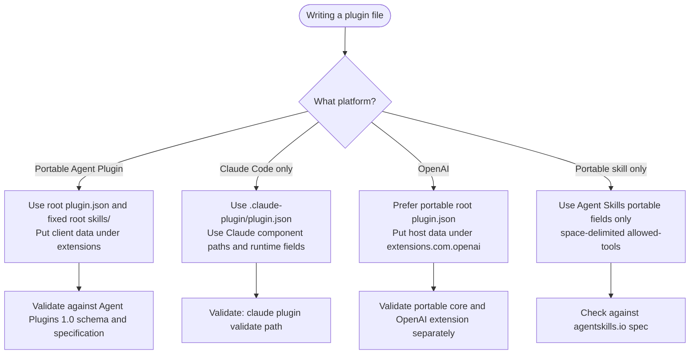

# Agent Plugin Ecosystem

This skill provides verified ecosystem facts for agents writing plugin manifests, skill files, and agent files. When loaded, use it to produce output that targets the correct schema and platform — and to avoid writing files that silently fail validation on a different vendor.

## Portable Agent Plugins 1.0

Agent Plugins 1.0 is the portable package standard. Keep its core schema separate from host
overlays:

- Put the required portable manifest at root `plugin.json`; `$schema` and `name` are required.
- The closed root schema permits `$schema`, `name`, `version`, `description`, `author`, `homepage`,
  `repository`, `license`, `keywords`, and `extensions`. Put host data under a reverse-domain key
  in `extensions`, not in new top-level fields.
- Discover skills only at `skills/<skill-name>/SKILL.md`; scan immediate child directories, not
  deeper descendants. Discover portable MCP configuration only from root `mcp.json`.
- Agent Plugins 1.0 standardizes skills and MCP servers only. Hooks, agents, commands, settings,
  marketplaces, and invocation syntax remain host-specific.
- Keep every package path inside the resolved plugin root. Fields defined as plugin-relative paths
  start with `./`.
- Portable MCP subprocesses receive `PLUGIN_ROOT` and persistent `PLUGIN_DATA`. Placeholder
  expansion is limited to MCP `args`, `env` values, and `cwd`; it does not apply to `command`, skill
  prose, or fixed component locations.

SOURCE: <https://agent-plugins.org/specification.md> and
<https://agent-plugins.org/schemas/1.0.0/plugin.schema.json> (accessed 2026-09-24)

## Claude Code Host Behavior

- Claude's host manifest is `.claude-plugin/plugin.json`. It is optional when all components use
  default locations; when present, `name` supplies plugin identity and the skill namespace.
- Plugin skills invoke as `/plugin-name:skill-name`. This namespace prevents collisions with
  standalone `/skill-name` entries. A skill frontmatter `name` supplies the invocation suffix;
  otherwise Claude falls back to the skill directory basename.
- Claude discovers `skills/<name>/SKILL.md` by default and also supports one root `SKILL.md` for a
  single-skill plugin. A manifest `skills` field adds to the default scan. Explicit `commands`,
  `agents`, and `outputStyles` paths replace their corresponding default scans.
- Claude component paths are plugin-root-relative, start with `./` (the `skills` field also accepts
  `.`), and cannot escape the plugin root.
- Marketplace plugins are copied into versioned cache directories unless their source mode loads
  them in place. In-place edits apply after a new session or `/reload-plugins`; copied installs need
  a resolved version update. Old copied versions are retained for roughly 14 days so existing
  sessions can finish.
- Plugin hooks and MCP/LSP processes use `CLAUDE_PLUGIN_ROOT`; writable state that must survive an
  update belongs under `CLAUDE_PLUGIN_DATA`. Claude skill bodies also support
  `CLAUDE_SKILL_DIR`, which points to that skill's own directory rather than the plugin root.
- Root `settings.json` currently supports `agent` and `subagentStatusLine`. Plugin-bundled agent
  fields have separate security restrictions; do not infer those restrictions for skill
  frontmatter.

SOURCE: <https://code.claude.com/docs/en/plugins.md>,
<https://code.claude.com/docs/en/plugins-reference.md>, and Context7 `/websites/code_claude`
(accessed 2026-09-24)

## OpenAI Host Behavior

- Author new packages with portable root `plugin.json`, root `skills/`, and root `mcp.json`.
  OpenAI-specific apps, hooks, and presentation metadata belong under
  `extensions.com.openai`.
- `.codex-plugin/plugin.json` remains a compatibility fallback. When the root extension object is
  present, it replaces the entire compatibility overlay as the source of OpenAI-specific settings;
  the two are not merged.
- For a recognized portable root manifest, skills always come from root `skills/` and MCP servers
  from root `mcp.json`. Legacy `skills` and `mcpServers` declarations apply only when no recognized
  portable root manifest exists.
- OpenAI uses the stable plugin `name` as plugin identity and component namespace. Local marketplace
  enablement uses `plugin-name@marketplace-name`; local installs are copied into
  `~/.codex/plugins/cache/<marketplace>/<plugin>/<version>/` rather than loaded from the source
  entry.
- Repo and personal marketplaces live at `.agents/plugins/marketplace.json` and
  `~/.agents/plugins/marketplace.json`; `.claude-plugin/marketplace.json` is accepted as a legacy
  repo-marketplace location. Public plugins use the universal directory shared by ChatGPT and
  Codex, which is distinct from local marketplace sources.
- OpenAI plugin hooks default to `hooks/hooks.json`. An explicit `extensions.com.openai.hooks` or
  compatibility-overlay `hooks` value replaces default-file discovery. Hook paths start with `./`,
  resolve from the plugin root, and stay inside it.
- Codex plugin hooks receive `PLUGIN_ROOT` and `PLUGIN_DATA`, plus Claude-named compatibility
  variables. They are non-managed hooks: enabling a plugin does not trust them, and Codex skips
  them until the current definition is reviewed and trusted.

SOURCE: <https://developers.openai.com/plugins/build/plugins.md>,
<https://developers.openai.com/plugins/build/skills.md>, and
<https://learn.chatgpt.com/docs/hooks> (accessed 2026-09-24)

## Hook Semantics Are Host-Specific

- Claude Code: plugin hooks are discovered from `hooks/hooks.json` and run when the plugin is
  enabled. Skill-frontmatter hooks support `PreToolUse`, `PostToolUse`, and `Stop` and are added for
  the rest of the session after that skill is invoked. Matching handlers run in parallel. Hooks run
  with the user's system permissions, so review plugin code before enabling it; workspace trust
  gates project hook configuration.
- OpenAI Codex: matching hooks from all active files run, and multiple matching command handlers
  launch concurrently. Plugin hooks require per-definition trust. Current Codex supports command
  and MCP-tool handlers; parsed `prompt` and `agent` handlers are skipped. Codex event coverage and
  some decision fields differ from Claude's even where event names match.

Do not copy one host's event support, trust flow, output fields, or blocking semantics into the
other host's configuration.

## SKILL.md Portability Standard (agentskills.io)

The `SKILL.md` format is a cross-vendor open standard. Use the live client showcase at
<https://agentskills.io> for the current adopter list rather than copying a list that will drift.

Portable specification fields: `name`, `description`, `license`, `compatibility`, `metadata`, and experimental `allowed-tools`. Client support is implementation-dependent.

Claude Code runtime extensions include `when_to_use`, `argument-hint`, `arguments`, `disable-model-invocation`, `user-invocable`, `disallowed-tools`, `model`, `effort`, `context`, `agent`, `background`, `hooks`, `paths`, and `shell`. Do not assume another runtime ignores unknown keys; verify its schema.

**Critical portability gap — `allowed-tools` delimiter:**

- agentskills.io spec: space-delimited — `allowed-tools: Read Grep Glob`
- Claude Code: comma-delimited — `allowed-tools: Read, Grep, Glob`

Use space-delimited `allowed-tools` for maximum cross-vendor interoperability. The portable specification requires this format; `skills-ref` does not currently type-check or delimiter-check the field.

Spec URL: <https://agentskills.io/specification>

## Skill Runtime and Package Boundaries

- Agent Plugins delegates each discovered `SKILL.md` to the Agent Skills specification; it does not
  define user/model invocation syntax.
- Claude Code accepts documented runtime extensions such as invocation controls, model/context
  selection, and skill-frontmatter hooks. Portable Agent Skills uploads and API/package boundaries
  accept only portable fields and reject unexpected frontmatter keys.
- OpenAI plugin skills use the portable `SKILL.md` shape. A plugin may bundle one or several skills,
  with optional `references/`, `assets/`, and `scripts/`. OpenAI's MCP skill import snapshots files
  into the draft rather than fetching them from the server at runtime.
- When an OpenAI skill requires an MCP tool, declare that dependency in the skill's
  `agents/openai.yaml`; the dependency makes the tool available but does not replace workflow
  instructions. Public submissions use remote HTTPS MCP endpoints unless OpenAI provides separate
  local-MCP support.

SOURCE: <https://agent-plugins.org/specification.md#71-skills>,
<https://code.claude.com/docs/en/skills.md#using-skill-frontmatter-outside-claude-code>, and
<https://developers.openai.com/plugins/build/skills.md> (accessed 2026-09-24)

## OpenCode SKILL.md Extensions

OpenCode supports two mechanisms for attaching MCP servers to a skill. Both are specific to the OpenCode runtime — other vendors ignore these fields.

### `mcp:` frontmatter field

A skill can declare MCP servers directly in SKILL.md frontmatter under the `mcp:` key. Each entry names a server and provides its launch configuration.

**stdio server (process-based):**

```yaml
---
name: my-skill
description: Does something
mcp:
  server-name:
    command: npx
    args: ["-y", "some-mcp-package"]
    env:
      KEY: value
---
```

**HTTP server (SSE-based):**

```yaml
mcp:
  server-name:
    url: https://mcp.example.com/sse
    headers:
      Authorization: "Bearer token"
```

### `mcp.json` sidecar file

An alternative to frontmatter: place an `mcp.json` file next to `SKILL.md` in the same directory.

```json
{ "mcpServers": { "server-name": { "command": "npx", "args": ["-y", "pkg"] } } }
```

**Precedence:** `mcp.json` takes precedence over frontmatter `mcp:` if both are present.

### Lifecycle

MCP servers declared via either mechanism use idle-timeout pooling:

- Server starts on first tool call
- Terminates after 5 minutes idle
- Tears down on session end
- Pool key: `sessionID:skillName:serverName`

### Portability note

The `mcp:` frontmatter key is an OpenCode extension. Preserve it for OpenCode consumers, but exclude it from portable uploads, the Skills API, and Anthropic packages because those boundaries hard-fail unknown fields. Behavior in other runtimes is unverified.

The `skilllint` FM009 guard treats `mcp:` as an ecosystem-owned key and skips rewriting its sub-keys (e.g., `command: npx -y server`) to avoid corrupting OpenCode skill definitions.

SOURCE: oh-my-opencode source `/src/features/opencode-skill-loader/skill-mcp-config.ts`, <https://github.com/code-yeongyu/oh-my-opencode> (accessed 2026-03-06).

## MCP Fully-Qualified Tool Name Syntax

When a skill instructs Claude to use an MCP tool, always use the fully-qualified format `ServerName:tool_name`. This is the naming convention Claude uses internally to route tool calls to the correct MCP server.

**Format:** `ServerName:tool_name`

**Examples:**

```markdown
Use the BigQuery:bigquery_schema tool to retrieve table schemas.
Use the GitHub:create_issue tool to create a new issue.
Use the Filesystem:read_file tool to read the configuration file.
```

Where the prefix before the colon is the MCP server name and the suffix is the tool name within that server. Without the server prefix, Claude may fail to locate the tool — especially when multiple MCP servers are available simultaneously and tool names conflict across servers.

**Discovering available MCP tool names:**

To find the correct server name and tool name for a given MCP server:

1. Check the MCP server's manifest or documentation for its declared server name
2. List available tools via the MCP protocol's `tools/list` method
3. For Claude Code plugins, inspect the `mcpServers` field in `plugin.json` — the key name is the server name Claude uses as the prefix

SOURCE: Anthropic skill-authoring best practices (docs.anthropic.com, accessed 2026-03-23)

## Writing for the Correct Target



## Self-Update Protocol

When making changes that affect ecosystem facts — new vendor adopters, schema changes, new fields, updated spec URLs — update this file and cite the source URL and access date inline.

SOURCE: <https://agentskills.io/specification.md> and <https://code.claude.com/docs/en/skills#using-skill-frontmatter-outside-claude-code> (accessed 2026-09-24)

Reference URLs to monitor for changes:

- <https://agent-plugins.org/specification.md>
- <https://agent-plugins.org/schemas/1.0.0/plugin.schema.json>
- <https://agentskills.io/specification>
- <https://code.claude.com/docs/en/plugins-reference.md>
- <https://developers.openai.com/plugins/build/plugins.md>
- <https://learn.chatgpt.com/docs/hooks>

SOURCE: Host and portable plugin claims refreshed from the sources above on 2026-09-24.
