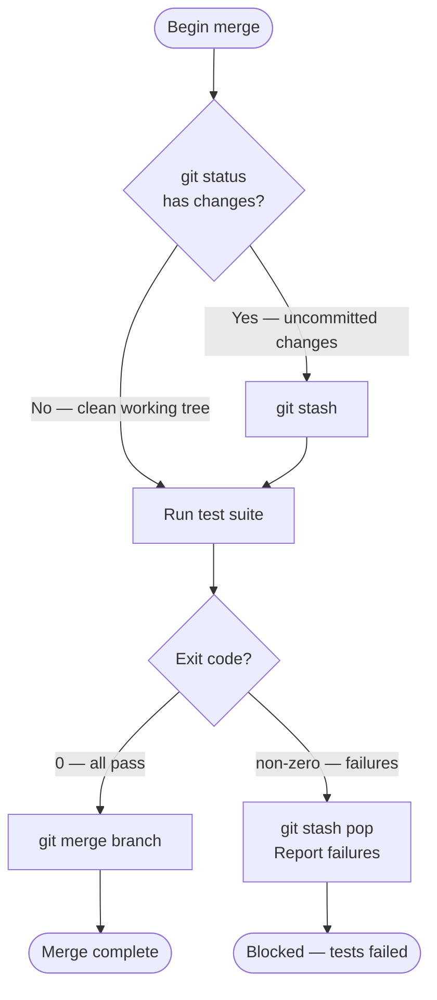

<p align="center">
  
</p>

# process-siren

Process Siren helps agents understand, improve, validate, and concisely describe processes and systems. It builds an explicit semantic model, identifies ambiguity and correctness gaps, improves behavior where established intent permits, and selects validation proportionate to each claim. Mermaid is used when a diagram is the clearest concise technical description of the process — not as a substitute for the underlying model or evidence.

## The Problem

AI agents reading prose instructions in SKILL.md, CLAUDE.md, and agent files must guess:

- "Then..." — how many steps? in what order?
- "If appropriate..." — appropriate by what observable fact?
- "Handle the usual cases" — which cases? what is usual?
- "When done..." — done by what signal?

Mermaid flowcharts eliminate these ambiguities. Every branch is an explicit labeled edge. Every
decision is a diamond node with an observable condition. Every path ends at a named terminal
state. An agent following a Mermaid diagram traces exactly one path without inferring anything.

## Before and After

**Before** (prose that fails AI agents):

```
1. Check for uncommitted changes
2. If yes, stash them before proceeding
3. Run the test suite
4. If tests pass, merge the branch
5. If tests fail, restore the stash and report errors
```

**After** (Mermaid — every path is unambiguous):



The structural representation test: can an AI agent follow the represented path without inventing meaning? Passing this establishes diagram fidelity, not behavioral correctness.

## What's Inside

| Component | Name | Activates on |
|-----------|------|--------------|
| Agent | `process-siren` | Analyze, improve, validate, or represent processes and systems |
| Skill | `mermaids-treasure` | Mermaid syntax reference — flowcharts, sequences, state diagrams, ER, Gantt, and more |
| Skill | `improve-processes` | Canonical semantic model and recursive improvement/validation loop |
| Skill | `woo-sailor` | Bulk analyze/improve/represent orchestration with cross-file synthesis |

## Quick Start

```bash
/plugin marketplace add Jamie-BitFlight/claude_skills
/plugin install process-siren@jamie-bitflight-skills
```

## Usage

### Convert a section in a file

```
@process-siren Convert the "Verification Decision Flow" section in .claude/CLAUDE.md to a Mermaid flowchart.
```

### Convert standalone prose

Paste the process directly:

```
@process-siren Convert this to a Mermaid diagram:

1. Check if the branch has uncommitted changes
2. If yes, stash changes before proceeding
3. Run the test suite
4. If tests pass, merge the branch
5. If tests fail, restore the stash and report errors
```

### Convert a whole file or directory

```
/process-siren:woo-sailor plugins/my-plugin/skills/my-skill/SKILL.md
/process-siren:woo-sailor plugins/my-plugin/  --dry-run
```

`--dry-run` and `--report` use read-only ANALYZE behavior. Use `--improve` to apply intent-preserving changes or `--represent` for faithful Mermaid representation.

### Run a quality audit before converting

```
/process-siren:improve-processes
```

Paste or reference the process you want audited. The skill builds the semantic model, classifies uncertainty, identifies correctness claims and gaps, and selects proportionate validation.

## Operating Modes

- **ANALYZE** — identify purpose, gaps, assumptions, claims, boundaries, and validation needs without changing the process.
- **IMPROVE** — apply corrections determined by established intent, validate affected claims, and iterate.
- **REPRESENT** — faithfully render an already-defined process as a concise Mermaid diagram without changing semantics.

## How the Agent Works

The agent establishes purpose at the useful resolution, builds a canonical ProcessModel, challenges gaps and assumptions, extracts falsifiable correctness claims, and selects the least-formal sufficient validation for each claim. In IMPROVE mode, failures feed back into improvement. It asks the user when continuing would require creating or changing intent or policy.

Mermaid is generated from the semantic model when a concise technical diagram improves communication. Syntax and semantic-fidelity validation ensure the diagram represents the model; they do not prove the process correct.

### MCP Server Integration

The plugin registers a Mermaid diagram validation MCP server (defined in `.mcp.json`) that
provides real-time syntax checking during conversion. This prevents incomplete or malformed
Mermaid syntax from entering the codebase. The server runs automatically after Bun is
installed; no additional MCP configuration is needed.

## Improvement and Validation Loop

`improve-processes` uses one recursive loop: UNDERSTAND → MODEL → CHALLENGE → IMPROVE → VALIDATE. Resolvable uncertainty is investigated; only intent-dependent decisions block autonomous improvement. Validation failures become evidence for diagnosis and targeted revalidation.

## When Not to Use It

- **Single-step instructions with no branching** — prose is fine; a diagram adds noise without
  value
- **Reference tables** — flat data belongs in a table, not a flowchart
- **Narrative explanations** — background context for human readers does not need to be a
  diagram

## Requirements

- Claude Code v2.0+
- Bun (for the bundled `mcp-mermaid` MCP server, launched with `bunx` on first use)

Install Bun using the [official installation instructions](https://bun.sh/docs/installation),
then verify it is available with `bun --version` before invoking the MCP-backed conversion.

---

> **The Ancient Woe**
>
> *A frustrated King screaming commands at an army of literal-minded clay golems. The King yells, "Defend the gates if appropriate," and the golems freeze, for they cannot evaluate what "appropriate" means! The King writes, "Handle the usual cases," and the golems do nothing, for "usual" is a human ghost they cannot perceive!*

> **The Bard's Decree**
>
> *"Banish the treacherous fog of human prose! Artificial minds cannot infer thy vague poetry! Thou must draw the Mermaid's map: explicit branching paths, absolute diamond decision gates rooted only in observable facts, and clearly named terminal states! Let the improve-processes skill audit thy commands, stripping away abstract verbs until a mere novice could follow thy logic cold in five minutes!"*
