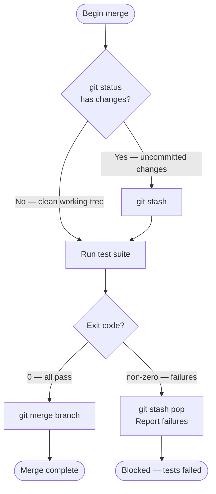

<p align="center">
  
</p>

# process-siren

Process Siren helps agents understand, improve, validate, and concisely describe processes and systems. It builds an explicit semantic model, identifies ambiguity and correctness gaps, improves behavior where established intent permits, and selects validation proportionate to each claim. Mermaid is used when a diagram is the clearest concise technical description of the process — not as a substitute for the underlying model or evidence.

## The Problem

Process instructions can leave consequential decisions unresolved:

- "Then..." — which ordering is required?
- "If appropriate..." — which fact determines the branch?
- "Handle the usual cases" — does routine knowledge suffice, or is a system-specific exception missing?
- "When done..." — what observable outcome establishes completion?

Mermaid can make process structure materially less ambiguous by expressing relevant transitions, guards, actors, and terminal states explicitly. It does not eliminate uncertainty or require deterministic behavior: the semantic model may intentionally permit multiple valid next states, and unresolved intent remains explicit rather than being invented by the diagram.

Completeness does not mean maximum detail. Keep familiar low-risk steps concise, and expand consequential decisions locally through a child procedure whose contract remains visible from the parent. Paths and wrapped labels do not automatically require extra nodes.

## Before and After

**Before** (an incomplete source process):

```text
1. Check for uncommitted changes
2. If yes, stash them before proceeding
3. Run the test suite
4. If tests pass, merge the branch
5. If tests fail, restore the stash and report errors
```

**After — as-is description, not an approved merge procedure.** This diagram exposes the source's routing without resolving its missing stash ownership, merge-failure, or successful-path restoration behavior. Those gaps require assessment before using it as an operational procedure.


```mermaid
flowchart TD
    Start(["Begin merge"]) --> Check{"git status<br>has changes?"}
    Check -->|"Yes — uncommitted changes"| Stash["git stash"]
    Check -->|"No — clean working tree"| Test
    Stash --> Test["Run test suite"]
    Test --> Result{"Exit code?"}
    Result -->|"0 — all pass"| Merge["git merge branch"]
    Result -->|"non-zero — failures"| Restore["git stash pop<br>Report failures"]
    Merge --> Done(["Merge complete"])
    Restore --> Blocked(["Blocked — tests failed"])
```

The structural representation test is whether the diagram preserves the source model at its stated resolution without inventing meaning. Passing this establishes fidelity, not behavioral correctness or permission to execute it.

## What's Inside

| Component | Name | Activates on |
|-----------|------|--------------|
| Agent | `process-siren` | Analyze, improve, validate, or represent processes and systems |
| Skill | `mermaids-treasure` | Mermaid syntax reference — flowcharts, sequences, state diagrams, ER, Gantt, and more |
| Skill | `improve-processes` | Canonical semantic model and recursive improvement/validation loop |
| Skill | `woo-sailor` | Bulk analyze/improve/represent orchestration with cross-file synthesis |

## Quick Start

```bash
/plugin marketplace add Jamie-BitFlight/claude_skills
/plugin install process-siren@jamie-bitflight-skills
```

## Usage

### Convert a section in a file

```text
@process-siren Convert the "Verification Decision Flow" section in .claude/CLAUDE.md to a Mermaid flowchart.
```

### Convert standalone prose

Paste the process directly:

```text
@process-siren Convert this to a Mermaid diagram:

1. Check if the branch has uncommitted changes
2. If yes, stash changes before proceeding
3. Run the test suite
4. If tests pass, merge the branch
5. If tests fail, restore the stash and report errors
```

### Analyze, improve, or represent a file or directory

```text
/process-siren:woo-sailor plugins/my-plugin/skills/my-skill/SKILL.md --represent
/process-siren:woo-sailor plugins/my-plugin/ --dry-run
/process-siren:woo-sailor plugins/my-plugin/ --improve
```

`--dry-run` and `--report` use read-only ANALYZE behavior. Use `--improve` to apply intent-preserving changes or `--represent` for faithful Mermaid representation. An invocation without a mode defaults to IMPROVE.

### Run a quality audit before converting

```text
/process-siren:improve-processes
```

Paste or reference the process you want audited. The skill builds the semantic model, classifies uncertainty, identifies correctness claims and gaps, and selects proportionate validation.

## Operating Modes

- **ANALYZE** — identify purpose, gaps, assumptions, claims, boundaries, and validation needs without changing the process.
- **IMPROVE** — apply corrections determined by established intent, validate affected claims, and iterate.
- **REPRESENT** — faithfully render an already-defined process as a concise Mermaid diagram without changing semantics.

## How the Agent Works

The agent establishes purpose at the useful resolution, builds a canonical ProcessModel, challenges gaps and assumptions, extracts falsifiable correctness claims, and selects the least-formal sufficient validation for each claim. In IMPROVE mode, failures feed back into improvement. It asks the user when continuing would require creating or changing intent or policy.

Mermaid is generated from the semantic model when a concise technical diagram improves communication. Syntax and semantic-fidelity validation ensure the diagram represents the model; they do not prove the process correct. A delivered diagram retains whether it is an as-is description, proposal, or approved procedure, with consequential assessment limits beside it.

### Completion and assessment

The caller's task-status envelope is preserved. Completing an analysis of an invalid process can produce `STATUS: DONE` with `Assessment: INVALID`; the task finished, but the target is not ready. Partial changes, evidence gaps and intent decisions remain explicit rather than disappearing behind a successful report status.

Recursive decomposition examines narrower relevant behavior. Candidate refinement separately detects cycles and lack of progress. Neither reaching a resource budget nor returning to an earlier candidate is a validation pass.

For material, reused or concurrent evidence, the [material-change lifecycle](./skills/improve-processes/references/material-change-lifecycle.md) binds source/candidate/contract/method identities and checks them before application. A stale source, missing safe-apply guarantee or incoherent dependent change set returns a proposal instead of overwriting other work. Routine reversible edits do not require new persistence machinery.

### MCP Server Integration

The plugin registers a Mermaid MCP server (defined in `.mcp.json`) for syntax validation when available. Record actual tool results; merely installing the server does not prove a diagram was checked. If the required validator cannot run, return the diagram with validation explicitly unperformed rather than claiming success.

## Improvement and Validation Loop

`improve-processes` uses one recursive loop: UNDERSTAND → MODEL → CHALLENGE → IMPROVE → VALIDATE. Resolvable uncertainty is investigated. Intent-dependent decisions require owner input; missing evidence, stale state and non-progress stop only dependent mutations. Independent useful analysis and faithful representation can continue. Validation failures become evidence for diagnosis and targeted revalidation.

The optional baseline-agent behavior method remains a concept rather than a prescribed tool: neutral scenarios, isolated responses, consensus/variance analysis and proportionate comparison can use whatever harness or API is available. Consensus measures likely inference, not correctness.

## When Not to Use a Diagram

- **Single-step instructions with no branching** — prose is fine; a diagram adds noise without value
- **Reference tables** — flat data belongs in a table, not a flowchart
- **Narrative explanations** — background context for human readers does not need to be a diagram

## Requirements

- Claude Code v2.0+
- Bun (for the bundled `mcp-mermaid` MCP server, launched with `bunx` on first use)

Install Bun using the [official installation instructions](https://bun.sh/docs/installation), then verify it is available with `bun --version` before invoking the MCP-backed conversion.

## Validation evidence

[Lifecycle regression cases](./evals/lifecycle-regressions.md) retain the expected boundaries for status transport, candidate cycles, revision changes, local resolution and coherent cross-file application. Their status is NOT_RUN until actual fresh-agent observations are retained; authored scenarios and source inspection are not runtime certification.

---

> **The Ancient Woe**
>
> *A King gives an army one map for every task: a hundred tiny arrows for fetching water, one vague arrow for closing the city gates. The army spends its attention on the bucket and guesses at the dangerous boundary.*

> **The Bard's Decree**
>
> *"Keep the common road concise; mark the perilous crossing precisely. A map may reveal a broken route without granting leave to follow it."*
