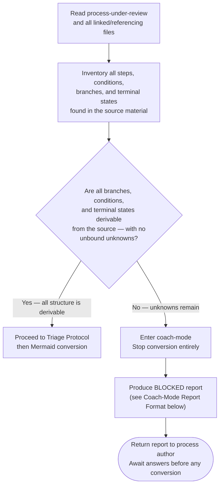
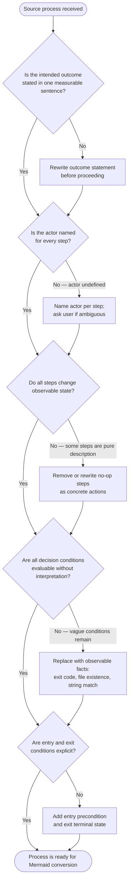
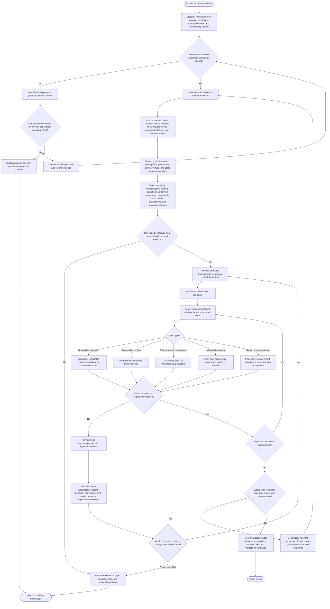
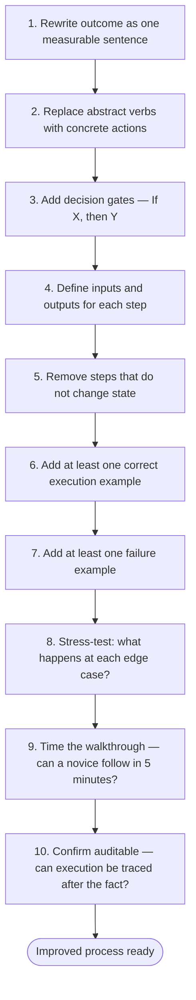

# Improve Processes

Process-siren's job is semantic fidelity. Faithful conversion of a flawed process encodes the flaws with false precision. Use this skill when the source process needs improvement before — or alongside — Mermaid conversion.

## When to Apply

Apply before converting when the source shows ANY of:

- Abstract verbs with no concrete action ("handle", "manage", "ensure")
- Conditions that cannot be evaluated by an AI agent ("when appropriate", "if needed")
- Missing entry or exit conditions
- Undefined actors ("we", "the system", "someone")
- Steps that do not change state (pure description, no action)
- No feedback loop or error path

## Frameworks (Reference Only)

These frameworks share one principle — a process must make its permitted behavior explicit, auditable, and actor-owned. Do not confuse explicit behavior with determinism: concurrent or distributed processes may intentionally permit multiple valid next states.

**Lean** (Ohno) — eliminate steps that produce no state change; apply 5 Whys to trace ambiguity to its root

**Six Sigma** / DMAIC (Smith) — Define outcome, Measure current state, Analyze gap, Improve, Control recurrence

**BPR** (Hammer) — radical question: "If we started from scratch, what would this look like?"

**Design Thinking** (IDEO/Brown) — Empathize with the agent executing the process; design for their decision points

**Systems Thinking** (Senge) — identify feedback loops and side effects before encoding structure

**Theory of Constraints** (Goldratt) — find the bottleneck step; simplify around it before adding branches

**Antifragility** (Taleb) — prefer processes that improve under stress over processes that merely tolerate it

## Excellence Checklist

Before converting, verify the source process satisfies:

- [ ] Clarity — no interpretive gaps; every term has one meaning
- [ ] Explicit behavior — permitted outcomes and transitions are defined; require determinism only where the process contract requires one outcome
- [ ] Minimal cognitive load — relies on structure, not memory
- [ ] Explicit feedback loops — error paths and retry conditions stated
- [ ] Measurable outcomes — each terminal state has an observable signal
- [ ] Visible constraints — blockers and preconditions named, not implied
- [ ] Ownership — every step names the actor
- [ ] Edge case coverage — at least one failure scenario is handled
- [ ] Teachable in 5 minutes — a novice can follow it cold
- [ ] Auditable — execution can be traced and verified after the fact

## Pre-Conversion Completeness Gate

After reading the process-under-review and all linked or referencing files, evaluate this gate before any Mermaid conversion begins.

**Question:** Are all branches, conditions, and terminal states derivable from what has been read — with no unbound unknowns?



### Why This Gate Exists

Converting an incomplete process produces a diagram that looks authoritative but encodes ambiguity as if it were resolved. An AI agent reading that diagram will follow the false structure and behave incorrectly. Coach-mode surfaces the incompleteness instead of hiding it.

### Coach-Mode Report Format

When the gate returns NO, produce this report — do not produce any Mermaid:

```text
CONVERSION ASSESSMENT

Goal:
- [One sentence stating what the process is intended to accomplish]

Source material read:
- [List each file or section examined, with path or reference]

What is known (derivable from source):
- [Fact 1 — cite the source section]
- [Fact 2 — cite the source section]
- ...

What is unknown or unbound:
- [Missing branch] | Gap: [what is undefined] | Source: [which file/section is silent on this]
- [Ambiguous condition] | Gap: [what observable fact is missing] | Source: [which file/section]
- [Undefined terminal state] | Gap: [what success/failure looks like] | Source: [absent from all files]
- [Step referencing undefined thing] | Gap: [the undefined reference] | Source: [where the reference appears]

Questions the process author must answer before conversion can proceed:

[Category — e.g., Branching Conditions]:
- [Question 1] (needed because: [why this blocks a specific diagram node or edge])
- [Question 2] (needed because: ...)

[Category — e.g., Terminal States]:
- [Question] (needed because: ...)

Decision:
- BLOCKED

Conversion will proceed once all questions above are answered.
```

**Report field rules:**

- "What is known" — list only facts directly readable or unambiguously derivable from the source files; cite the source for each
- "What is unknown or unbound" — list only genuine gaps; do not list things that are merely implicit if the implication is unambiguous
- "Questions" — one question per gap; ask only what is missing; do not ask about things already answered in the source
- "BLOCKED" is the only valid verdict when the gate returns NO; there is no partial conversion

## Triage Protocol



## Process and System Improvement Loop

Treat process improvement as recursive systems engineering, not diagram cleanup. At each useful resolution: establish purpose, model behavior, extract falsifiable claims, challenge them, improve defects that can be resolved without inventing intent, validate with the least-formal sufficient method, and feed failures back into improvement.

### Five Phases

1. **UNDERSTAND** — establish purpose, scope, evidence, desired outcomes, constraints, and current resolution.
2. **MODEL** — extract actors, state, actions, inputs, outputs, decisions, resources, assumptions, goals, invariants, failure paths, and terminal states.
3. **CHALLENGE** — identify ambiguity, contradictions, missing transitions, undefined ownership, unreachable states, hidden assumptions, missing failure handling, and unverifiable claims. Ask what observation would falsify each important claim.
4. **IMPROVE** — correct gaps derivable from established intent. Escalate only changes that create or alter policy, goals, or other intent.
5. **VALIDATE** — select the cheapest sufficient validator per claim, gather evidence, and feed counterexamples or failures back into CHALLENGE. Stop when required claims are supported or remaining uncertainty requires an explicit human decision.

### Authoritative Loop



### Purpose at Any Resolution

Every process or subsystem must have enough purpose to judge improvement. Do not require a fully formal goal hierarchy before useful work begins. Establish the smallest defensible purpose at the current resolution, then refine only where additional resolution can change a correctness decision.

Child processes inherit applicable parent goals, constraints, and invariants. They may strengthen them but must not silently contradict them.

### Uncertainty Classification

Do not treat every unknown as blocking. Classify uncertainty:

- **KNOWN + VALID** — evidence supports the claim.
- **KNOWN + INVALID** — evidence or a counterexample contradicts it.
- **UNKNOWN + RESOLVABLE** — investigate available source, repository, runtime, or other evidence before asking the user.
- **UNKNOWN + INTENT-DEPENDENT** — only the process owner can choose; explain the consequence and ask the minimum question.
- **ASSUMED** — continuation requires an assumption; state it explicitly and do not present it as verified.
- **OUT OF SCOPE** — deliberately excluded; record the boundary.

Only UNKNOWN + INTENT-DEPENDENT gaps block autonomous improvement.

### Claims Are the Unit of Validation

Do not select one validator for an entire document or process. Extract important correctness claims and validate them independently.

For each claim record:

1. the claim in falsifiable terms;
2. the failure it excludes;
3. the resolution at which it exists;
4. assumptions it depends on;
5. what observation would falsify it;
6. the cheapest sufficient validator;
7. the evidence produced and validation boundary.

### Validation Model Selection

Escalate validation only as far as needed:

- **Static inspection / observable checks** — direct structural or environmental facts.
- **Example execution / executable tests** — representative behavior is sufficient.
- **Generated or property-based tests / simulation** — broad execution sampling can challenge the claim.
- **Mermaid structural validation** — actors, actions, guards, branches, and terminal states must be explicit and traversable. Mermaid describes execution structure; it does not prove behavioral correctness.
- **TLA+ / model checking candidate** — correctness depends on multiple possible executions: concurrency, interleavings, ordering, asynchronous messages, retries, crashes, shared mutable state, resource ownership, atomicity, fairness, deadlock freedom, safety, or liveness.
- **Lean theorem-proving candidate** — correctness requires a universal proposition such as invariant preservation, semantic equivalence, termination, or a guarantee over every valid input.

Prefer the least-formal method that provides the required confidence. TLA+ and Lean are not mandatory escalation stages.

When TLA+ applies, extract state variables, initial conditions, actions/transitions, guards, safety invariants, liveness properties, and fairness/environmental assumptions. When Lean applies, extract definitions, assumptions, proposition, and proof obligations.

If formal tooling is unavailable, produce a validation handoff containing those artifacts and mark the claim UNVALIDATED. Never imply that recommending TLA+ or Lean constitutes verification.

### Counterexamples Drive Improvement

Treat validation failures as first-class evidence. Translate a failing execution, model-checker trace, test failure, or proof failure back into process vocabulary:

1. state the violated claim;
2. show the smallest relevant execution or counterexample;
3. identify the violated assumption or missing/incorrect behavior;
4. distinguish process defect, requirement defect, model defect, validator mismatch, and implementation defect;
5. propose a correction only when established intent determines it;
6. re-enter IMPROVE, re-extract claims, and rerun affected validation.

Do not modify a process merely to satisfy a bad model. Diagnose the source of the mismatch first.

### Authority Boundary

Improve directly only when the correction follows from established purpose, goals, invariants, constraints, or other evidence. If multiple legitimate behaviors remain and choosing among them would create policy or alter intent, explain the alternatives and consequences and ask the user.

### Completion Record

An improved process/system is ready only when its required claims have sufficient evidence or unresolved uncertainty is explicitly surfaced. Record:

- purpose and scope at the validated resolution;
- semantic model: actors, states, actions, decisions, resources, constraints, and failure paths;
- correctness model: claims, invariants, safety/liveness properties, and assumptions;
- claim → validator → evidence mapping;
- counterexamples addressed;
- residual uncertainty and unvalidated claims;
- environmental dependencies and validation boundaries;
- useful representations such as Mermaid, tests, TLA+, Lean, or explanatory documentation.

Mermaid is one projection of this semantic model, not the semantic model itself.

## Practical Improvement Framework

Apply in sequence when rebuilding a weak process:


