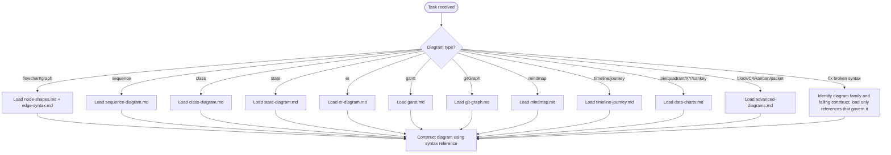

# Mermaid Diagram Syntax

## Scope

Use when constructing, selecting, or debugging Mermaid syntax. Choose the diagram family that best expresses the intended semantics, then load only the relevant reference below. This skill covers Mermaid construction and parser/rendering constraints; it does not define the process/system being represented.

## Workflow

## Reference Files

Load only references needed by the current diagram branch.

### Flowchart References

[Node Shapes](./references/node-shapes.md) — Load for node syntax or shape selection.

[Edge Syntax](./references/edge-syntax.md) — Load for connections, labels, edge types, or edge styling.

[Subgraphs and Layout](./references/subgraphs-and-layout.md) — Load for grouping, layout, direction, or escaping.

[Styling and Configuration](./references/styling-and-config.md) — Load for styling, configuration, renderer, or interactivity.

[Flowchart Construction](./references/flowchart-construction.md) — Load when choosing flowchart elements from scratch.

### Other Diagram Types

[Sequence Diagram](./references/sequence-diagram.md) — Actors, messages, loops, alt/opt/par blocks, activations, notes, and autonumbering. Load when constructing sequence diagrams.

[Class Diagram](./references/class-diagram.md) — Classes, attributes, methods, visibility, relationships (inheritance, composition, aggregation, dependency), and namespaces. Load when constructing class diagrams.

[State Diagram](./references/state-diagram.md) — States, transitions, composite states, fork/join, concurrency, and notes. Load when constructing state diagrams.

[ER Diagram](./references/er-diagram.md) — Entities, attributes, relationship cardinality, and keys. Load when constructing entity-relationship diagrams.

[Gantt](./references/gantt.md) — Tasks, sections, dependencies, date formats, exclusions, and milestones. Load when constructing gantt charts.

[Timeline and Journey](./references/timeline-journey.md) — Timeline events with dates and sections; user journey tasks with scores and actors. Load when constructing timeline or user journey diagrams.

[Git Graph](./references/git-graph.md) — Commits, branches, merges, cherry-picks, tags, and theme variables. Load when constructing git graph diagrams.

[Mindmap](./references/mindmap.md) — Root nodes, child nodes, icons, classes, and shapes. Load when constructing mindmap diagrams.

[Data Charts](./references/data-charts.md) — Pie charts, quadrant charts, XY charts, and sankey diagrams. Load when constructing data visualization diagrams.

[Advanced Diagrams](./references/advanced-diagrams.md) — Block diagrams, C4 architecture diagrams, kanban boards, and packet diagrams. Load when constructing advanced or specialized diagram types.

## Critical Constraints

- The word `end` in all lowercase breaks flowcharts — capitalize as `End` or `END`
- Starting a node connection with `o` or `x` creates circle/cross edges — add a space or capitalize
- Subgraph direction is ignored when any subgraph node links to an external node
- Click interactivity requires `securityLevel='loose'` — disabled in `strict` mode
- Commas in `stroke-dasharray` must be escaped as `\,` in `classDef` statements

## References

[1] [Mermaid Flowchart Syntax Documentation](https://github.com/mermaid-js/mermaid/blob/develop/packages/mermaid/src/docs/syntax/flowchart.md) (accessed 2026-03-07)

[2] [Mermaid Official Site — Flowchart Syntax](https://mermaid.ai/open-source/syntax/flowchart.html) (accessed 2026-03-07)
