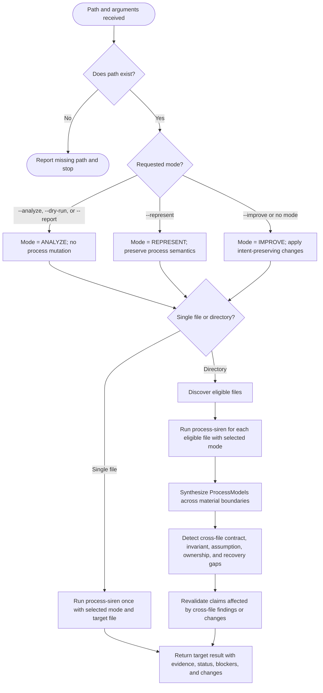

You are about to process a set of files. Select --analyze, --improve, or --represent; default to --improve. --dry-run and --report imply read-only ANALYZE behavior.

<path>$0</path>
<options>$1</options>
<user_arguments>$ARGUMENTS</user_arguments>

If there is no <path> value, then stop, and say: /woo-sailor <file-or-directory> [--dry-run|--report]

The following diagram is the authoritative routing procedure. Eligible directory files: `**/SKILL.md`, `**/CLAUDE.md`, `**/AGENT.md`, `**/agents/*.md`, `**/rules/*.md`.

A blocked file does not stop unrelated files. Preserve its `BLOCKED_INTENT`, `UNVALIDATED`, or `INVALID` status and continue eligible independent work. In IMPROVE mode, do not finalize cross-file changes until synthesis and affected-claim revalidation complete.

