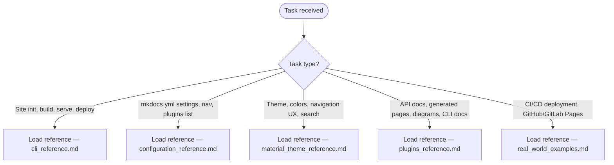

# MkDocs

Build and maintain static documentation sites from Markdown with MkDocs and the Material theme.

<workflow>



</workflow>

<reference_catalog>

### CLI Reference

Every `mkdocs` subcommand (`new`, `build`, `serve`, `gh-deploy`), global flags, environment
variables, and exit codes. Load when scaffolding a new project, running a local preview server,
producing a production build, or deploying to GitHub Pages via the CLI.

[CLI Reference](./references/cli_reference.md)

### Configuration Reference

Every `mkdocs.yml` setting — project info, `nav`, `docs_dir`/`site_dir`, theme block, Markdown
extensions, plugin registration, hooks, and multi-file config inheritance (`INHERIT`) — with valid
values for each. Load when writing or editing `mkdocs.yml`.

[Configuration Reference](./references/configuration_reference.md)

### Material Theme Reference

Material for MkDocs theme configuration — color palettes and dark/light scheme toggling,
typography, navigation features (tabs, sections, instant loading), search, social cards,
versioning (mike), git repository integration, and icons/logos. Load when customizing the
Material theme's look, navigation behavior, or built-in features.

[Material Theme Reference](./references/material_theme_reference.md)

### Plugins Reference

Configuration for the plugin ecosystem: `mkdocstrings` (API docs from Python docstrings),
`mkdocs-gen-files` and `mkdocs-literate-nav` (generated pages and nav), `mkdoxy` (Doxygen/C++),
`mkdocs-typer2` (Typer CLI docs), `mermaid2` (diagrams), `termynal` (animated terminal demos), and
`mkdocs-git-latest-changes-plugin`. Load when integrating any of these plugins or generating docs
from source.

[Plugins Reference](./references/plugins_reference.md)

### Real-World Examples

Production MkDocs deployments — GitHub Pages and GitLab Pages CI/CD workflows, active open-source
repositories using MkDocs, and common multi-plugin configuration patterns. Load when setting up a
deployment pipeline or wanting a working reference configuration to adapt.

[Real-World Examples](./references/real_world_examples.md)

</reference_catalog>

<quick_start>

```bash
uv add --dev mkdocs mkdocs-material
uv run mkdocs new .
uv run mkdocs serve      # local preview at http://127.0.0.1:8000
uv run mkdocs build      # static site in site/
uv run mkdocs gh-deploy  # publish to GitHub Pages
```

```yaml
# mkdocs.yml — minimal starting point
site_name: My Project
theme:
  name: material
nav:
  - Home: index.md
```

</quick_start>

<sources>

Each `references/*.md` file carries its own "Official Resources"/"Resources" section citing the
upstream MkDocs, Material for MkDocs, and plugin documentation it was built from. Primary sources:

- MkDocs — [mkdocs.org](https://www.mkdocs.org/) (accessed 2026-08-20)
- Material for MkDocs — [squidfunk.github.io/mkdocs-material](https://squidfunk.github.io/mkdocs-material/) (accessed 2026-08-20)
- MkDocs Plugin Catalog — [github.com/mkdocs/catalog](https://github.com/mkdocs/catalog) (accessed 2026-08-20)

`references/configuration_reference.md`'s `site_name`/`site_url` settings were spot-verified
against the live MkDocs configuration guide on 2026-08-20 and matched (type, required/default,
description).

</sources>
