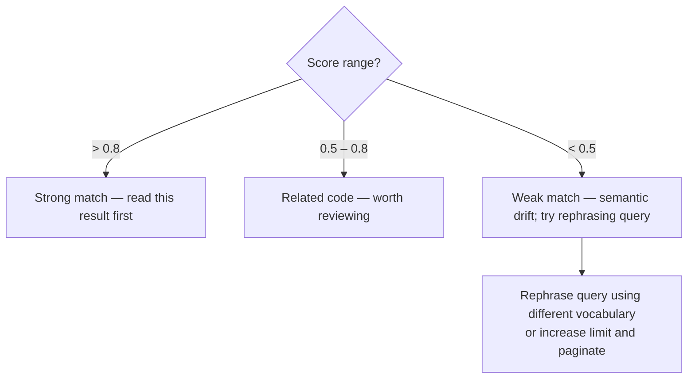
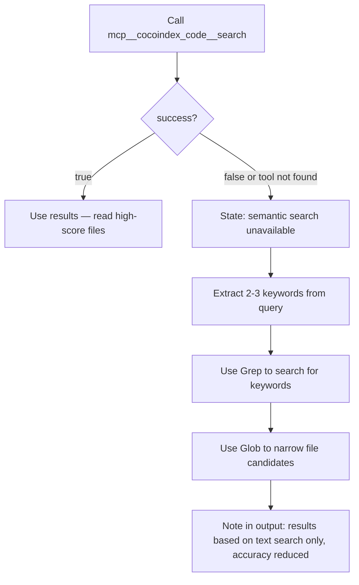

Use the cocoindex-code MCP server for semantic code search when:

- Searching for code by meaning or description rather than exact text
- Exploring unfamiliar parts of the codebase
- Looking for implementations without knowing exact names
- Finding similar code patterns or related functionality
- The user describes behavior in natural language and you need to locate the code responsible

Continue using Grep/Glob when:

- Searching for an exact known identifier, import, or string literal
- Checking for a specific file path or known symbol
- The MCP tool call fails (see Fallback Strategy below)

## Tool Schema

**Tool name**: `mcp__cocoindex_code__search`

**Parameters**:

| Parameter | Type | Default | Description |
|-----------|------|---------|-------------|
| `query` | string | required | Natural language description or code snippet to search for |
| `limit` | int | 5 | Number of results to return (1-100) |
| `offset` | int | 0 | Pagination offset for iterating through large result sets |
| `refresh_index` | bool | true | Refresh index before search to include recent file changes |

**Return shape**:

```json
{
  "success": true,
  "results": [
    {
      "file_path": "src/auth/login.py",
      "language": "Python",
      "content": "def authenticate_user(username, password):\n    ...",
      "start_line": 42,
      "end_line": 58,
      "score": 0.87
    }
  ],
  "total_returned": 3,
  "offset": 0,
  "message": null
}
```

`score` is a 0–1 cosine similarity value. Higher means more relevant.

SOURCE: [CocoIndex Code GitHub Repository](https://github.com/cocoindex-io/cocoindex-code) (accessed 2026-03-10)

## Query Patterns

**Effective queries** — natural language descriptions and code snippets both work:

```text
"authentication logic"
"database connection setup"
"how errors are logged"
"retry with exponential backoff"
"async def fetch"               # partial code snippet
"class that handles file uploads"
```

**Ineffective queries** — single generic keywords produce low-signal results:

```text
"user"        # too vague — matches everywhere
"error"       # too vague — matches everywhere
"import"      # too vague — syntactic noise
```

Use phrases of 3+ words describing behavior, purpose, or structure rather than individual tokens.

## Result Interpretation



**Pagination**: If the top results are weak or incomplete, set `offset` to skip already-seen
results and call again. Use `limit=10` for broader initial coverage.

**Reading results**: Use `Read` on `file_path` at lines `start_line`–`end_line` to see full context.

## Fallback Strategy



When falling back, be explicit: state that the MCP tool was unavailable and the results came
from keyword-based text search.

## Installation Prerequisite

The `mcp__cocoindex_code__search` tool is available only if the user has:

1. Installed CocoIndex Code:

   ```bash
   pipx install cocoindex-code
   # or
   uv tool install --upgrade cocoindex-code --prerelease explicit --with "cocoindex>=1.0.0a24"
   ```

2. Registered it as an MCP server:

   ```bash
   claude mcp add cocoindex-code -- cocoindex-code
   ```

If the tool is missing and the user has not installed CocoIndex Code, inform them of these steps
and fall back to Grep/Glob for the current task.

SOURCE: [CocoIndex Code README](https://github.com/cocoindex-io/cocoindex-code/blob/main/README.md) (accessed 2026-03-10)
