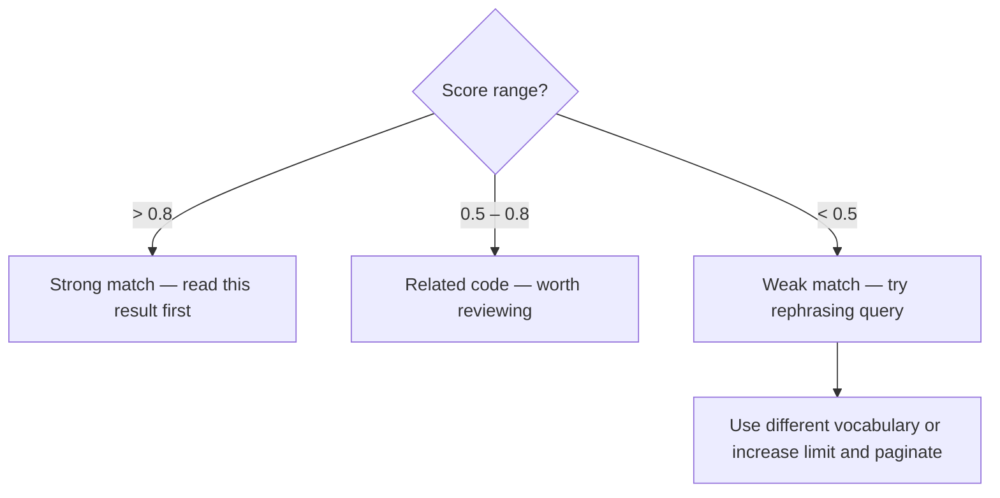

Use the cocoindex-code MCP server for semantic code search when:

- Searching for code by meaning or description rather than exact text
- Exploring unfamiliar parts of the codebase
- Looking for implementations without knowing exact names
- Finding similar code patterns or related functionality

## Tool

**Tool name**: `mcp__cocoindex_code__search`

| Parameter | Type | Default | Description |
|-----------|------|---------|-------------|
| `query` | string | required | Natural language description or code snippet to search for |
| `limit` | int | 5 | Number of results to return (1–100) |
| `offset` | int | 0 | Pagination offset for iterating through large result sets |
| `refresh_index` | bool | true | Refresh index before search to include recent file changes |

`score` in each result is a 0–1 cosine similarity value — higher means more relevant.

SOURCE: [CocoIndex Code GitHub Repository](https://github.com/cocoindex-io/cocoindex-code) (accessed 2026-03-10)

## Query Patterns

**Effective** — natural language descriptions and partial code snippets:

```text
"authentication logic"
"database connection setup"
"how errors are logged"
"retry with exponential backoff"
"async def fetch"
"class that handles file uploads"
```

**Ineffective** — single generic keywords produce low-signal results:

```text
"user"    # too vague
"error"   # too vague
"import"  # syntactic noise
```

Use phrases of 3+ words describing behavior, purpose, or structure.

## Result Interpretation



**Pagination**: Set `offset` to skip already-seen results. Use `limit=10` for broader initial coverage.

**Reading results**: Use `Read` on `file_path` at lines `start_line`–`end_line` for full context.

## Server Availability

The CocoIndex Code MCP server is bundled with this plugin via `.mcp.json` and launches automatically using `uvx cocoindex-code` — no pre-installation required. If `mcp__cocoindex_code__search` is not listed in available tools, report BLOCKED — this is a configuration error, not a fallback scenario.

SOURCE: [CocoIndex Code README](https://github.com/cocoindex-io/cocoindex-code/blob/main/README.md) (accessed 2026-03-10)
