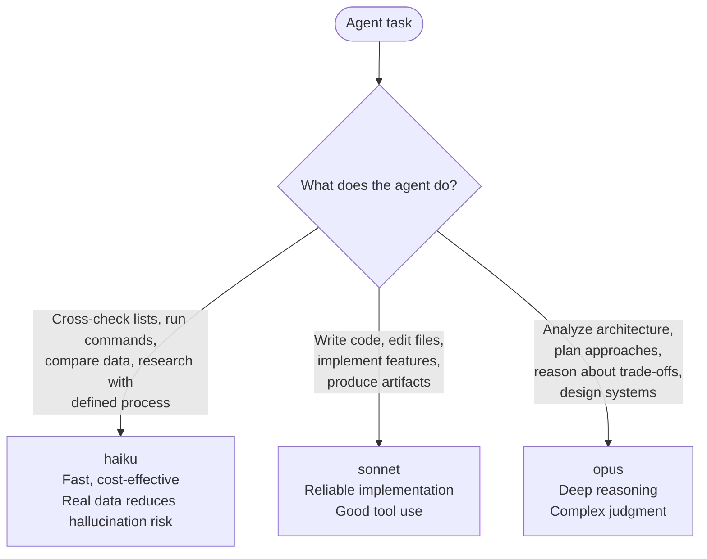

# Model Selection for Agent Delegation

Assign models based on the cognitive requirement of the task, not the agent name.

What an existing agent uses is its own `model:` frontmatter — read the agent file rather than a list here.

**The branch most often mis-called is the first**: work that looks like checking but requires judgment about what it finds. `plan-validator`, `code-reviewer` and `feature-verifier` all read as checkers and none is haiku — a cheaper model asserts a gap without verifying it.

**If an agent does both checking AND analysis**: split it into two agents — a haiku checker and an opus analyzer.

---

## Effort Tier Guidance

Orthogonal to `--model`: a haiku agent doing a boilerplate task should use `low`; a sonnet agent designing a subsystem should use `high`.

| Effort | Task type |
|---|---|
| `low` | Coordination, status checks, boilerplate generation, deterministic transforms |
| `medium` | Standard implementation, file editing, test writing, documentation updates |
| `high` | Architecture decisions, root-cause analysis, complex debugging, cross-file refactors |
| `max` | Deep reasoning, planning under uncertainty, novel design problems |

**Default (omit `--effort`)**: inherits model default.

**How to pass**: `spawn.py ... spawn --effort {level}` or `dispatch_spawn(effort="{level}")`.
